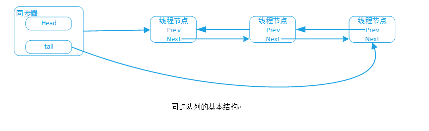
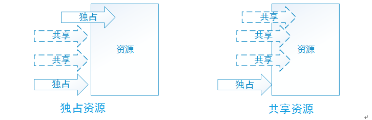

## 走近AbstractQueuedSynchronizer
## 一、从类结构开始
Java并发包中的同步器是很多并发组件的基础，如各种Lock，ConcurrentHashMap中的Segment，阻塞队列，CountDownLatch等。按我们一贯的风格，让我们直接走近设计者对其的诠释。
在java.util.concurrent.locks包中, AbstractQueuedSynchronizer直接继承自AbstractOwnableSynchronizer，在接下来的文字中有时会简写为AQS.
1. AbstractOwnableSynchronizer
AbstractOwnableSynchronizer是一种可由一个线程独占的同步器，同时也是创建锁的基础，它还包含了一种叫所有权的概念。AbstractOwnableSynchronizer本身不管理内部数据，但是它的子类可以用来维护一些值并用于控制或监视线程的访问。
AbstractOwnableSynchronizer内部只有一个属性：独占当前同步状态的线程和该属性的set/get方法。
代码如下：
```java
public abstract class AbstractOwnableSynchronizer {
    private transient Thread exclusiveOwnerThread;
}
```
2. AbstractQueuedSynchronizer
AbstractQueuedSynchronizer提供了一种框架，用于实现阻塞锁和其他基于先入先出（FIFO）等待队列的同步组件。该类用一个Int类型的原子变量来表示一种状态。子类必须实现该类的protect方法，以此来改变同步状态。在获取或释放该状态时，需要定义这个状态值。类中的其他方法实现了线程入队与阻塞功能，子类依然可以维护其他状态字段，但是只能使用getState、setState、compareAndSetState方法来跟踪同步状态。
子类应该定义为非公共的内部工具类，并需要在类中实现相应的同步方法。AbstractQueuedSynchronizer本身没有实现任何接口，支持独占式与共享式的获取同步状态。如果是独占模式，那么其他线程则不能获取到，而共享式则允许多个线程同时获取。两种不同模式下的等待线程共享同一个队列，通常实现的子类只支持一种模式，但是也有两种都支持的，如ReadWriteLock。仅支持独占或共享的子类可以不用实现对应模式所定义的方法。
AbstractQueuedSynchronizer类中定义了一个嵌套类ConditionObject。ConditionObject主要提供一种条件，由子类决定是否支持独占模式，并由isHeldExclusively方法决定当前线程是否是独占的获取同步状态。
除此，类中还定义了一些方法，用于检查、监控内部队列与条件对象。
## 二、队列节点
正式走近AbstractQueuedSynchronizer。
在AbstractQueuedSynchronizer内部，有一个静态的Node内部类，Doug对他解释如下：

等待队列节点
等待队列是一种“CLH(自旋锁)”锁队列。我们用自旋锁来实现阻塞同步器，但用的是同样的策略来控制一个线程的前驱节点的信息。每个节点中的status字段记录了一个线程是否已阻塞。当一个节点的前驱节点释放锁后会以信号的形式通知该节点，队列的每个结点作为一个特定通知风格（specific-notification-style）的监视器服务，会持有一个单独的等待线程，但是status字段不会控制是否线程能被赋予锁。如果一个线程是第一个进入队列的节点，他就可以尝试获取锁，但是也不能保证获取成功，只是有了竞争的权利。所以当前释放锁的竞争者线程可能需要再次等待。
为了进入CLH锁队列，你只需要原子的拼接成一个尾节点。要出队列的话，你仅需要设置head字段即可。

            +------+ prev +-----+     +-----+
       head |      | <---- |      | <---- |     |  tail
            +------+     +-----+      +-----+

插入节点到CLH队列要求在tail节点上是原子性的操作，未到队列的节点与入队的节点之间的界定就是是否有一个简单的原子指向操作执行该节点。类似的，节点出队牵涉到操作的就是更新head节点。然而，对于节点来说却需要花很多功夫来决定他们的后继结点是什么，处理一部分因超时或中断而导致的取消。

prev链向符主要是用于处理取消，如果一个节点被取消后，他的后继节点可以重新链向一个有效的前驱节点。（想要了解自旋锁的更多说明可参考[Scott and Scherer的论文](http://www.cs.rochester.edu/u/scott/synchronization/)）
我们还使用了next链向符，用于实现阻塞的原理。每个节点里保留了一个线程的Id,因此一个前驱节点可以通过遍历next节点来找到具体的线程然后唤醒next节点。决定后继节点时需要避免与新入队的节点竞争去设置他们前驱节点的next字段。
取消节点采用一些保守的算法。由于我们必需要根据某节点来轮询取消，因此可能会错过在之前或之后的节点。在执行取消时，会唤醒他的后继节点，并允许他们稳定在一个新的前驱节点上。
CLH队列需要一个虚拟的head节点来开始，但不会在构造方法中创建他，因为如果没有竞争那么会很浪费。相反，在创建节点时遇到第一次竞争时才会设置head和tail节点。

等待线程使用的也是同样的节点，只不过用的是额外的链向符。条件是用来链接队列的，线程在等待时，就会新增一个节点到条件队列中，再被得到通知时，该节点就转入到主队列中。节点用一个特殊的状态值来表示在哪个队列中。

## 三、节点状态
类上的注释说完了，开始说说类本身吧。从Node开始。
```java
static final class Node { //静态内部Final类
//标记符，表示在共享模式下的等待节点
static final Node SHARED = new Node();

//标记符，表示在独占模式下的等待节点
static final Node EXCLUSIVE = null;

//等待状态值，表示一个线程已经被取消了
static final int CANCELLED =  1;

//等待状态值，表示一个后继节点的线程需要唤醒
static final int SIGNAL    = -1;

//等待状态值，表示线程等待在某种条件下
static final int CONDITION = -2;

//等待状态值，表示下一次共享式获取状态的操作应该无条件的传播
static final int PROPAGATE = -3;

/***
状态字段，取值如下：
SIGNAL: 当前结点的后继节点将会是阻塞的（通过park方法），因此当前结点需要唤醒他的后继节点，当他释放或取消后。为了避免竞争，获取同步状态的方法必须抢先表示自己需要信号，然后重新原子的获取。最后可能是获取失败，或者再次被阻塞。
CANCELLED：  由于超时、中断等原因，当前结点会被取消。取消后，节点不会释放状态。特殊情景下，被取消的节点中的线程将不会再被阻塞
CONDITION：  当前结点在一个条件队列中，再被转移之前将不会被作为同步节点。被转移时该值会被设置为0。
PROPAGATE：  共享式方式释放同步状态后应该被传播到其他节点。这种设置（仅对head节点）在doReleaseShared方法中确保了可以持续，及时有其他的干预操作。
0：  非以上状态
**/
volatile int waitStatus;

/**
当前节点（线程）依赖于等待的状态值而链向的前驱节点。在入队列时被赋值，在出队时被置空（让GC回收）。
*/
volatile Node prev;

/**
当前结点（线程）在释放同步状态后会唤醒的后继节点
*/
volatile Node next;

//节点关联的线程，构造时被初始化、用完后置空
volatile Thread thread;

/**
链向的下一个等待节点，或是一个特殊值SHARED.由于只能是独占式的访问条件队列，所以只需简单的链向队列就行了。又由于条件只能是独占式的获取，我们保留了一个字段并使用特殊的值来表示共享模式。
**/
Node nextWaiter;

//如果节点是以共享模式在等待，则返回true
final boolean isShared() {return nextWaiter == SHARED;}
    一组构造方法
    Node (){}
    Node(Thread thread, Node mode) {     // 添加一个等待节点时，可使用
            this.nextWaiter = mode;
            this.thread = thread;
     }
//添加一个依赖于某条件的节点时，可使用
     Node(Thread thread, int waitStatus) {
            this.waitStatus = waitStatus;
            this.thread = thread;
     }
}
```
## 四、类成员与几个方法
AbstractQueuedSynchronizer定义的重要的属性和方法如下：
```java
//等待队列中的头节点，会延迟初始化。只能通过setHead方法修改头节点。注意：如果头节点存在，需要保证他的waitStatus不能是CANCELLED。
private transient volatile Node head;

//等待队列中的尾节点，会延迟初始化。只能通过enq方法来添加一个新的等待节点。
private transient volatile Node tail;

//同步状态
private volatile int state;

//返回当前的同步状态值。该操作拥有volatile读的内存语义。
protected final int getState() {
        return state;
}
//设置同步状态的值
protected final void setState(int newState) {
        state = newState;
}
//如果当前的状态值等于预期的值，则原子的设置同步状态值为给定的update值，设置成功后返回true.如果实际的值不等于预期的expect值，则返回false
protected final boolean compareAndSetState(int expect, int update) {
        // See below for intrinsics setup to support this
        return unsafe.compareAndSwapInt(this, stateOffset, expect, update);
}
```

看看一些队列操作的工具方法。
```java
/**
新增节点到队列中。
**/
private Node enq(final Node node) {
        for (;;) {
            Node t = tail; //先验证尾节点是否为空
            if (t == null) { // 如果为空，则必须初始化
                if (compareAndSetHead(new Node()))
                    tail = head; //第一次入队时，头节点和尾节点相同
            } else {
                node.prev = t;
                if (compareAndSetTail(t, node)) { //原子的设置尾节点为当前结点，并链接好前后节点
                    t.next = node;
                    return t;
                }
            }
        }
    }

/***
用当前的线程和给定的模式来创建一个节点，并加入到队列中。
mode为Node.EXCLUSIVE表示独占式，为Node.SHARED表示共享式
**/
private Node addWaiter(Node mode) {
        Node node = new Node(Thread.currentThread(), mode);
        // 尝试快速入队，如果失败则候补到全队列中
        Node pred = tail;
        if (pred != null) {
            node.prev = pred;
            if (compareAndSetTail(pred, node)) {
                pred.next = node;
                return node;
            }
        }
        enq(node);
        return node;
    }
/**
设置队列中的head节点为给的的node，从而出队列。仅会被acquire方法调用。
*/
private void setHead(Node node) {
        head = node;
        node.thread = null;
        node.prev = null; }
/***
如果存在后继节点，则唤醒该节点
**/
private void unparkSuccessor(Node node) {
        /*
        如果状态是负数（表示需要一个信号），先抢先设置状态为0，表示自己需要信号。
        当然也可能获取失败，然后则进入等待队列
         */
        int ws = node.waitStatus;
        if (ws < 0)
            compareAndSetWaitStatus(node, ws, 0);

        /*
        正常情况下，直接唤醒后继节点。但是后继节点是空的或被取消了，则从尾节点开始遍历出一个没有被取消的节点
         */
        Node s = node.next;
        if (s == null || s.waitStatus > 0) {
            s = null;
            for (Node t = tail; t != null && t != node; t = t.prev)
                if (t.waitStatus <= 0)
                    s = t;
        }
        if (s != null)
            LockSupport.unpark(s.thread);
}
```
代码先看到这里…
## 五、同步器原理
同步器依赖内部的同步队列（FIFO）来完成同步状态的管理，当前线程获取同步状态失败时，同步器会将当前线程以及等待状态等信息构造成一个节点并将其加入到同步队列，同时阻塞当前线程。首节点是获取同步状态成功的节点，同步状态释放时，首节点会唤醒后继节点中的线程，并可能让其获取同步状态。
同步器拥有的头节点(head)、尾节点(tail)， 还有一个线程队列，以双向链表的形式体现。
 
 同步队列的基本结构
线程在尝试获取同步状态时，AQS会把该线程构造成一个节点，节点结构即上文中的Node类，然后让内部的tail节点引用该节点，此阶段是通过compareAndSetTail方法利用CAS原理设置tail指向该节点的引用。

获取到同步的线程，AQS中的head节点会指向包含该线程的节点，执行完相应的逻辑后，会释放同步状态。然后首节点会唤醒它的后继节点（next引用）并让该节点中的线程参与获取同步状态的活动。

## 六、独占式获取与释放同步状态
方法说明如下：
当前线程独占的获取同步状态，即当前线程调用compareAndSetState方法设置内部的state变量值为特点的值，这由AQS具体子类在tryAcquire方法中指定值。compareAndSetState方法通过CAS设置成功后会返回true, 代表该线程设置状态成功，也就意味着获取同步状态成功。最后设置当前的exclusiveOwnerThread属性为当前线程。（AQS继承AbstractOwnableSynchronizer）
```java
public final void acquire(int arg) {
        if (!tryAcquire(arg) &&
            acquireQueued(addWaiter(Node.EXCLUSIVE), arg))
            selfInterrupt();
}
```
由于子类的具体实现，因此获取同步状态有不同的规则，如公平的获取，非公平的获取等。

如果tryAcquire方法返回false, 意味着当前线程获取同步状态失败，则执行acquireQueued方法。

先看addWaiter方法
独占式获取，参数为：Node.EXCLUSIVE
```java
private Node addWaiter(Node mode) {
    //按类型构造一个节点
        Node node = new Node(Thread.currentThread(), mode);
        //快速加到尾节点，失败了则重新入队
        Node pred = tail;
        if (pred != null) {
            node.prev = pred;
            if (compareAndSetTail(pred, node)) {
                pred.next = node;
                return node;
            }
        }
        enq(node);
        return node;
    }
 ```
再看看accuireQueued()方法
方法主要意图为：当前线程不间断的一直去获取同步状态，没有获取到则进入自旋过程。
```java
final boolean acquireQueued(final Node node, int arg) {
        boolean failed = true;
        try {
            boolean interrupted = false;
            for (;;) {
                final Node p = node.predecessor();
                if (p == head && tryAcquire(arg)) {
                    setHead(node);
                    p.next = null; // help GC
                    failed = false;
                    return interrupted;
                }
                //没获取到时，是否应该让当前线程等待
                if (shouldParkAfterFailedAcquire(p, node) &&
                    parkAndCheckInterrupt())
                    interrupted = true;
            }
        } finally {
            if (failed)
                cancelAcquire(node);
        }
}
```
在自旋的过程里，如果当前节点的prev节点的等待状态为SIGNAL后，则会park线程了，因为节点的前驱节点不是头节点，所以让自己先等待。

直到有节点获取到后，之后会释放，直到让所有的节点都获取到。
释放的方法如下：
释放同步状态，由子类来完成，一般思路是更改state为0或设置state自减arg。
然后唤醒后继节点，让其参与获取同步状态。
```java
public final boolean release(int arg) {
        if (tryRelease(arg)) {
            Node h = head;
            if (h != null && h.waitStatus != 0)
                unparkSuccessor(h);
            return true;
        }
        return false;
}
```
## 七、共享式获取与释放
共享式与独占式获取最主要的区别在于同一时刻能否有多个线程同时获取到同步状态。如图所示：
  
共享式获取同步状态的方法是带有share标识的。
```java
public final void acquireShared(int arg) {
        if (tryAcquireShared(arg) < 0)
            doAcquireShared(arg);
}
```
acquireShared方法表示以共享的方式来获取同步状态，同时可以忽略线程是否中断。
tryAcquireShared方法与tryAccquird类似，也是由子类的行为来决定。返回小于0 (通常为-1)的数代表获取失败，返回大于等于0代表获取到同步状态。没有获取到则进入doAcquireShared方法。
方法如下：
```java
private void doAcquireShared(int arg) {
        final Node node = addWaiter(Node.SHARED);
        boolean failed = true;
        try {
            boolean interrupted = false;
            for (;;) {
                final Node p = node.predecessor();
                if (p == head) {
                    int r = tryAcquireShared(arg);
                    if (r >= 0) {
                        //获取到同步状态后，让该行为传播下去
                        setHeadAndPropagate(node, r);
                        p.next = null; // help GC
                        if (interrupted)
                            selfInterrupt();
                        failed = false;
                        return;
                    }
                }
                if (shouldParkAfterFailedAcquire(p, node) &&
                    parkAndCheckInterrupt())
                    interrupted = true;
            }
        } finally {
            if (failed)
                cancelAcquire(node);
        }
}
```
与独占获取类似，也是构造节点，加入队列并进入自旋过程。
但是在自旋时，一旦获取到状态后，便执行setHeadAndPropagate，意为让自己的后继节点也去获取同步状态。
在setHeadAndPropagate方法中会设置自己为头节点，最后会调用doReleaseShared释放同步状态。

看看doReleaseShared方法，逻辑为更改waitStatus为Node.PROPAGATE，意为传播该行为 ，并唤醒后继节点。
```java
for (;;) {
            Node h = head;
            if (h != null && h != tail) {
                int ws = h.waitStatus;
                if (ws == Node.SIGNAL) {
                    if (!compareAndSetWaitStatus(h, Node.SIGNAL, 0))
                        continue;            // loop to recheck cases
                    unparkSuccessor(h);
                }
                else if (ws == 0 &&
                         !compareAndSetWaitStatus(h, 0, Node.PROPAGATE))
                    continue;                // loop on failed CAS
            }
            if (h == head)                   // loop if head changed
                break;
        }
 ```
## 八、AQS具体应用
在JUC包中，AQS的应用很多，如ThreadPoolExecutor中的Worker，阻塞队列中poll或take方法，还有重入锁、CountDownLatch，ConcurrentHashMap，还有读写锁等。下面举其中一部分例子。
**1. 重入锁**
重入锁（ReentrantLock）代表一个线程可以对资源重复加锁。Java中的synchronized关键字是隐式的支持重进入，而重入锁在代码层面实现了重入的含义。线程在执行一个递归方法时，获取了锁后仍能连续多次的获得该锁，而有些排它锁则只能获取一次，下一次获取则只能重新排队竞争。
如你所想，重入锁同时是一把非公平锁，可直接看看ReentrantLock的代码实现。
不知还曾记否Doug对AQS的使用建议：子类应该定义为非公共的内部工具类，并需要在类中实现相应的同步方法。可以看到所以同步组件的实现都是定了一个Sync的内部类。
ReentrantLock实现重新获取锁的逻辑如下(直接看非公平锁的实现):
```java
static final class NonfairSync extends Sync {
        /**
         获取锁时，先闯入获取。没有获取到再到候补队列中
         */
        final void lock() {
            if (compareAndSetState(0, 1))
                setExclusiveOwnerThread(Thread.currentThread());
            else
                acquire(1);
        }
        protected final boolean tryAcquire(int acquires) {
            return nonfairTryAcquire(acquires);
        }
    }
```
在Sync中定义的nonfairTryAcquire方法解决了线程再次获取锁：如果再次获取锁的线程是当前线程，则对当前的同步状态执行累加acquires值。
```java
final boolean nonfairTryAcquire(int acquires) {
            final Thread current = Thread.currentThread();
            int c = getState();
            if (c == 0) {
                if (compareAndSetState(0, acquires)) {
                    setExclusiveOwnerThread(current);
                    return true;
                }
            }
            else if (current == getExclusiveOwnerThread()) { //代码实现
                int nextc = c + acquires;
                if (nextc < 0) // overflow
                    throw new Error("Maximum lock count exceeded");
                setState(nextc);
                return true;
            }
            return false;
        }
```
而在释放锁时，需要保证锁的最终释放，需要对同步状态的获取次数自减，当计数为0时表示锁已经成功释放。
```java
protected final boolean tryRelease(int releases) {
            int c = getState() - releases; //自减计数
            if (Thread.currentThread() != getExclusiveOwnerThread())
                throw new IllegalMonitorStateException();
            boolean free = false;
            if (c == 0) {
                free = true;
                setExclusiveOwnerThread(null);
            }
            setState(c);
            return free;
        }
```
**2. CountDownLatch**
Latch意为门闩，门锁，CountDownLatch中文直意为计数门闩，用于在线程间计数后最后放开门闩。
CountDownLatch的文档描述为：用于辅助一个或多个线程等待一系列的操作执行完成后然后才可以执行后续动作。CountDownLatch是典型的共享模式的同步组件。初始化时，设置当前的线程数量为同步状态的值，每次执行countdown方法时，同步状态自减。直到同步状态为0时，代表以及全部释放，然后发起调用的线程就可以执行后续动作。看看CountDownLatch是怎么借用AQS来完成countDown和openLatch的。
内部直接使用一个静态工具类继承AQS，然后在构造方法设置同步状态为构造参数。
Sync(int count) {
            setState(count);
}
CountDownLatch表示当前线程（或调用线程）需要等待其他线程完成其相应的工作，因此设置的锁计数器是针对其他线程的，因此当前线程想要执行后续操作，需要等待其他线程都释放锁，直到同步状态为0时，当前线程才会从等待中返回。
因此CountDownLatch的核心方法为await()，countDown()。
重写的tryAcquireShared方法为
```java
protected int tryAcquireShared(int acquires) {
            return (getState() == 0) ? 1 : -1;
}
```

而await方法实现为：表示在等待时是响应中的。
```java
public void await() throws InterruptedException {
        sync.acquireSharedInterruptibly(1);
}
```
acquireSharedInterruptibly()是AQS中的方法，该方法会调用子类的tryAcquireShared方法来验证同步状态是否为0.

而在countDown方法则含义简明，直接释放一个状态计数。
```java
public void countDown() {
        sync.releaseShared(1);
}
protected boolean tryReleaseShared(int releases) {
            // Decrement count; signal when transition to zero
            for (;;) {
                int c = getState();
                if (c == 0)
                    return false;
                int nextc = c-1;
                if (compareAndSetState(c, nextc))
                    return nextc == 0;
            }
        }
```
注: AQS中的获取与释放方法前文中都已经阐述。
**3. ConcurrentHashMap**
我觉得ConcurrentHashMap的结构就是两个HashMap。添加元素时，先根据key找到对应的段（Segment），再根据段找到具体的Bucket桶的位置（数组的索引），最后添加元素到Entry中。当然这段描述简化了很多，接下来我们来探索一下ConcurrentHashMap的并发控制机制。
ConcurrentHashMap把欲存储的数据分成了多个段（Segment）， 而每个段里就类似一个HashMap, 里面包含一个Table数组，并用于存储数据。
因此，ConcurrentHashMap对于并发的控制转交给了内部的Segment，而Segment自身是继承了ReentrantLock重入锁（注:在JDK7中）。所以，最终的并发控制还是由AQS来接管的，所以又不得不聊聊ConcurrentHashMap和AQS是怎么哥俩好的。
3.1 初始化
与HashMap类似，ConcurrentHashMap也是先设置一些基础属性。如指定并发级别（就是指定最大Segment数量）,负载因子，容量设置为2的n次方，以及用于hash的掩码和移位数值，最后构造Segment数组。
3.2 put元素（挖坑埋宝）
put元素时，会先找到key映射在那个Segment中，最后由具体的Segment来完成put操作。
```java
public V put(K key, V value) {
        Segment<K,V> s;
        if (value == null)
            throw new NullPointerException();
        int hash = hash(key);
        int j = (hash >>> segmentShift) & segmentMask;
        if ((s = (Segment<K,V>)UNSAFE.getObject          // nonvolatile; recheck
             (segments, (j << SSHIFT) + SBASE)) == null) //  in ensureSegment
            s = ensureSegment(j);
        return s.put(key, hash, value, false);
    }
```
在Segment put元素时，会对当前Segment加锁，如代码：
```java
final V put(K key, int hash, V value, boolean onlyIfAbsent) {
            HashEntry<K,V> node = tryLock() ? null :
                scanAndLockForPut(key, hash, value);
    省略…
}
```
如果当前线程加锁成功，则node为null. 然后就想HashMap中添加元素那样，执行添加元素。
如果tryLock返回false, 代表当前线程获取锁失败，说明正在有其他线程在操作同一个Segment。于是，便执行scanAndLockForPut方法。
scanAndLockForPut很有意思。某一个线程在同一个Segment上执行put方法，发现有其他线程已经获取到了锁，因此不让它put。但是咱不能闲着啊，不能执行put，咱能提前干点其他的事儿啊，比如先算算给我的key应该落在哪个坑里（entryForHash方法），等我找到我的坑后，再去看看其他线程活儿干完没有, 如果你还没有put完成，那我先把要埋的宝贝准备好（构造节点），只要等你释放锁后，我便立即埋坑。
```java
private HashEntry<K,V> scanAndLockForPut(K key, int hash, V value) {
            //找坑
            HashEntry<K,V> first = entryForHash(this, hash);
            HashEntry<K,V> e = first;
            HashEntry<K,V> node = null;
            int retries = -1; // negative while locating node
            while (!tryLock()) { //再次去获取锁
                HashEntry<K,V> f; // to recheck first below
                //双重检测、以防止这个坑别人填了
                if (retries < 0) {
                    if (e == null) {
                        if (node == null) // speculatively create node
                            //准备好土
                            node = new HashEntry<K,V>(hash, key, value, null);
                        retries = 0;
                    }
                    else if (key.equals(e.key))
                        retries = 0;
                    else
                        e = e.next;
                }
                else if (++retries > MAX_SCAN_RETRIES) {
                    lock();
                    break;
                }
                else if ((retries & 1) == 0 &&
                         (f = entryForHash(this, hash)) != first) {
                    e = first = f; // re-traverse if entry changed
                    retries = -1;
                }
            }
            return node; //最后把准备好的宝贝返回给put方法，用于正式埋坑。
        }
```java
整体上看下来，ConcurrentHashMap的put方法就像是一个挖坑埋宝的故事。
3.3 get元素（挖宝）
最难的挖坑需要先去找哪里可以挖，然后如果你要在同一片土地上埋宝的话，咱还等排队）。
但是挖宝贝咱就管不了那么多了，先找到那个坑，看谁挖的快，看谁挖的深浅就行。
对应到get方法，就是直接找到那个Segment，然后再找到具体的索引，然后逐个验证key,最后取走就ok.
```java
public V get(Object key) {
        Segment<K,V> s; // manually integrate access methods to reduce overhead
        HashEntry<K,V>[] tab;
        int h = hash(key); //找Segment
        long u = (((h >>> segmentShift) & segmentMask) << SSHIFT) + SBASE;
        if ((s = (Segment<K,V>)UNSAFE.getObjectVolatile(segments, u)) != null &&
            (tab = s.table) != null) {
            //在Segment中找具体的数组索引
            for (HashEntry<K,V> e = (HashEntry<K,V>) UNSAFE.getObjectVolatile
                     (tab, ((long)(((tab.length - 1) & h)) << TSHIFT) + TBASE);
                 e != null; e = e.next) {
                K k;
                if ((k = e.key) == key || (e.hash == h && key.equals(k)))
                    return e.value;
            }
        }
        return null; //没有找到(哥，您当时可能没有埋宝，您想开点)。
}
```
## 九、结束语
AQS包含的设计思想是非一时半刻就能吸收的，还有很多哲学上的启发。因此需要花很多时间来分析和付诸很多的思考与其中。本文讲述的内容恐怕浮光掠影，比如还有没有探讨的内容有Conditon接口、LockSupport工具。但一言以蔽之，Conditon及其实现类ConditionObject就是实现了Java中的等待/通知机制，即wait方法和notify方法的语义。而LockSupport是一个工具类，用于阻塞和唤醒当前线程，而其也是依赖于JVM自身来控制的。
