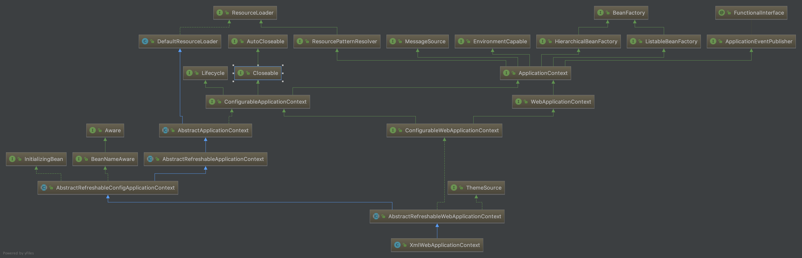
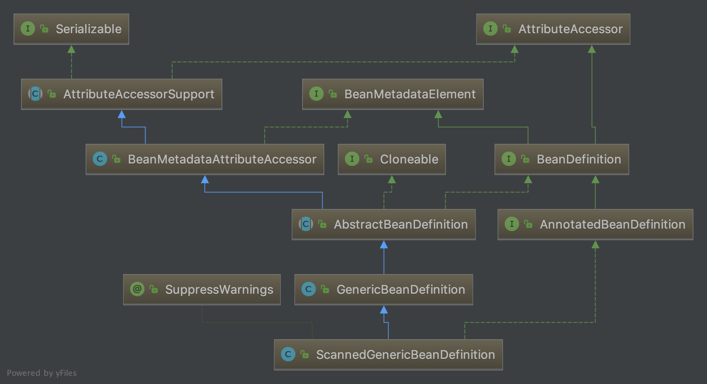
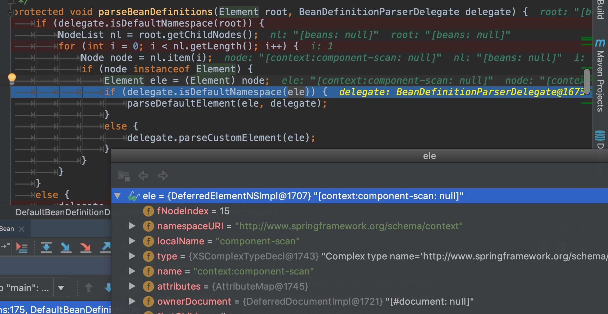

# Spring ApplicationContext源码梳理
## 概要
Spring ApplicationContext在Web场景中的类图依赖如下:


Web应用中个，常用的实现类有: `XmlWebApplication`和`AnnotationConfigWebApplicationContext`.

`BeanDefinition`类图如下：


XMLBean为`GenericBeanDefinition`,注解扫描的Bean为`ScannedGenericBeanDefinition`

## refresh
从`ConfigurableApplicationContext`的Refresh方法开始
```java
/**
	 * Load or refresh the persistent representation of the configuration,
	 * which might an XML file, properties file, or relational database schema.
	 * <p>As this is a startup method, it should destroy already created singletons
	 * if it fails, to avoid dangling resources. In other words, after invocation
	 * of that method, either all or no singletons at all should be instantiated.
	 * @throws BeansException if the bean factory could not be initialized
	 * @throws IllegalStateException if already initialized and multiple refresh
	 * attempts are not supported
	 */
	void refresh() throws BeansException, IllegalStateException;

```
refresh方法会加载xml或其他形式的配置，完成bean实例化。

实现代码在`AbstractApplicationContext`中。
```java

@Override
	public void refresh() throws BeansException, IllegalStateException {
		synchronized (this.startupShutdownMonitor) {
			// Prepare this context for refreshing.
			prepareRefresh();

			// Tell the subclass to refresh the internal bean factory.
			ConfigurableListableBeanFactory beanFactory = obtainFreshBeanFactory();

			// Prepare the bean factory for use in this context.
			prepareBeanFactory(beanFactory);

			try {
				// Allows post-processing of the bean factory in context subclasses.
				postProcessBeanFactory(beanFactory);

				// Invoke factory processors registered as beans in the context.
				invokeBeanFactoryPostProcessors(beanFactory);

				// Register bean processors that intercept bean creation.
				registerBeanPostProcessors(beanFactory);

				// Initialize message source for this context.
				initMessageSource();

				// Initialize event multicaster for this context.
				initApplicationEventMulticaster();

				// Initialize other special beans in specific context subclasses.
				onRefresh();

				// Check for listener beans and register them.
				registerListeners();

				// Instantiate all remaining (non-lazy-init) singletons.
				finishBeanFactoryInitialization(beanFactory);

				// Last step: publish corresponding event.
				finishRefresh();
			}

			catch (BeansException ex) {
				if (logger.isWarnEnabled()) {
					logger.warn("Exception encountered during context initialization - " +
							"cancelling refresh attempt: " + ex);
				}

				// Destroy already created singletons to avoid dangling resources.
				destroyBeans();

				// Reset 'active' flag.
				cancelRefresh(ex);

				// Propagate exception to caller.
				throw ex;
			}

			finally {
				// Reset common introspection caches in Spring's core, since we
				// might not ever need metadata for singleton beans anymore...
				resetCommonCaches();
			}
		}
	}
```
接下来进入一个个方法的内部细看。

### prepareRefresh()
> prepareRefresh方法：准备context，设置初始化的时间，与激活flag, 同时初始化属性源。
> 代码中用注释的形式标注

```java

	/**
	 * Prepare this context for refreshing, setting its startup date and
	 * active flag as well as performing any initialization of property sources.
	 */
	protected void prepareRefresh() {
		// Switch to active.
		this.startupDate = System.currentTimeMillis();

		this.closed.set(false); // 表示容器未关闭
		this.active.set(true); // 表示容器已激活

		// Initialize any placeholder property sources in the context environment.
		initPropertySources();

	}
```
### obtainFreshBeanFactory
> 子类分别为XmlWebApplicationContext与AnnotationConfigWebApplicationContext，由子类各自实现获取刷新后的Bean工厂.

### refreshBeanFactory
> 创建默认的DefaultListableBeanFactory(直接new)，然后设置bean工厂的Id（对象hash地址. 然后执行loadBeanDefinitions载入工程中的Bean定义，如Xml配置的Bean，注解配置的Bean，两种混合使用的Bean.

#### xml load beandedinition
解析XML文件处理流程简要概括为:
1) 判断每个xml node是否默认的命名空间:http://www.springframework.org/schema/beans，代码见`DefaultBeanDefinitionDocumentReader#parseBeanDefinitions`:

（处理XML node，tag的namespace会统一设置）

2) 如果是beans这个命名空间下的元素则进入default的parse流程，解析`beans`,`bean`,`import`，`context:component-scan`，`context:annotation-config`等xml元素标签。
3）对于beans,beans,import采用xml node直接解析并创建为一个`GenericBeanDefinition`,然后包装为一个`BeanDefinitionHolder`，`BeanDefinitionHolder`为一个典型的值对象,其关键定义如下:
```java
public class BeanDefinitionHolder implements BeanMetadataElement {

	private final BeanDefinition beanDefinition;

	private final String beanName;

	@Nullable
	private final String[] aliases;
}
```
4）如果是自定义的命名空间，则采用自定义的解析流程。如`context:xxx`这种特殊标签，为Spring提供的命名空间，采用命名空间解析器来处理，用户可自定义命名空间，如`dubbo:xxx`.Spring内置了很多命名空间，如`context:xxx`, `aop:xx`,`mvc:xx`.
代码见：`BeanDefinitionParserDelegate#parseCustomElement(org.w3c.dom.Element, org.springframework.beans.factory.config.BeanDefinition)`
```java
	public BeanDefinition parseCustomElement(Element ele, @Nullable BeanDefinition containingBd) {
		String namespaceUri = getNamespaceURI(ele);
		if (namespaceUri == null) {
			return null;
		}
		NamespaceHandler handler = this.readerContext.getNamespaceHandlerResolver().resolve(namespaceUri);

		return handler.parse(ele, new ParserContext(this.readerContext, this, containingBd));
	}
```
解析NamespaceHandler采用的是配置加SPI的机制，`DefaultNamespaceHandlerResolver`把当前类路径下的META-INF/spring.handlers文件加载到一个Map中,Key为命名空间，Value为具体的处理类。
文件内容如下:
```java
http\://www.springframework.org/schema/context=org.springframework.context.config.ContextNamespaceHandler
http\://www.springframework.org/schema/jee=org.springframework.ejb.config.JeeNamespaceHandler
http\://www.springframework.org/schema/lang=org.springframework.scripting.config.LangNamespaceHandler
http\://www.springframework.org/schema/task=org.springframework.scheduling.config.TaskNamespaceHandler
http\://www.springframework.org/schema/cache=org.springframework.cache.config.CacheNamespaceHandler
```

`resolve`时根据`namespace uri`查找Handler，并反射创建一个class,然后执行init,注册标签属性解析器。`context:xxx`的Handler示例如下:
```java
public class ContextNamespaceHandler extends NamespaceHandlerSupport {

	@Override
	public void init() {
		registerBeanDefinitionParser("property-placeholder", new PropertyPlaceholderBeanDefinitionParser());
		registerBeanDefinitionParser("property-override", new PropertyOverrideBeanDefinitionParser());
		registerBeanDefinitionParser("annotation-config", new AnnotationConfigBeanDefinitionParser());
		registerBeanDefinitionParser("component-scan", new ComponentScanBeanDefinitionParser());
		registerBeanDefinitionParser("load-time-weaver", new LoadTimeWeaverBeanDefinitionParser());
		registerBeanDefinitionParser("spring-configured", new SpringConfiguredBeanDefinitionParser());
		registerBeanDefinitionParser("mbean-export", new MBeanExportBeanDefinitionParser());
		registerBeanDefinitionParser("mbean-server", new MBeanServerBeanDefinitionParser());
	}

}
```

#### annotation config load beandefinition
注解配置主要是配置扫描路径，Spring默认采用`ClassPathBeanDefinitionScanner`执行bean扫描。扫描带有`@Component`注解的class.然后注册到Bean工厂。

### prepareBeanFactory(ConfigurableListableBeanFactory beanFactory)
1）准备bean工厂阶段,添加一些bean-post processor,如：`ApplicationContextAwareProcessor`（用来调用实现了XXXAware接口的bean的setXXX方法）
2) 添加ignoreDependencyInterfaces,如XXXAware接口(ApplicationContextAware), 如果实现了这些接口，表示不执行自动注入,当前prepare方法中有如下几个:
```java
		// Configure the bean factory with context callbacks.
		beanFactory.addBeanPostProcessor(new ApplicationContextAwareProcessor(this));
		beanFactory.ignoreDependencyInterface(EnvironmentAware.class);
		beanFactory.ignoreDependencyInterface(EmbeddedValueResolverAware.class);
		beanFactory.ignoreDependencyInterface(ResourceLoaderAware.class);
		beanFactory.ignoreDependencyInterface(ApplicationEventPublisherAware.class);
		beanFactory.ignoreDependencyInterface(MessageSourceAware.class);
		beanFactory.ignoreDependencyInterface(ApplicationContextAware.class);
```

2）添加一些特殊接口，表示可自动注入到Bean中，如可注入一个BeanFactory，ApplicationContext实例，共有如下几个:
```java
// BeanFactory interface not registered as resolvable type in a plain factory.
		// MessageSource registered (and found for autowiring) as a bean.
		beanFactory.registerResolvableDependency(BeanFactory.class, beanFactory);
		beanFactory.registerResolvableDependency(ResourceLoader.class, this);
		beanFactory.registerResolvableDependency(ApplicationEventPublisher.class, this);
		beanFactory.registerResolvableDependency(ApplicationContext.class, this);

```

### invokeBeanFactoryPostProcessors(ConfigurableListableBeanFactory beanFactory) ??
```
/**
	 * Instantiate and invoke all registered BeanFactoryPostProcessor beans,
	 * respecting explicit order if given.
	 * <p>Must be called before singleton instantiation.
	 */
	protected void invokeBeanFactoryPostProcessors(ConfigurableListableBeanFactory beanFactory) {
		PostProcessorRegistrationDelegate.invokeBeanFactoryPostProcessors(beanFactory, getBeanFactoryPostProcessors());

		// Detect a LoadTimeWeaver and prepare for weaving, if found in the meantime
		// (e.g. through an @Bean method registered by ConfigurationClassPostProcessor)
		if (beanFactory.getTempClassLoader() == null && beanFactory.containsBean(LOAD_TIME_WEAVER_BEAN_NAME)) {
			beanFactory.addBeanPostProcessor(new LoadTimeWeaverAwareProcessor(beanFactory));
			beanFactory.setTempClassLoader(new ContextTypeMatchClassLoader(beanFactory.getBeanClassLoader()));
		}
	}

```

### registerBeanPostProcessors(ConfigurableListableBeanFactory beanFactory)
> 拦截Bean创建流程: Register bean processors that intercept bean creation.

Spring注册Bean阶段，会注册一些内部的post-processor, 如:`CommonAnnotationBeanPostProcessor,AutowiredAnnotationBeanPostProcessor`.

### initMessageSource()
> Initialize message source for this context.

### initApplicationEventMulticaster()
> Initialize event multicaster for this context. default is SimpleApplicationEventMulticaster

### onRefresh()
> Initialize other special beans in specific context subclasses.

### registerListeners()
>  Check for listener beans and register them.

### finishBeanFactoryInitialization(ConfigurableListableBeanFactory beanFactory)
> Instantiate all remaining (non-lazy-init) singletons.

#### preInstantiateSingletons
> Ensure that all non-lazy-init singletons are instantiated, also considering FactoryBeans
Typically invoked at the end of factory setup, if desired.


### finishRefresh()
> Finish the refresh of this context, invoking the LifecycleProcessor's
	onRefresh() method and publishing the event.


## Bean的自定义初始化执行顺序
> 先执行 @PostConstruct 在执行 InitializingBean#afterPropertiesSet 最后执行XML配置的init方法

```java
protected Object initializeBean(final String beanName, final Object bean, @Nullable RootBeanDefinition mbd) {
		invokeAwareMethods(beanName, bean);

		Object wrappedBean = bean;
		wrappedBean = applyBeanPostProcessorsBeforeInitialization(wrappedBean, beanName);
		invokeInitMethods(beanName, wrappedBean, mbd);
		if (mbd == null || !mbd.isSynthetic()) {
			wrappedBean = applyBeanPostProcessorsAfterInitialization(wrappedBean, beanName);
		}

		return wrappedBean;
	}

```
invokeInitMethods方法如下:
```java
protected void invokeInitMethods(String beanName, final Object bean, @Nullable RootBeanDefinition mbd)
			throws Throwable {
			boolean isInitializingBean = (bean instanceof InitializingBean);
			if (isInitializingBean && (mbd == null || !mbd.isExternallyManagedInitMethod("afterPropertiesSet"))){
			((InitializingBean) bean).afterPropertiesSet();
			}

	if (mbd != null && bean.getClass() != NullBean.class) {
			String initMethodName = mbd.getInitMethodName();
			if (StringUtils.hasLength(initMethodName) &&
					!(isInitializingBean && "afterPropertiesSet".equals(initMethodName)) &&
					!mbd.isExternallyManagedInitMethod(initMethodName)) {
				invokeCustomInitMethod(beanName, bean, mbd);
			}
		}			
}
```

## Bean的生命周期


## 如何解决循环依赖
> 构造方法注入不支持循环依赖，Setter方法与字段注入支持循环依赖

构造方法注入会强校验bean是否为null，否则抛异常。因此构造方法注入场景出现循环依赖Spring抛出如下异常:
```java
Unsatisfied dependency expressed through constructor parameter 0; nested exception is org.springframework.beans.factory.BeanCurrentlyInCreationException: Error creating bean with name 'ABean': Requested bean is currently in creation: Is there an unresolvable circular reference?

	at org.springframework.beans.factory.support.ConstructorResolver.createArgumentArray(ConstructorResolver.java:798)
```
### 三级缓存
```java
DefaultSingletonBeanRegistry {
	/** Cache of singleton objects: bean name to bean instance. */
  // 创建完成的单例对象
	private final Map<String, Object> singletonObjects = new ConcurrentHashMap<>(256);

	/** Cache of singleton factories: bean name to ObjectFactory. */
  // 单例对象工厂缓存
	private final Map<String, ObjectFactory<?>> singletonFactories = new HashMap<>(16);

	/** Cache of early singleton objects: bean name to bean instance. */
  // 提前创建的bean
	private final Map<String, Object> earlySingletonObjects = new HashMap<>(16);


	/** Names of beans that are currently in creation. */
  // 正在创建的bean,还未创建完成
	private final Set<String> singletonsCurrentlyInCreation =
			Collections.newSetFromMap(new ConcurrentHashMap<>(16));
}
```
如A依赖B,B依赖A. A,B的Bean都会被添加到`singletonsCurrentlyInCreation`.当创建B时,发现依赖A,则再次去getBean(A), 发现A正在创建,则抛`BeanCurrentlyInCreationException`异常。代码如下:
```java
/**
 * Callback before singleton creation.
 * <p>The default implementation register the singleton as currently in creation.
 * @param beanName the name of the singleton about to be created
 * @see #isSingletonCurrentlyInCreation
 */
protected void beforeSingletonCreation(String beanName) {
	if (!this.inCreationCheckExclusions.contains(beanName) && !this.singletonsCurrentlyInCreation.add(beanName)) {
		throw new BeanCurrentlyInCreationException(beanName);
	}
}
```

Setter方法与字段注入产生的循环依赖,Spring是先创建Bean实例，一般直接反射创建一个class实例，内部的字段默认都是`null`,后续再执行依赖注入。通过`@Autowired`,`@Resource`内置的BeanPostProcessor完成注入。

对于Autowired注解,处理处理简要如下:
1) AutowiredAnnotationBeanPostProcessor#postProcessProperties
2) InjectionMetadata#inject
3) InjectionMetadata具体实现有:`AutowiredFieldElement`,`AutowiredMethodElement`
4) 注入方法的处理关键点为: 查找method,反射调用method#invoke
```java
ReflectionUtils.makeAccessible(method);
method.invoke(bean, arguments);
```
5) 注入字段的处理关键点为: 查找field,反射调用field#set
```java
ReflectionUtils.makeAccessible(field);
field.set(bean, value);
```
