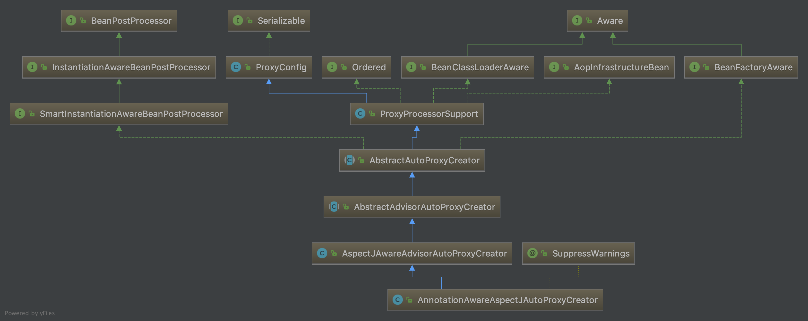
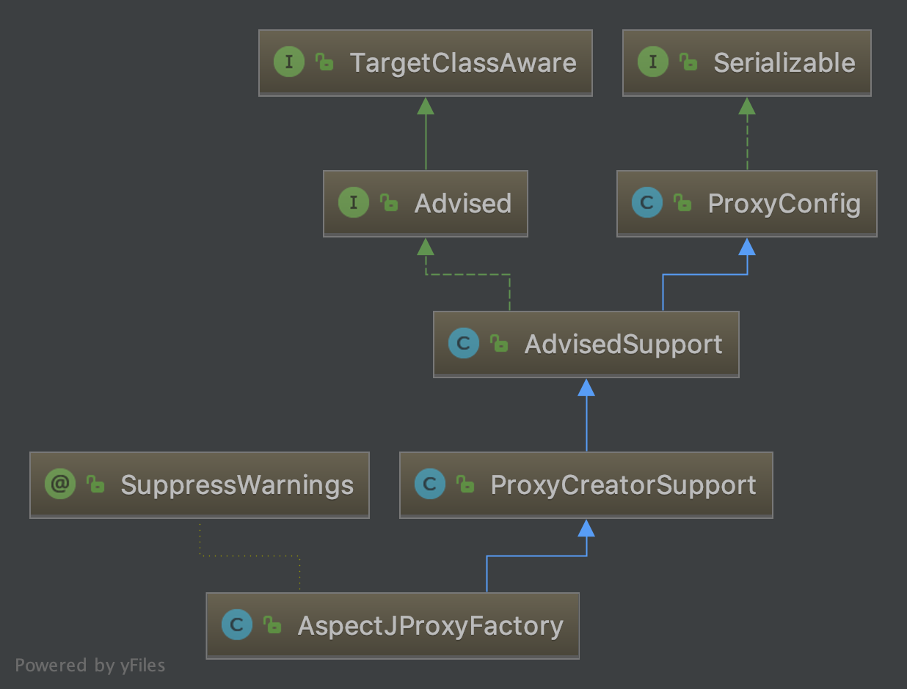

# Aspectj与Spring Aop
## 前言
`Aspectj`是面向切面编程中的java实现类库，Spring可以更方便的集成aspectj. SpringAOP的底层是基于代理模式来实现的。默认情况下有两种实现策略: 一是基于JDK的动态代理，二是基于CGLIB字节码生产库来实现。
Spring AOP从类库层面集成了Cglib与AOP联盟(`org.aopalliance`),如果要使用aspectj.需要引入aspectjweaver.jar，maven依赖如下:
```XML
<dependency>
    <groupId>org.aspectj</groupId>
    <artifactId>aspectjweaver</artifactId>
    <version>1.9.5</version>
</dependency>
```
## Spring的AOP设计
### 开启AspectJ定义切面
一是采用`@Aspectj`的注解,二是基于XML的配置方式。推荐使用注解风格来定义切面。
如通过注解开启aspectj
```
@Configuration
@EnableAspectJAutoProxy
public class AppConfig {

}

```
通过xml配置开启:
> <aop:aspectj-autoproxy/>

添加`@EnableAspectJAutoProxy`或`<aop:aspectj-autoproxy/>`后会隐式注册如下BeanPostProcessor到容器中:
> AnnotationAwareAspectJAutoProxyCreator

该类在Spring中的类图如下:


可以看到该类的作用主要与创建代理有关，也就是说启用aspect后，都会作用到相应的bean上，并给对应的bean生成对应的代理，如果启用了`proxyTargetClass`则强制生成cglib代理。
`AnnotationAwareAspectJAutoProxyCreator`的`postProcessBeforeInstantiation方法`或`wrapIfNecessary方法`在容器的Refresh阶段会被调用，因此可以容器启动阶段对满足条件的bean调用`createProxy方法`，最后返回的bean实例即为被代理后的bean.


### AspectJ使用
#### Aspect中的常用概念
- `Aspect(切面)`：一个模块化的关注点，并可用于横切多个类，例如日志记录，事物处理，异常捕获等。
- `JoinPoint(连接点)`:执行程序的切入点，表示一次方法执行。
- `Pointcut(横切点)`: 表示匹配连接点的前置条件，并关联到相应的Advice上。
- `Advice(通知)`: 英文直意为通知，建议等，我理解为在调用目标方法时，需要做某些相关的操作，可以是前置操作，后置操作，这些操作需要告知目标对象。有的翻译为增强处理，也可行，重在理解即可。

#### 支持的横切点语法
Spring AOP supports the following AspectJ pointcut designators (PCD) for use in pointcut expressions:

>execution: For matching method execution join points. This is the primary pointcut designator to use when working with Spring AOP.

>within: Limits matching to join points within certain types (the execution of a method declared within a matching type when using Spring AOP).

>this: Limits matching to join points (the execution of methods when using Spring AOP) where the bean reference (Spring AOP proxy) is an instance of the given type.

>target: Limits matching to join points (the execution of methods when using Spring AOP) where the target object (application object being proxied) is an instance of the given type.

>args: Limits matching to join points (the execution of methods when using Spring AOP) where the arguments are instances of the given types.

>@target: Limits matching to join points (the execution of methods when using Spring AOP) where the class of the executing object has an annotation of the given type.

>@args: Limits matching to join points (the execution of methods when using Spring AOP) where the runtime type of the actual arguments passed have annotations of the given types.

>@within: Limits matching to join points within types that have the given annotation (the execution of methods declared in types with the given annotation when using Spring AOP).

>@annotation: Limits matching to join points where the subject of the join point (the method being executed in Spring AOP) has the given annotation.

#### 常见示例
#### Combining Pointcut Expressions
```Java
@Pointcut("execution(public * *(..))")
private void anyPublicOperation() {}

@Pointcut("within(com.xyz.someapp.trading..*)")
private void inTrading() {}

@Pointcut("anyPublicOperation() && inTrading()")
private void tradingOperation() {}

```
##### Combining Pointcut Expressions
```Java
@Aspect
public class SystemArchitecture {

    /**
     * A join point is in the web layer if the method is defined
     * in a type in the com.xyz.someapp.web package or any sub-package
     * under that.
     */
    @Pointcut("within(com.xyz.someapp.web..*)")
    public void inWebLayer() {}

    /**
     * A join point is in the service layer if the method is defined
     * in a type in the com.xyz.someapp.service package or any sub-package
     * under that.
     */
    @Pointcut("within(com.xyz.someapp.service..*)")
    public void inServiceLayer() {}

    /**
     * A join point is in the data access layer if the method is defined
     * in a type in the com.xyz.someapp.dao package or any sub-package
     * under that.
     */
    @Pointcut("within(com.xyz.someapp.dao..*)")
    public void inDataAccessLayer() {}

    /**
     * A business service is the execution of any method defined on a service
     * interface. This definition assumes that interfaces are placed in the
     * "service" package, and that implementation types are in sub-packages.
     *
     * If you group service interfaces by functional area (for example,
     * in packages com.xyz.someapp.abc.service and com.xyz.someapp.def.service) then
     * the pointcut expression "execution(* com.xyz.someapp..service.*.*(..))"
     * could be used instead.
     *
     * Alternatively, you can write the expression using the 'bean'
     * PCD, like so "bean(*Service)". (This assumes that you have
     * named your Spring service beans in a consistent fashion.)
     */
    @Pointcut("execution(* com.xyz.someapp..service.*.*(..))")
    public void businessService() {}

    /**
     * A data access operation is the execution of any method defined on a
     * dao interface. This definition assumes that interfaces are placed in the
     * "dao" package, and that implementation types are in sub-packages.
     */
    @Pointcut("execution(* com.xyz.someapp.dao.*.*(..))")
    public void dataAccessOperation() {}

}
```
#### exection 表达式
> execution(modifiers-pattern? ret-type-pattern declaring-type-pattern?name-pattern(param-pattern)
                throws-pattern?)
#### Declaring Advice
```
@Aspect
public class BeforeExample {

    @Before("com.xyz.myapp.SystemArchitecture.dataAccessOperation()")
    public void doAccessCheck() {
        // ...
    }

    @Before("execution(* com.xyz.myapp.dao.*.*(..))")
    public void doAccessCheck() {
        // ...
    }

    @AfterReturning("com.xyz.myapp.SystemArchitecture.dataAccessOperation()")
    public void doAccessCheck() {
        // ...
    }

    @Around("com.xyz.myapp.SystemArchitecture.businessService()")
    public Object doBasicProfiling(ProceedingJoinPoint pjp) throws Throwable {
        // start stopwatch
        Object retVal = pjp.proceed();
        // stop stopwatch
        return retVal;
    }

}

```                
### 编程API使用AspectJ
```
@Test
public void testAspect() {
    HelloSpring hs = new HelloSpring();
    // create a factory that can generate a proxy for the given target object
    AspectJProxyFactory factory = new AspectJProxyFactory(hs);

    // add an aspect, the class must be an @AspectJ aspect
    // you can call this as many times as you need with different aspects

    // you can also add existing aspect instances, the type of the object supplied must be an @AspectJ aspect
    factory.addAspect(BeforeAspect.class);
    factory.addAspect(AfterAspect.class);
    factory.addAspect(AroundAspect.class);

    // now get the proxy object...
    HelloSpring proxy = factory.getProxy();

    proxy.show();
}
```

## 获取被代理后的实例
> getBean() -> doCreateBean() -> beanPostProcessor -> AbstractAutoProxyCreator#getEarlyBeanReference -> ProxyFactory.getProxy
-> createAopProxy().getProxy(classLoader)

`ProxyFactory`的类图如下:(以AspectJ为例)


分析如下：
传入到构造方法中的bean或target对象会通过`ProxyCreatorSupport`记录对象的所有`interface`并把bean或target包装为`SingletonTargetSource`.
`factory.addAspect`的切面会记录到Creator的`List<Advisor> advisors`属性里。
调用getProxy时,则执行`getAopProxyFactory().createAopProxy(ProxyCreatorSupport)`
最后通过返回的`AopProxy.getProxy()`拿到被代理后的对象。

## 查找@Aspect
```Java
AnnotationAwareAspectJAutoProxyCreator#findCandidateAdvisors
protected List<Advisor> findCandidateAdvisors() {
  // Add all the Spring advisors found according to superclass rules.
  List<Advisor> advisors = super.findCandidateAdvisors();
  // Build Advisors for all AspectJ aspects in the bean factory.
  if (this.aspectJAdvisorsBuilder != null) {
    advisors.addAll(this.aspectJAdvisorsBuilder.buildAspectJAdvisors());
  }
  return advisors;
}

BeanFactoryAspectJAdvisorsBuilder#buildAspectJAdvisors
AbstractAspectJAdvisorFactory#hasAspectAnnotation

/**
 * We consider something to be an AspectJ aspect suitable for use by the Spring AOP system
 * if it has the @Aspect annotation, and was not compiled by ajc. The reason for this latter test
 * is that aspects written in the code-style (AspectJ language) also have the annotation present
 * when compiled by ajc with the -1.5 flag, yet they cannot be consumed by Spring AOP.
 */
@Override
public boolean isAspect(Class<?> clazz) {
  return (hasAspectAnnotation(clazz) && !compiledByAjc(clazz));
}

private boolean hasAspectAnnotation(Class<?> clazz) {
  return (AnnotationUtils.findAnnotation(clazz, Aspect.class) != null);
}

for (String beanName : beanNames) {
if (!isEligibleBean(beanName)) {
	continue;
}
// We must be careful not to instantiate beans eagerly as in this case they
// would be cached by the Spring container but would not have been weaved.
Class<?> beanType = this.beanFactory.getType(beanName);
if (beanType == null) {
	continue;
}
if (this.advisorFactory.isAspect(beanType)) {
	aspectNames.add(beanName);
	AspectMetadata amd = new AspectMetadata(beanType, beanName);
	if (amd.getAjType().getPerClause().getKind() == PerClauseKind.SINGLETON) {
		MetadataAwareAspectInstanceFactory factory =
				new BeanFactoryAspectInstanceFactory(this.beanFactory, beanName);
		List<Advisor> classAdvisors = this.advisorFactory.getAdvisors(factory);
		if (this.beanFactory.isSingleton(beanName)) {
			this.advisorsCache.put(beanName, classAdvisors);
		}
		else {
			this.aspectFactoryCache.put(beanName, factory);
		}
		advisors.addAll(classAdvisors);
 }
}

```

## AOP联盟与代理
如果配置了增强Advisor(切面)，Spring AOP采用AOP联盟提供的API(如MethodInterceptor)来封装代理的调用流程,主要是把切面封装为一个调用链，方法调用链最终执行的还是底层的代理逻辑。
> DefaultAopProxyFactory -> createAopProxy -> ObjenesisCglibAopProxy or JdkDynamicAopProxy -> getProxy -> invoke -> MethodInterceptor -> MethodInvocation -> Method.invoke

如果没有任何切面，则执行JDK动态代理或CGLIB代理的原始调用逻辑。
JDK代理执行InvocationHandler#invoke方法,代码如下：
```
public Object invoke(Object proxy, Method method, Object[] args) throws Throwable {
// Check whether we have any advice. If we don't, we can fallback on direct
// reflective invocation of the target, and avoid creating a MethodInvocation.
if (chain.isEmpty()) {
  // We can skip creating a MethodInvocation: just invoke the target directly
  // Note that the final invoker must be an InvokerInterceptor so we know it does
  // nothing but a reflective operation on the target, and no hot swapping or fancy proxying.
  Object[] argsToUse = AopProxyUtils.adaptArgumentsIfNecessary(method, args);
  retVal = AopUtils.invokeJoinpointUsingReflection(target, method, argsToUse);
}
else {
  // We need to create a method invocation...
  MethodInvocation invocation =
      new ReflectiveMethodInvocation(proxy, target, method, args, targetClass, chain);
  // Proceed to the joinpoint through the interceptor chain.
  retVal = invocation.proceed();
}
}
```

CGlib则执行`org.springframework.cglib.proxy.MethodInterceptor#intercept`,代码如下：
```Java
/**
	 * General purpose AOP callback. Used when the target is dynamic or when the
	 * proxy is not frozen.
	 */
	private static class DynamicAdvisedInterceptor implements MethodInterceptor, Serializable {

		private final AdvisedSupport advised;

		public DynamicAdvisedInterceptor(AdvisedSupport advised) {
			this.advised = advised;
		}

		@Override
		@Nullable
		public Object intercept(Object proxy, Method method, Object[] args, MethodProxy methodProxy) throws Throwable {
			Object oldProxy = null;
			boolean setProxyContext = false;
			Object target = null;
			TargetSource targetSource = this.advised.getTargetSource();
			try {
				if (this.advised.exposeProxy) {
					// Make invocation available if necessary.
					oldProxy = AopContext.setCurrentProxy(proxy);
					setProxyContext = true;
				}
				// Get as late as possible to minimize the time we "own" the target, in case it comes from a pool...
				target = targetSource.getTarget();
				Class<?> targetClass = (target != null ? target.getClass() : null);
				List<Object> chain = this.advised.getInterceptorsAndDynamicInterceptionAdvice(method, targetClass);
				Object retVal;
				// Check whether we only have one InvokerInterceptor: that is,
				// no real advice, but just reflective invocation of the target.
				if (chain.isEmpty() && Modifier.isPublic(method.getModifiers())) {
					// We can skip creating a MethodInvocation: just invoke the target directly.
					// Note that the final invoker must be an InvokerInterceptor, so we know
					// it does nothing but a reflective operation on the target, and no hot
					// swapping or fancy proxying.
					Object[] argsToUse = AopProxyUtils.adaptArgumentsIfNecessary(method, args);
					retVal = methodProxy.invoke(target, argsToUse);
				}
				else {
					// We need to create a method invocation...
					retVal = new CglibMethodInvocation(proxy, target, method, args, targetClass, chain, methodProxy).proceed();
				}
				retVal = processReturnType(proxy, target, method, retVal);
				return retVal;
			}
			finally {
				if (target != null && !targetSource.isStatic()) {
					targetSource.releaseTarget(target);
				}
				if (setProxyContext) {
					// Restore old proxy.
					AopContext.setCurrentProxy(oldProxy);
				}
			}
		}
}    
```
