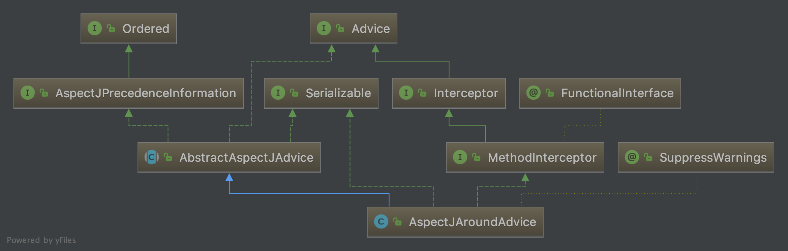

# 使用自动代理
## 前言
Spring允许使用自动代理Bean,其原理为通过BeanPostProcessor处理容器中的Bean.为当前bean查找可用的`Advisor（切面）`.Spirng中的Advisor持有`Advice`，而Advice类似一种拦截器,表示对原始调用作增强。如AspectJ中的around切点的处理类图为:



## BeanNameAutoProxyCreator
> The BeanNameAutoProxyCreator class is a BeanPostProcessor that automatically creates AOP proxies for beans with names that match literal values or wildcards. The following example shows how to create a BeanNameAutoProxyCreator bean.

```Java
<bean class="org.springframework.aop.framework.autoproxy.BeanNameAutoProxyCreator">
    <property name="beanNames" value="jdk*,onlyJdk"/>
    <property name="interceptorNames">
        <list>
            <value>myInterceptor</value>
        </list>
    </property>
</bean>
```

BeanNameAutoProxyCreator是一个PostBeanProcessor,容器获取单例对象时,会执行`getEarlyBeanReference`方法，该方法作查找容器里的`Advisor`,BeanNameAutoProxyCreator直接返回常量:
`Object[] PROXY_WITHOUT_ADDITIONAL_INTERCEPTORS = new Object[0]`
表示不依赖其他Advisor.
