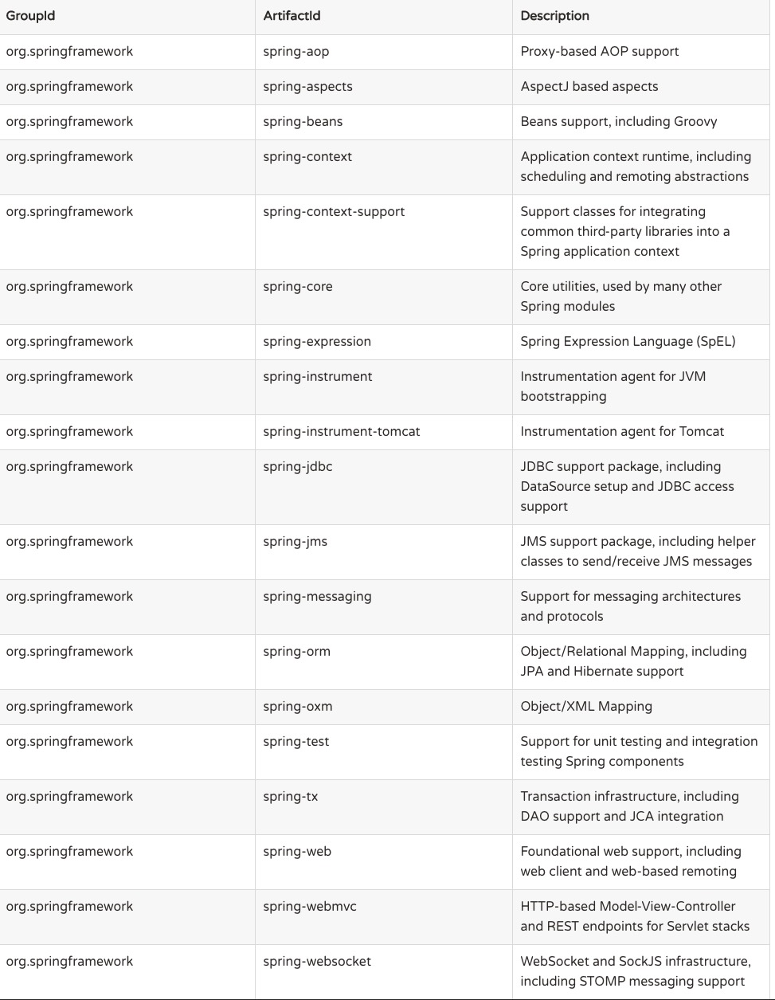

# Spring框架概述
## Spring模块
> The Spring Framework consists of features organized into about 20 modules. These modules are grouped into Core Container, Data Access/Integration, Web, AOP (Aspect Oriented Programming), Instrumentation, Messaging, and Test, as shown in the following diagram.

## 典型的使用场景

## Spring常用模块构件

