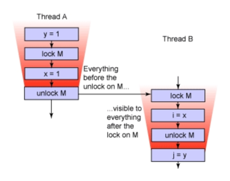
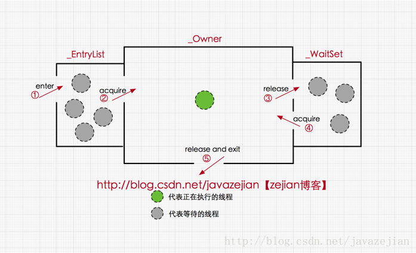

# 搞懂Synchronized
## 前言
互斥同步是常见的一种并发正确性保障手段。同步是指在多个线程并发访问共享数据时，保证共享数据在同一时刻只被一个(或者一些，使用信号量)线程使用。而互斥是实现同步的一种手段，临界区（Critical Section），互斥量（Mutex)和信号量（Semaphore)都是主要的互斥实现方式。因此在这四个字里面：互斥是因，同步是果，互斥是方法，同步是目的。

synchronized关键字是Java语言提供的原始关键字，是最基本的互斥同步实现。在Synchronized修饰的同步块代码里，经过编译后会在同步块前后生成monitorenter与monitorexit两个字节码指令。如果修饰的是实例方法或静态方法，内部锁定的对象则是当前方法的实例对象或Class对象，编译后的方法在方法访问标识上，生成一个ACC_SYNCHONIZED的标识，标识需要作互斥同步访问。

synchronized除了用来实现线程间的互斥访问，还有一个重要作用就是实现线程可见性(主内存共享变量被其他线程可见)，这是因为Java内存模型对synchronized语义作了如下保证：



即当ThreadA释放锁M时，它所写过的变量（比如，x和y，存在它工作内存中的）都会同步到主存中，而当ThreadB在申请同一个锁M时，ThreadB的工作内存会被设置为无效，然后ThreadB会重新从主存中加载它要访问的变量到它的工作内存中（这时x=1，y=1，是ThreadA中修改过的最新的值）。通过这样的方式来实现ThreadA到ThreadB的线程间的通信。

这实际上是JSR133定义的其中一条happen-before规则。JSR133给Java内存模型定义以下一组happen-before规则，

单线程规则：同一个线程中的每个操作都happens-before于出现在其后的任何一个操作。
对一个监视器的解锁操作happens-before于每一个后续对同一个监视器的加锁操作。
对volatile字段的写入操作happens-before于每一个后续的对同一个volatile字段的读操作。
Thread.start()的调用操作会happens-before于启动线程里面的操作。
一个线程中的所有操作都happens-before于其他线程成功返回在该线程上的join()调用后的所有操作。
一个对象构造函数的结束操作happens-before与该对象的finalizer的开始操作。
传递性规则：如果A操作happens-before于B操作，而B操作happens-before与C操作，那么A动作happens-before于C操作。
实际上这组happens-before规则定义了操作之间的内存可见性，如果A操作happens-before B操作，那么A操作的执行结果（比如对变量的写入）必定在执行B操作时可见。

## 创建线程的方式
> Thread.join()可以使当前线程等待目标线程结束之后才继续运行.

```java
/**
     * 创建线程的三种方式
     * @throws ExecutionException
     * @throws InterruptedException
     */
    @Test
    public void testCreateThread() throws ExecutionException, InterruptedException {

        // 1: 直接继承Thread,重新run方法
        final Thread t1 = new Thread() {
            @Override
            public void run() {
                System.out.println("MyThread Run Here");
            }
        };

        // 2:传入一个Runnable
        final Thread t2 = new Thread(new Runnable() {
            @Override
            public void run() {
                System.out.println("T2 Here");
            }
        });

        // 3: 采用future:本质上还是执行的是Runnable
        FutureTask<Integer> future = new FutureTask<>(new Callable<Integer>() {
            @Override
            public Integer call() throws Exception {
                System.out.println("before sleep, name:" + Thread.currentThread().getName());
                Thread.sleep(3000);
                System.out.println("after sleep, name:" + Thread.currentThread().getName());
                return 0;
            }
        });

        final Thread t3 = new Thread(future, "future-thread");

        t1.start();
        t2.start();
        t3.start();

        t1.join();
        System.out.println("t1 done");
        t2.join();
        System.out.println("t2 done");
        t3.join();
        System.out.println("t3 done");
        System.out.println("future get value: " + future.get());
        System.out.println("Main End");

    }

执行结果：
MyThread Run Here
T2 Here
t1 done
t2 done
before sleep, name:future-thread
after sleep, name:future-thread
t3 done
future get value: 0
Main End
```

## synchronized的三种应用方式
synchronized关键字最主要有以下3种应用方式，下面分别介绍
- 修饰实例方法，作用于当前实例加锁，进入同步代码前要获得当前实例的锁
- 修饰静态方法，作用于当前类对象加锁，进入同步代码前要获得当前类对象的锁
- 修饰代码块，指定加锁对象，对给定对象加锁，进入同步代码库前要获得给定对象的锁

### 修饰实例方法
synchronize实例方法incr编译后的字节码在方法标识上有个：`ACC_SYNCHRONIZED`,用来标识需要作同步控制。
```Java
/**
 * 共享资源
 */
static int i = 0;


public synchronized void incr() {
    i++;
}

编译后:
public synchronized void incr();
  descriptor: ()V
  flags: ACC_PUBLIC, ACC_SYNCHRONIZED
  Code:
    stack=2, locals=1, args_size=1
       0: getstatic     #2                  // Field i:I
       3: iconst_1
       4: iadd
       5: putstatic     #2                  // Field i:I
       8: return
    LineNumberTable:
      line 20: 0
      line 21: 8
    LocalVariableTable:
      Start  Length  Slot  Name   Signature
          0       9     0  this   Lcom/example/start/springdemo/concurrent/SynchronizedUsage;


```
### 修饰静态方法
当synchronized作用于静态方法时，其锁就是当前类的class对象锁。由于静态成员不专属于任何一个实例对象，是类成员，因此通过class对象锁可以控制静态 成员的并发操作。

```Java
public static synchronized void incr() {
    i++;
}
编译后:
public static synchronized void incr();
    descriptor: ()V
    flags: ACC_PUBLIC, ACC_STATIC, ACC_SYNCHRONIZED

```

### 修饰代码块
在某些情况下，我们编写的方法体可能比较大，同时存在一些比较耗时的操作，而需要同步的代码又只有一小部分，如果直接对整个方法进行同步操作，可能会得不偿失，此时我们可以使用同步代码块的方式对需要同步的代码进行包裹，这样就无需对整个方法进行同步操作了，同步代码块的使用示例如下：
```Java
/**
 * 共享资源
 */
static int i = 0;


public void incr() {
    synchronized (this) {
        i++;
    }
}
编译后:
public void incr();
    descriptor: ()V
    flags: ACC_PUBLIC
    Code:
      stack=2, locals=3, args_size=1
         0: aload_0
         1: dup
         2: astore_1
         3: monitorenter
         4: getstatic     #2                  // Field i:I
         7: iconst_1
         8: iadd
         9: putstatic     #2                  // Field i:I
        12: aload_1
        13: monitorexit
        14: goto          22
        17: astore_2
        18: aload_1
        19: monitorexit
        20: aload_2
        21: athrow
        22: return

```
可见修饰同步块编译后生成两条monitorenter与monitorexit的字节码指令，用来控制并发访问。

## synchronized底层语义原理
Java 虚拟机中的同步(Synchronization)基于进入和退出管程(Monitor)对象实现， 无论是显式同步(有明确的 monitorenter 和 monitorexit 指令,即同步代码块)还是隐式同步都是如此。在 Java 语言中，同步用的最多的地方可能是被 synchronized 修饰的同步方法。同步方法 并不是由 monitorenter 和 monitorexit 指令来实现同步的，而是由方法调用指令读取运行时常量池中方法的 ACC_SYNCHRONIZED 标志来隐式实现的，关于这点，稍后详细分析。下面先来了解一个概念Java对象头，这对深入理解synchronized实现原理非常关键。

理解Java对象头与Monitor
在JVM中，对象在内存中的布局分为三块区域：对象头、实例数据和对齐填充。如下：


其中轻量级锁和偏向锁是Java 6 对 synchronized 锁进行优化后新增加的，稍后我们会简要分析。这里我们主要分析一下重量级锁也就是通常说synchronized的对象锁，锁标识位为10，其中指针指向的是monitor对象（也称为管程或监视器锁）的起始地址。每个对象都存在着一个 monitor 与之关联，对象与其 monitor 之间的关系有存在多种实现方式，如monitor可以与对象一起创建销毁或当线程试图获取对象锁时自动生成，但当一个 monitor 被某个线程持有后，它便处于锁定状态。在Java虚拟机(HotSpot)中，monitor是由ObjectMonitor实现的，其主要数据结构如下（位于HotSpot虚拟机源码ObjectMonitor.hpp文件，C++实现的）

```java
ObjectMonitor() {
    _header       = NULL;
    _count        = 0; //记录个数
    _waiters      = 0,
    _recursions   = 0;
    _object       = NULL;
    _owner        = NULL;
    _WaitSet      = NULL; //处于wait状态的线程，会被加入到_WaitSet
    _WaitSetLock  = 0 ;
    _Responsible  = NULL ;
    _succ         = NULL ;
    _cxq          = NULL ;
    FreeNext      = NULL ;
    _EntryList    = NULL ; //处于等待锁block状态的线程，会被加入到该列表
    _SpinFreq     = 0 ;
    _SpinClock    = 0 ;
    OwnerIsThread = 0 ;
  }

```

ObjectMonitor中有两个队列,`_WaitSet`和`_EntryList`,用来保存ObjectWaiter对象列表( 每个等待锁的线程都会被封装成ObjectWaiter对象)，`_owner`指向持有ObjectMonitor对象的线程，当多个线程同时访问一段同步代码时，首先会进入`_EntryList`集合，当线程获取到对象的monitor后进入` _Owner` 区域并把monitor中的owner变量设置为当前线程同时monitor中的计数器count加1，若线程调用 wait() 方法，将释放当前持有的monitor，owner变量恢复为null，count自减1，同时该线程进入 WaitSet集合中等待被唤醒。若当前线程执行完毕也将释放monitor(锁)并复位变量的值，以便其他线程进入获取monitor(锁)。如下图所示



由此看来，monitor对象存在于每个Java对象的对象头中(存储的指针的指向)，synchronized锁便是通过这种方式获取锁的，也是为什么Java中任意对象可以作为锁的原因，同时也是notify/notifyAll/wait等方法存在于顶级对象Object中的原因.

synchronized修饰的实例方法，静态方法或同步块，从字节码层面虽有些差异，但jvm在执行时都通过对象头的标识获取monitor对象，从而作实现互斥。同时我们还必须注意到的是在Java早期版本中，synchronized属于重量级锁，效率低下，因为监视器锁（monitor）是依赖于底层的操作系统的Mutex Lock来实现的，而操作系统实现线程之间的切换时需要从用户态转换到核心态，这个状态之间的转换需要相对比较长的时间，时间成本相对较高，这也是为什么早期的synchronized效率低的原因。庆幸的是在Java 6之后Java官方对从JVM层面对synchronized较大优化，所以现在的synchronized锁效率也优化得很不错了，Java 6之后，为了减少获得锁和释放锁所带来的性能消耗，引入了轻量级锁和偏向锁，接下来我们将简单了解一下Java官方在JVM层面对synchronized锁的优化。

## Java虚拟机对synchronized的优化
锁的状态总共有四种，无锁状态、偏向锁、轻量级锁和重量级锁。随着锁的竞争，锁可以从偏向锁升级到轻量级锁，再升级的重量级锁，但是锁的升级是单向的，也就是说只能从低到高升级，不会出现锁的降级，关于重量级锁，前面我们已详细分析过，下面我们将介绍偏向锁和轻量级锁以及JVM的其他优化手段，这里并不打算深入到每个锁的实现和转换过程更多地是阐述Java虚拟机所提供的每个锁的核心优化思想，毕竟涉及到具体过程比较繁琐，如需了解详细过程可以查阅《深入理解Java虚拟机原理》。

### 偏向锁
偏向锁是Java 6之后加入的新锁，它是一种针对加锁操作的优化手段，经过研究发现，在大多数情况下，锁不仅不存在多线程竞争，而且总是由同一线程多次获得，因此为了减少同一线程获取锁(会涉及到一些CAS操作,耗时)的代价而引入偏向锁。偏向锁的核心思想是，如果一个线程获得了锁，那么锁就进入偏向模式，此时Mark Word 的结构也变为偏向锁结构，当这个线程再次请求锁时，无需再做任何同步操作，即获取锁的过程，这样就省去了大量有关锁申请的操作，从而也就提供程序的性能。所以，对于没有锁竞争的场合，偏向锁有很好的优化效果，毕竟极有可能连续多次是同一个线程申请相同的锁。但是对于锁竞争比较激烈的场合，偏向锁就失效了，因为这样场合极有可能每次申请锁的线程都是不相同的，因此这种场合下不应该使用偏向锁，否则会得不偿失，需要注意的是，偏向锁失败后，并不会立即膨胀为重量级锁，而是先升级为轻量级锁。下面我们接着了解轻量级锁。

### 轻量级锁
倘若偏向锁失败，虚拟机并不会立即升级为重量级锁，它还会尝试使用一种称为轻量级锁的优化手段(1.6之后加入的)，此时Mark Word 的结构也变为轻量级锁的结构。轻量级锁能够提升程序性能的依据是“对绝大部分的锁，在整个同步周期内都不存在竞争”，注意这是经验数据。需要了解的是，轻量级锁所适应的场景是线程交替执行同步块的场合，如果存在同一时间访问同一锁的场合，就会导致轻量级锁膨胀为重量级锁。

### 自旋锁
轻量级锁失败后，虚拟机为了避免线程真实地在操作系统层面挂起，还会进行一项称为自旋锁的优化手段。这是基于在大多数情况下，线程持有锁的时间都不会太长，如果直接挂起操作系统层面的线程可能会得不偿失，毕竟操作系统实现线程之间的切换时需要从用户态转换到核心态，这个状态之间的转换需要相对比较长的时间，时间成本相对较高，因此自旋锁会假设在不久将来，当前的线程可以获得锁，因此虚拟机会让当前想要获取锁的线程做几个空循环(这也是称为自旋的原因)，一般不会太久，可能是50个循环或100循环，在经过若干次循环后，如果得到锁，就顺利进入临界区。如果还不能获得锁，那就会将线程在操作系统层面挂起，这就是自旋锁的优化方式，这种方式确实也是可以提升效率的。最后没办法也就只能升级为重量级锁了。

### 锁消除
消除锁是虚拟机另外一种锁的优化，这种优化更彻底，Java虚拟机在JIT编译时(可以简单理解为当某段代码即将第一次被执行时进行编译，又称即时编译)，通过对运行上下文的扫描，去除不可能存在共享资源竞争的锁，通过这种方式消除没有必要的锁，可以节省毫无意义的请求锁时间，如下StringBuffer的append是一个同步方法，但是在add方法中的StringBuffer属于一个局部变量，并且不会被其他线程所使用，因此StringBuffer不可能存在共享资源竞争的情景，JVM会自动将其锁消除。

### 关于synchronized 可能需要了解的关键点
#### synchronized的可重入性
从互斥锁的设计上来说，当一个线程试图操作一个由其他线程持有的对象锁的临界资源时，将会处于阻塞状态，但当一个线程再次请求自己持有对象锁的临界资源时，这种情况属于重入锁，请求将会成功，在java中synchronized是基于原子性的内部锁机制，是可重入的，因此在一个线程调用synchronized方法的同时在其方法体内部调用该对象另一个synchronized方法，也就是说一个线程得到一个对象锁后再次请求该对象锁，是允许的，这就是synchronized的可重入性。
正如代码所演示的，在获取当前实例对象锁后进入synchronized代码块执行同步代码，并在代码块中调用了当前实例对象的另外一个synchronized方法，再次请求当前实例锁时，将被允许，进而执行方法体代码，这就是重入锁最直接的体现，需要特别注意另外一种情况，当子类继承父类时，子类也是可以通过可重入锁调用父类的同步方法。注意由于synchronized是基于monitor实现的，因此每次重入，monitor中的计数器仍会加1。

## 等待唤醒机制与synchronized
所谓等待唤醒机制本篇主要指的是notify/notifyAll和wait方法，在使用这3个方法时，必须处于synchronized代码块或者synchronized方法中，否则就会抛出IllegalMonitorStateException异常，这是因为调用这几个方法前必须拿到当前对象的监视器monitor对象，也就是说notify/notifyAll和wait方法依赖于monitor对象，在前面的分析中，我们知道monitor 存在于对象头的Mark Word 中(存储monitor引用指针)，而synchronized关键字可以获取 monitor ，这也就是为什么notify/notifyAll和wait方法必须在synchronized代码块或者synchronized方法调用的原因。
```java
synchronized (obj) {
       obj.wait();
       obj.notify();
       obj.notifyAll();         
 }
```
需要特别理解的一点是，与sleep方法不同的是wait方法调用完成后，线程将被暂停，但wait方法将会释放当前持有的监视器锁(monitor)，直到有线程调用notify/notifyAll方法后方能继续执行，而sleep方法只让线程休眠并不释放锁。同时notify/notifyAll方法调用后，并不会马上释放监视器锁，而是在相应的synchronized(){}/synchronized方法执行结束后才自动释放锁

注上述内容有部分摘要自原文链接：https://blog.csdn.net/javazejian/java/article/details/72828483
