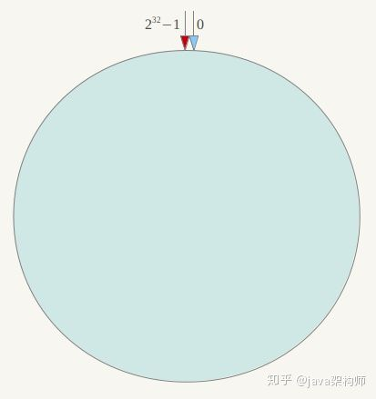
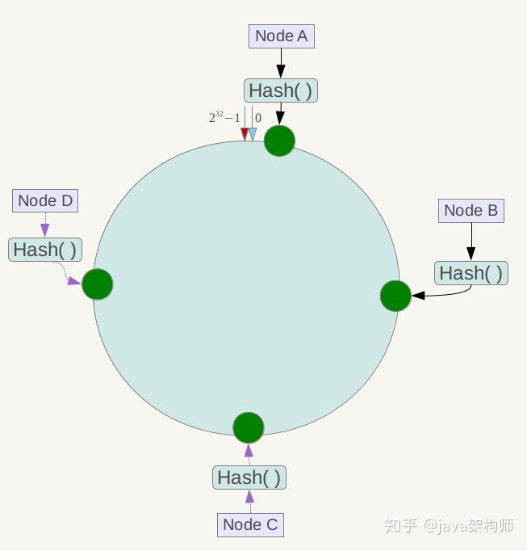
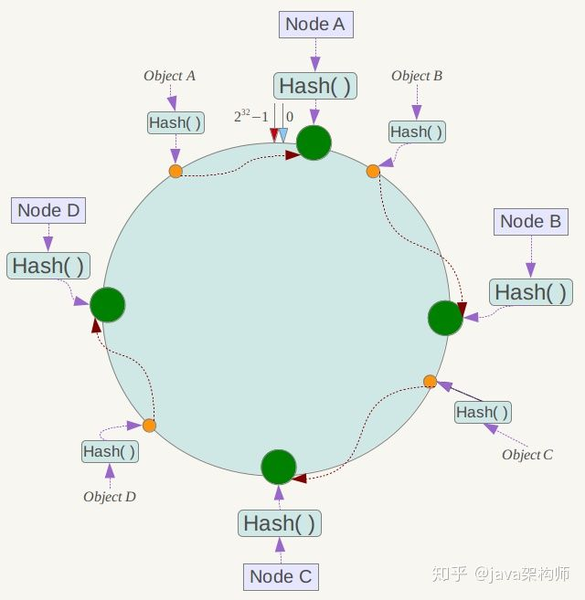
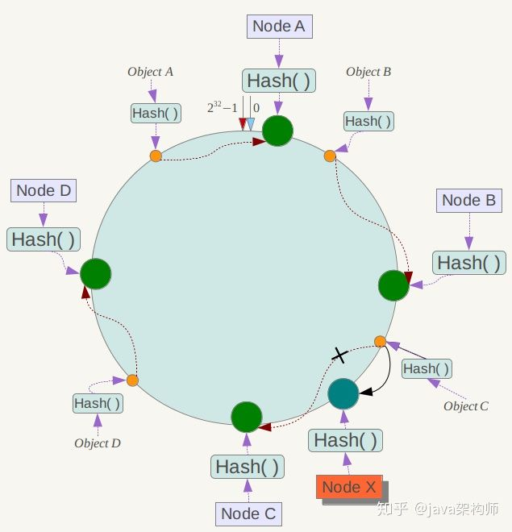
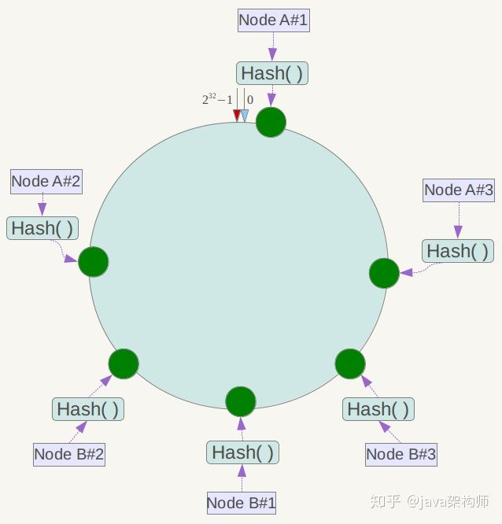
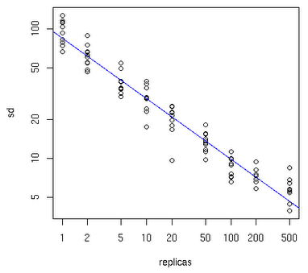

# 搞懂一致性Hash算法
## 前言
哈希算法是一种应用类似f(x) = y的函数，将一个原始值映射为一个新值，常用于键值对的数据结构。一致性哈希算法是一种特殊的哈希算法，多用于分布式环境中的缓存服务器选址，或远程调用服务器选址等场景，一致性的含义为：对请求数据与服务器节点都运用相同的Hash算法，此为一致性之意。

## 一致性Hash
对节点和数据，都做一次hash运算，然后比较节点和数据的hash值，数据值和节点最相近的节点作为处理节点。为了分布得更均匀，通过使用虚拟节点的方式，每个节点计算出n个hash值，均匀地放在hash环上这样数据就能比较均匀地分布到每个节点。

### 原理
#### 抽象的环形空间
按照常用的hash算法来将对应的key哈希到一个具有2^32次方个节点的空间中，即0 ~ (2^32)-1的数字空间中。现在我们可以将这些数字头尾相连，想象成一个闭合的环形。



#### 映射服务器节点
将各个服务器使用Hash进行一个哈希，具体可以选择服务器的ip或唯一主机名作为关键字进行哈希，这样每台机器就能确定其在哈希环上的位置。假设我们将四台服务器使用ip地址哈希后在环空间的位置如下：



#### 映射数据
现在我们将objectA、objectB、objectC、objectD四个对象通过特定的Hash函数计算出对应的key值，然后散列到Hash环上,然后从数据所在位置沿环顺时针“行走”，第一台遇到的服务器就是其应该定位到的服务器。



#### 服务器的删除与添加
如果此时NodeC宕机了，此时Object A、B、D不会受到影响，只有Object C会重新分配到Node D上面去，而其他数据对象不会发生变化

如果在环境中新增一台服务器Node X，通过hash算法将Node X映射到环中，通过按顺时针迁移的规则，那么Object C被迁移到了Node X中，其它对象还保持这原有的存储位置。通过对节点的添加和删除的分析，一致性哈希算法在保持了单调性的同时，还是数据的迁移达到了最小，这样的算法对分布式集群来说是非常合适的，避免了大量数据迁移，减小了服务器的的压力。



#### 虚拟节点
到目前为止一致性hash也可以算做完成了，但是有一个问题还需要解决，那就是平衡性。从下图我们可以看出，当服务器节点比较少的时候，会出现一个问题，就是此时必然造成大量数据集中到一个节点上面，极少数数据集中到另外的节点上面。
为了解决这种数据倾斜问题，一致性哈希算法引入了虚拟节点机制，即对每一个服务节点计算多个哈希，每个计算结果位置都放置一个此服务节点，称为虚拟节点。具体做法可以先确定每个物理节点关联的虚拟节点数量，然后在ip或者主机名后面增加编号。例如上面的情况，可以为每台服务器计算三个虚拟节点，于是可以分别计算 “Node A#1”、“Node A#2”、“Node A#3”、“Node B#1”、“Node B#2”、“Node B#3”的哈希值，于是形成六个虚拟节点：



一个物理节点应该拆分为多少虚拟节点，下面可以先看一张图：



横轴表示需要为每台福利服务器扩展的虚拟节点倍数，纵轴表示的是实际物理服务器数。可以看出，物理服务器很少，需要更大的虚拟节点；反之物理服务器比较多，虚拟节点就可以少一些。比如有10台物理服务器，那么差不多需要为每台服务器增加100~200个虚拟节点才可以达到真正的负载均衡。

## Java实现
### 数据结构选择
一致性Hash算法的关键点为在统一的有序环形空间里查找hash值比目标Key大的第一个hash值。本质上是做一个排序与查找，对应的实现可以用`ArrayList+排序`,或`LinkedList+遍历+排序`。数据量较大时，这两种算法的时间复杂度都较高。另一种较好的方式是排序二叉树，如AVL与红黑树。在JDK里提供了红黑树TreeMap的实现，可以开箱即用，`TreeMap`中和了排序与查找的性质，在时间与空间复杂度效率上都较好，在API功能上提供了`tailMap`的方法，返回大于Key的所有K-V子Map.很实用在一致性Hash算法中的查找。

### Hash算法选择
在分布式集群部署场景下，服务器的IP或`host name`都有一定的相似性，采用Java里默认String重写的hashCode，分散性差，大多的server的hashcode相差不大，因此无法做到很好的均衡效果。示例：

```java
@Test
public void testUserStringHashCode() {
    System.out.println("192.168.0.0的哈希值：" + "192.168.0.0".hashCode());
    System.out.println("192.168.0.1的哈希值：" + "192.168.0.1".hashCode());
    System.out.println("192.168.0.2的哈希值：" + "192.168.0.2".hashCode());
    System.out.println("192.168.0.3的哈希值：" + "192.168.0.3".hashCode());
    System.out.println("192.168.0.4的哈希值：" + "192.168.0.4".hashCode());
}

192.168.0.0的哈希值：55965011
192.168.0.1的哈希值：55965012
192.168.0.2的哈希值：55965013
192.168.0.3的哈希值：55965014
192.168.0.4的哈希值：55965015
```

环形空间的范围为[0, 2^32-1],最大值为4294967295,当前server的分布只占据了一小范围,可见分布在环形空间太密集，不分散。很容易造成大量请求都落到部分的节点上。

>综上，String重写的hashCode()方法在一致性Hash算法中没有任何实用价值，得找个算法重新计算HashCode。这种重新计算Hash值的算法有很多，比如CRC32_HASH、FNV1_32_HASH、KETAMA_HASH等，其中KETAMA_HASH是默认的MemCache推荐的一致性Hash算法，用别的Hash算法也可以，比如FNV1_32_HASH算法的计算效率就会高一些。

### 一致性Hash算法实现版本：不带虚拟节点与带虚拟节点
```Java
/**
 * @author xiele.xl
 * @date 2020-05-21 14:54
 */
public class ConsistentHash {

    private final TreeMap<Integer, Server> ring = new TreeMap<>();


    private static final class Server {

        private String url;

        public Server(String url) {
            this.url = url;
        }

        @Override
        public String toString() {
            return "Server{" +
                "url='" + url + '\'' +
                '}';
        }
    }

    /**
     * 初始化hash环
     * 设定服务器server的格式为ip:port
     *
     * @param servers
     */
    public void initRing(List<Server> servers) {

        servers.stream().forEach(item -> {
                final int hash = getHash(item.url);
                System.out.println(String.format("server node=%s, hash=%s", item.url, hash));
                ring.put(hash, new Server(item.url));
            }
        );

    }

    /**
     * 初始化带虚拟节点的Server
     * @param servers
     */
    public void initRingWithVirtualNode(List<Server> servers) {
        servers.stream().forEach(item -> {
                for (int i = 0; i < 10; i++) {
                    String newItem = item.url + "#" + i;
                    final int hash = getHash(newItem);
                    System.out.println(String.format("server node=%s, vnode=%s,hash=%s", item, newItem,  hash));
                    ring.put(hash, new Server(newItem));
                }

            }
        );
    }

    /**
     * 根据请求的key查找对应的server node
     *
     * @param key
     * @return
     */
    public Server findServer(String key) {

        final int hashForKey = getHash(key);
        System.out.println("request key hash=" + hashForKey);

        Entry<Integer, Server> entry = ring.tailMap(hashForKey, true).firstEntry();
        if (entry == null) {
            entry = ring.firstEntry();
        }

        return entry.getValue();

    }


    /**
     * 使用FNV1_32_HASH算法计算服务器的Hash值,这里不使用重写hashCode的方法
     *
     * @param str
     * @return
     */
    private static int getHash(String str) {

        final int p = 16777619;
        int hash = (int)2166136261L;
        for (int i = 0; i < str.length(); i++) { hash = (hash ^ str.charAt(i)) * p; }
        hash += hash << 13;
        hash ^= hash >> 7;
        hash += hash << 3;
        hash ^= hash >> 17;
        hash += hash << 5;

        // 如果算出来的值为负数则取其绝对值
        if (hash < 0) { hash = Math.abs(hash); }
        return hash;
    }

    @Test
    public void testFindServer() {

        ConsistentHash ch = new ConsistentHash();
        ch.initRingWithVirtualNode(new ArrayList<>(Arrays.asList(
            new Server("30.23.224.81:12200"),
            new Server("30.23.224.82:12200"),
            new Server("30.23.224.83:12200"),
            new Server("30.23.224.84:12200"),
            new Server("30.23.224.85:12200")
        )));

        String key = "hello,world";
        Server server = ch.findServer(key);

        System.out.println(String.format("find server, key=%s,server=%s", key, server));
    }

}

运行结果:
server node=30.23.224.81:12200, vnode=30.23.224.81:12200#0,hash=267666629
server node=30.23.224.81:12200, vnode=30.23.224.81:12200#1,hash=808533591
server node=30.23.224.81:12200, vnode=30.23.224.81:12200#2,hash=1687365852
server node=30.23.224.81:12200, vnode=30.23.224.81:12200#3,hash=798514940
server node=30.23.224.81:12200, vnode=30.23.224.81:12200#4,hash=978985582
server node=30.23.224.81:12200, vnode=30.23.224.81:12200#5,hash=2132577108
server node=30.23.224.81:12200, vnode=30.23.224.81:12200#6,hash=646115721
server node=30.23.224.81:12200, vnode=30.23.224.81:12200#7,hash=115609433
server node=30.23.224.81:12200, vnode=30.23.224.81:12200#8,hash=1693947362
server node=30.23.224.81:12200, vnode=30.23.224.81:12200#9,hash=820130953
server node=30.23.224.82:12200, vnode=30.23.224.82:12200#0,hash=2086351301
server node=30.23.224.82:12200, vnode=30.23.224.82:12200#1,hash=1416515605
server node=30.23.224.82:12200, vnode=30.23.224.82:12200#2,hash=459114849
server node=30.23.224.82:12200, vnode=30.23.224.82:12200#3,hash=193293835
server node=30.23.224.82:12200, vnode=30.23.224.82:12200#4,hash=2049843152
server node=30.23.224.82:12200, vnode=30.23.224.82:12200#5,hash=570195581
server node=30.23.224.82:12200, vnode=30.23.224.82:12200#6,hash=1683324189
server node=30.23.224.82:12200, vnode=30.23.224.82:12200#7,hash=186930102
server node=30.23.224.82:12200, vnode=30.23.224.82:12200#8,hash=869762788
server node=30.23.224.82:12200, vnode=30.23.224.82:12200#9,hash=1996236454
server node=30.23.224.83:12200, vnode=30.23.224.83:12200#0,hash=1373522883
server node=30.23.224.83:12200, vnode=30.23.224.83:12200#1,hash=1620442417
server node=30.23.224.83:12200, vnode=30.23.224.83:12200#2,hash=361815801
server node=30.23.224.83:12200, vnode=30.23.224.83:12200#3,hash=374550472
server node=30.23.224.83:12200, vnode=30.23.224.83:12200#4,hash=1633432850
server node=30.23.224.83:12200, vnode=30.23.224.83:12200#5,hash=451347877
server node=30.23.224.83:12200, vnode=30.23.224.83:12200#6,hash=739278830
server node=30.23.224.83:12200, vnode=30.23.224.83:12200#7,hash=842256790
server node=30.23.224.83:12200, vnode=30.23.224.83:12200#8,hash=1320066887
server node=30.23.224.83:12200, vnode=30.23.224.83:12200#9,hash=1021230837
server node=30.23.224.84:12200, vnode=30.23.224.84:12200#0,hash=20200109
server node=30.23.224.84:12200, vnode=30.23.224.84:12200#1,hash=489102096
server node=30.23.224.84:12200, vnode=30.23.224.84:12200#2,hash=503441929
server node=30.23.224.84:12200, vnode=30.23.224.84:12200#3,hash=585373937
server node=30.23.224.84:12200, vnode=30.23.224.84:12200#4,hash=195537698
server node=30.23.224.84:12200, vnode=30.23.224.84:12200#5,hash=335124402
server node=30.23.224.84:12200, vnode=30.23.224.84:12200#6,hash=481750680
server node=30.23.224.84:12200, vnode=30.23.224.84:12200#7,hash=147248156
server node=30.23.224.84:12200, vnode=30.23.224.84:12200#8,hash=1459362027
server node=30.23.224.84:12200, vnode=30.23.224.84:12200#9,hash=611893684
server node=30.23.224.85:12200, vnode=30.23.224.85:12200#0,hash=31167799
server node=30.23.224.85:12200, vnode=30.23.224.85:12200#1,hash=1632282222
server node=30.23.224.85:12200, vnode=30.23.224.85:12200#2,hash=1108221530
server node=30.23.224.85:12200, vnode=30.23.224.85:12200#3,hash=903545256
server node=30.23.224.85:12200, vnode=30.23.224.85:12200#4,hash=1696334375
server node=30.23.224.85:12200, vnode=30.23.224.85:12200#5,hash=136165989
server node=30.23.224.85:12200, vnode=30.23.224.85:12200#6,hash=1703968952
server node=30.23.224.85:12200, vnode=30.23.224.85:12200#7,hash=1429317432
server node=30.23.224.85:12200, vnode=30.23.224.85:12200#8,hash=732640802
server node=30.23.224.85:12200, vnode=30.23.224.85:12200#9,hash=1688156986
request key hash=1659918577
find server, key=hello,world,server=30.23.224.82:12200

```
## Dubbo中的一致性Hash算法分析
下列内容摘自:Dubbo官方文档
> 一致性 hash 算法由麻省理工学院的 Karger 及其合作者于1997年提出的，算法提出之初是用于大规模缓存系统的负载均衡。它的工作过程是这样的，首先根据 ip 或者其他的信息为缓存节点生成一个 hash，并将这个 hash 投射到 [0, 2^32 - 1] 的圆环上。当有查询或写入请求时，则为缓存项的 key 生成一个 hash 值。然后查找第一个大于或等于该 hash 值的缓存节点，并到这个节点中查询或写入缓存项。如果当前节点挂了，则在下一次查询或写入缓存时，为缓存项查找另一个大于其 hash 值的缓存节点即可。大致效果如下图所示，每个缓存节点在圆环上占据一个位置。如果缓存项的 key 的 hash 值小于缓存节点 hash 值，则到该缓存节点中存储或读取缓存项。比如下面绿色点对应的缓存项将会被存储到 cache-2 节点中。由于 cache-3 挂了，原本应该存到该节点中的缓存项最终会存储到 cache-4 节点中。

一致性 hash 在 Dubbo 中的应用


这里相同颜色的节点均属于同一个服务提供者，比如 Invoker1-1，Invoker1-2，……, Invoker1-160。这样做的目的是通过引入虚拟节点，让 Invoker 在圆环上分散开来，避免数据倾斜问题。所谓数据倾斜是指，由于节点不够分散，导致大量请求落到了同一个节点上，而其他节点只会接收到了少量请求的情况。比如:


如上，由于 Invoker-1 和 Invoker-2 在圆环上分布不均，导致系统中75%的请求都会落到 Invoker-1 上，只有 25% 的请求会落到 Invoker-2 上。解决这个问题办法是引入虚拟节点，通过虚拟节点均衡各个节点的请求量。

### 源码分析
>代码说明:抽象AbstractLoadBalance定义模板方法，由具体的子类实现，其中ConsistentHashLoadBalance表示一致性哈希实现的负载均衡选择算法。

`AbstractLoadBalance.java`
```Java
@Override
public <T> Invoker<T> select(List<Invoker<T>> invokers, URL url, Invocation invocation) {
    if (invokers == null || invokers.isEmpty())
        return null;
    if (invokers.size() == 1)
        return invokers.get(0);
    return doSelect(invokers, url, invocation);
}

protected abstract <T> Invoker<T> doSelect(List<Invoker<T>> invokers, URL url, Invocation invocation);
```

`ConsistentHashLoadBalance.java`

ConsistentHashSelector 的构造方法执行了一系列的初始化逻辑，比如从配置中获取虚拟节点数以及参与 hash 计算的参数下标，默认情况下只使用第一个参数进行 hash。需要特别说明的是，ConsistentHashLoadBalance 的负载均衡逻辑只受参数值影响，具有相同参数值的请求将会被分配给同一个服务提供者。ConsistentHashLoadBalance 不 关系权重，因此使用时需要注意一下。

在获取虚拟节点数和参数下标配置后，接下来要做的事情是计算虚拟节点 hash 值，并将虚拟节点存储到 TreeMap 中。到此，ConsistentHashSelector 初始化工作就完成了。接下来，我们来看看 select 方法的逻辑。
然后就是根据请求参数作实际的选择。代码如下:

```Java
/**
Dubbo中一致性hash算法实现
 * ConsistentHashLoadBalance
 *
 */
public class ConsistentHashLoadBalance extends AbstractLoadBalance {

    private final ConcurrentMap<String, ConsistentHashSelector<?>> selectors = new ConcurrentHashMap<String, ConsistentHashSelector<?>>();

    @SuppressWarnings("unchecked")
    @Override
    protected <T> Invoker<T> doSelect(List<Invoker<T>> invokers, URL url, Invocation invocation) {
        // 获取到远程调用接口的调用方法
        String methodName = RpcUtils.getMethodName(invocation);
        // 由于key形式为:接口名称/分组/版本，每个server提供的都是相同的，因此取第一个即可
        String key = invokers.get(0).getUrl().getServiceKey() + "." + methodName;

        // 这里用一个Map来缓存选择器,目的是复用
        int identityHashCode = System.identityHashCode(invokers);
        ConsistentHashSelector<T> selector = (ConsistentHashSelector<T>) selectors.get(key);
        // 当首次选址或服务提供者的节点通过注册中心推送后，发生了变化，可能增加也可能减少，则
        // selector.identityHashCode != identityHashCode 则成立，因此需要重新选址
        // 重新选址时，仍然复用一致性hash算法
        if (selector == null || selector.identityHashCode != identityHashCode) {
            selectors.put(key, new ConsistentHashSelector<T>(invokers, methodName, identityHashCode));
            selector = (ConsistentHashSelector<T>) selectors.get(key);
        }
        // 提供者列表稳定的时间里，直接从缓存里取出，直接选址，内存高效执行
        return selector.select(invocation);
    }

    /// 这里是具体的一致性Hash实现类，采用静态内部final类，只允许当前外部类调用，禁止被继承
    /// 当前类的职责就是运用一致性hash算法实现负载均衡选址，对外提供选址结果，不需要发布额外的数据或行为，采用内部类是一种很好的封装设计，值得学习
    private static final class ConsistentHashSelector<T> {

        // 带虚拟节点的hash 环形空间,用红黑树存储，内部排序
        private final TreeMap<Long, Invoker<T>> virtualInvokers;

        // 表示虚拟节点的数量
        private final int replicaNumber;

        // 全量提供者的唯一hashcode，用来是否服务节点是否有变化
        private final int identityHashCode;

        private final int[] argumentIndex;

        /// 一致性的初始化逻辑: 初始化TreeMap,虚拟节点数据容器，默认取160
        /// 然后对每个节点初始化160个虚拟节点
        ConsistentHashSelector(List<Invoker<T>> invokers, String methodName, int identityHashCode) {
            this.virtualInvokers = new TreeMap<Long, Invoker<T>>();
            this.identityHashCode = identityHashCode;
            URL url = invokers.get(0).getUrl();
            this.replicaNumber = url.getMethodParameter(methodName, "hash.nodes", 160);
            // 获取参与 hash 计算的参数下标值，默认对第一个参数进行 hash 运算
            String[] index = Constants.COMMA_SPLIT_PATTERN.split(url.getMethodParameter(methodName, "hash.arguments", "0"));
            argumentIndex = new int[index.length];
            for (int i = 0; i < index.length; i++) {
                argumentIndex[i] = Integer.parseInt(index[i]);
            }
            for (Invoker<T> invoker : invokers) {
            String address = invoker.getUrl().getAddress();
            for (int i = 0; i < replicaNumber / 4; i++) {
                // 对 address + i 进行 md5 运算，得到一个长度为16的字节数组
                byte[] digest = md5(address + i);
                // 对 digest 部分字节进行4次 hash 运算，得到四个不同的 long 型正整数
                for (int h = 0; h < 4; h++) {
                    // h = 0 时，取 digest 中下标为 0 ~ 3 的4个字节进行位运算
                    // h = 1 时，取 digest 中下标为 4 ~ 7 的4个字节进行位运算
                    // h = 2, h = 3 时过程同上
                    long m = hash(digest, h);
                    // 将 hash 到 invoker 的映射关系存储到 virtualInvokers 中，
                    // virtualInvokers 需要提供高效的查询操作，因此选用 TreeMap 作为存储结构
                    virtualInvokers.put(m, invoker);
                }
            }
        }

        public Invoker<T> select(Invocation invocation) {
            // 将参数转为 key
            String key = toKey(invocation.getArguments());
            // 对参数 key 进行 md5 运算
            byte[] digest = md5(key);
            // 取 digest 数组的前四个字节进行 hash 运算，再将 hash 值传给 selectForKey 方法，
            // 寻找合适的 Invoker
            return selectForKey(hash(digest, 0));
        }

        /**
          把调用接口的请求参数转换为字符串类型的参数Key
          默认情况下只取第一个参数
          相同参数会路由到相同的节点上
        */
        private String toKey(Object[] args) {
            StringBuilder buf = new StringBuilder();
            for (int i : argumentIndex) {
                // 注: 如果argumentIndex.length=1，只执行一次
                if (i >= 0 && i < args.length) {
                    buf.append(args[i]);
                }
            }
            return buf.toString();
        }

        private Invoker<T> selectForKey(long hash) {
            // 在TreeMap中查找第一个大于或等于当前hash的Invoker
            Map.Entry<Long, Invoker<T>> entry = virtualInvokers.tailMap(hash, true).firstEntry();
            // 如果当前hash大于TreeMap中的所有key,则tailMap返回null.
            // 这种情况取TreeMap的第一个Key也就是头结点
            if (entry == null) {
                entry = virtualInvokers.firstEntry();
            }
            return entry.getValue();
        }

        /// hash 算法,算法思想 看不懂
        private long hash(byte[] digest, int number) {
            return (((long) (digest[3 + number * 4] & 0xFF) << 24)
                    | ((long) (digest[2 + number * 4] & 0xFF) << 16)
                    | ((long) (digest[1 + number * 4] & 0xFF) << 8)
                    | (digest[number * 4] & 0xFF))
                    & 0xFFFFFFFFL;
        }

        /// 这里的md5 函数事实上可以抽取到Util中,放到这里感觉不优雅
        private byte[] md5(String value) {
            MessageDigest md5;
            try {
                md5 = MessageDigest.getInstance("MD5");
            } catch (NoSuchAlgorithmException e) {
                throw new IllegalStateException(e.getMessage(), e);
            }
            md5.reset();
            byte[] bytes;
            try {
                bytes = value.getBytes("UTF-8");
            } catch (UnsupportedEncodingException e) {
                throw new IllegalStateException(e.getMessage(), e);
            }
            md5.update(bytes);
            return md5.digest();
        }

    }

}
```
