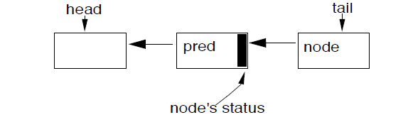
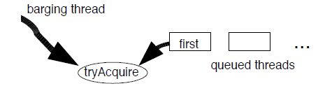

## Java同步框架（译）

### 前言
本文翻译自Doug Lea的论文，编号为NY 13126，旨在为了补充说明AQS的原理与设计实现。如需传播或另作刊摘，请尊重原作者。
文章主要探索AQS的原理与设计决策，因此删减了性能测试等末尾几章节。翻译属于再次加工，很多理解不当或转意有误，还请参见原文。  --Schelor
### 摘要
在J2SE 1.5 java.util.concurrent包中的大多数同步组件（锁、内存屏障等）都是基于一个小框架AbstractQueuedSynchronizer而构建的。该框架提供了一种通用的机制来原子的管理同步状态、线程的阻塞与唤醒以及同步队列的入队与出队操作。本文描述了这种机制的基本原理、设计思路、实现方法、使用方法，还有性能特征。
### 类别与主题
【编程技术】: 并发编程、并行编程
### 一般术语
算法、测量、性能、设计
### 关键词
同步、Java
### 1.简介
Java™发行的J2SE-1.5中引入了java.util.concurrent包，这个包提供了一系列中级并发辅助类，并由JCP组织(Java Community Process)的JSR166(Java Specification Request)创建。在这些同步组件内部，有维护内部同步状态（可用于表示是锁定状态还是未锁定状态）的抽象类，有用于更新或检查同步状态的操作方法，还有用于阻塞线程、唤醒线程的方法。并发包里包含了多种形式的互斥锁、读写锁、信号量、同步屏障(barriers)、异步结果对象（futures）、事件指示器，还有切换队列（handoff queue）。
总所周知，几乎任何一种同步器都可以用于实现其他类型的同步器。例如，就可用重入锁（Reentrant）来构建信号量（Semaphors）, 当然，反过来也一样。然而，这样做却会很复杂, 还会增加很多开销，最后充其量却是二流的工程上的选择。更进一步讲，这种方法从概念上就很不让人很感兴趣。但是如果不用这些，那么单独去设计就需要更底层一些，开发者不应该被强迫用这种转换的方式来实现自己的同步器。幸运的是，JSF166创立了一种围绕AbstractQueuedSynchronizer为核心的框架，用于提供一种通用的机制来满足大多数包里同步组件的使用，而且还能用于用户自定义的其他类。
接下来的内容将讨论同步框架被期望满足的功能需求，设计背后的主要思想和实现，用法示例、还有一些展示性能特性的测量指标。
### 2.需求
#### 2.1 功能
同步器有两种类型的方法：1. 至少一个获取(accire)操作，用于阻塞调用线程直到同步状态对其可用。2. 至少一个释放操作(release),用于更改同步状态以唤醒一个或多个阻塞线程。
java.util.concurrent包没有为同步组件定义统一的API.有些是通过接口来定义的(如Lock)，还有些仅包含的是专业的定制版本。因此acquire和release操作在不同的类间有不同的名称及表现形式。例如，Lock中的lock方法，Semaphore中的acquire方法，CountDownLatch中的await方法，甚至还有FutureTask中的get方法，这些都是对应于框架中的acquire操作。然而，包中的各种类却遵循一致的约定，都支持一惯的用法。当赋予特定的场景中时，每种同步器都支持下列功能：
* 非阻塞的获取同步状态（tryLock）
* 可选性的超时等待
* 中断取消，通常分为可响应中断和不响应中断的版本
同步器根据其对同步状态的管理，提供两种模式来处理同步状态。一是独占模式，表示一次只有一个线程能获取到同步状态。还有就是共享模式，表示一次可以有多个线程能获取到同步状态。常规的锁自然是独占式的，但计数信号量就是共享式的。例如，设定一个计数值，就可允许相应个数的线程同时获取到同步状态。为了能被广泛的使用，框架必须支持这两种类型的操作。
java.util.concurrent包还定义了一个Condition接口，用作监视风格(monitor-style)的等待通知操作。这些操作一般会关联到独占式的一个Lock类上。
#### 2.2 性能指标
Java内置的锁(用synchronized修饰的方法或代码块来访问)一直以来都有性能上的关注，因此已有很多资料来解读它。然而关于它的主要讨论还是集中在单一处理器上如何减少针对单一线程上下文切换的空间消耗(任何Java对象都可作为锁)和时间消耗问题。对于同步器却不用关注这些，编程人员只管在使用时创建即可，不需要想浪费空间的问题。同步器几乎都用于独占式多线程设计中(更多的用在多核处理器上)的资源竞争场景下。虚拟机对于锁的优化主要还是基于零竞争场合下，因此针对多线程的服务端应用程序主要还是会依赖java.util.concurrent包来实现。
对于并发框架的来说，反而主要的性能指标却是可扩展性：要预先的维持效率，特别是面临竞争时。理想情况下，无论有多少线程在竞争，当达到一个同步点后，性能消耗将不会再变化。在这个主要的指标里是当线程被允许经过同步点后但是自身还没有执行完，如何减少总体的时间消耗。然而，还必需平衡对资源的考虑，如CPU总体时间、内存访问量、线程调度开销。
### 3.设计与实现
同步器背后的基本思想很一目了然。
获取同步状态的操作如下：
```java
while (synchronization state does not allow acquire) { //同步状态不能获取
enqueue current thread if not already queued; //如果当前线程没有入队则加入到队列中
possibly block current thread; //可能会阻塞当前线程
}
dequeue current thread if it was queued; //获取到则出队
```
释放同步状态的操作如下：
update synchronization state; //更新状态
if (state may permit a blocked thread to acquire) //如果阻塞线程获取
unblock one or more queued threads; //唤醒线程

支持如上的操作需要三种基本组件的协同工作：
* 原子地管理同步状态
* 阻塞并唤醒线程
* 维护队列
有了这些才能建立一种框架并允许这三种组件独立工作。然而这却带来效率和使用方面的不足。例如，在队列节点中的信息必需保持与唤醒后的线程一致，还必需依据同步状态来决定对外导出方法的签名形式。
同步框架的核心设计方案就是在很多具体使用场景中选择以上三种组件的具体实现类。虽然限制了很多适用性，但却带来了很多灵活性。
#### 3.1 同步状态
AbstractQueuedSynchronizer类用一个32位的Int变量来维护同步状态，并公开getState, setState和compareAndSetState方法来访问或更新同步状态。这些方法依赖于java.util.concurrent.atomic包中的原子操作，atomic包由JSR133提供符合volatile的内存语义读写一致性，底层由load-store指令来实现的compareAndSetState方法，因此，如果当前状态值与预期的值一致的话，就可以原子的设置状态为一个新的值。
限制同步状态为一个32位Int类型是很实用的。由于JSR166还允许在64位Long类型的字段上作原子操作，这又必需在不同平台上作全面的模拟验证，因此又导致了很难执行。在将来，可能新增一个基于64位Long值作为状态的类，但是现在还不用着急。目前32位可以满足大多数应用了。只有java.util.concurrent包中的CyclicBarrier类将需要多位来维护状态，因此一般都用Lock来代替它了。
AbstractQueuedSynchronizer的实现类必须重新定义tryAcquire和tryRelease方法，并以此来实现自定义的获取和释放操作。如果获取到同步状态后，tryAcquire必须返回true。如果新的状态值允许被获取到，tryRelease则必须返回true. 这些方法还能接受一个int类型的参数，用于传递给预期的状态值。例如，在重入锁中，在等待中返回后重新获取锁时，需要重新设置循环计算器。很多同步器都用不着这个参数，因此忽略它就行。
#### 3.2 阻塞
在JSR166之前，除了使用Java内置的锁来实现同步之外，还没有可用的API来阻塞、唤醒线程。一些候选的方法Thread.suspend和Thread.resume在面临不可解决的竞争时还不可用: 如果未阻塞的线程在阻塞的线程执行suspend方法前调用了resume方法，resume方法将不会起作用。
java.util.concurrent.locks包下包含了一个LockSupport类，类中的一些方法就专门用于解决这个问题的。LockSupport.park方法用于阻塞当前线程，只有调用LockSupport.unpark方法才能解除阻塞。一个park对应一个unpark，除此之外park方法只能应用在线程上，不能应用于同步器。线程在一个新的同步器上调用park方法可能会立即返回，因为可能由之前的线程unpark了该线程。然后如果缺少unpark，下一次调用将被阻塞。
这种简单的机制与Solaris-9的线程库和WIN32中的consumable events，还有Linux NPTL线程库原理类似。因此可以高效的映射到常见的Java平台中(然后而当前的Hot Spot JVM在Linux和Solaris中的实现为了适应现有的运行时设计实际上使用的是pthread条件变量).park方法支持相对和绝对的超时，还集成到了Thread.interrupt方法里—利用中断来unpark线程。
#### 3.3 队列
同步框架的核心就是维护阻塞线程的FIFO队列。因此框架是不支持基于优先级的同步。
最近还有一点小争议，就是对于同步队列最合适是使用非阻塞的数据结构，因为他们不需要用低级的锁来构建。基于此，有两种候选版本：Mellor-Crummey and Scott (MCS) locks变体版，Craig, Landin, and Hagersten (CLH) locks变体版本。由于历史原因，CHL锁已经被用作于自旋锁，然而还是比MCS版更合适的用在同步器框架中，因为它能应对一些取消和超时场景。因此选择了CHL队列作为了基础队列，为了便于行文，特意摘除了CHL原始解释中的很多内容。
CHL队列不是很像队列，因为它的入队和出队操作紧密的联系在一起。它是一个链式的队列，通过两个原子式更新的字段head,tail来访问，head和tail在初始化时都会指向一个虚拟节点。
 
新节点入队时使用的是一个原子操作：
` do { pred = tail;
  } while(!tail.compareAndSet(pred, node));
`
释放状态是由节点的前驱节点来完成的，因此一个节点的自旋看起来就像是这样：
`while (pred.status != RELEASED) ; // spin`
出队操作就是节点获取到锁后，然后设置节点为head节点。
`head = node;`
CHL锁的优势就是入队和出队很快，不用加锁，不会阻塞。因此检测是否有线程正在等待就非常快(验证head是否等于tail就行). 释放状态也是分散的，这也避免了一些内存竞争。
在CLH锁的原始版本中，是没有链接的节点的。在自旋锁中，pred变量可以作为一个local变量，然而Scott and Scherer明确地展示在节点中维护前驱节点，CHL锁可以处理超时、还有一些其他形式的取消操作。如果节点的前驱节点被取消后，该节点可以向前使用前驱节点的状态值。
使用CLH队列来阻塞同步器就要提供一种有效的方式来找到节点的后继节点。在自旋锁里，节点仅需要改变自身的状态，然后通知其下一个节点就行，因此链向操作是不必要的。但在阻塞同步器中，节点需要明确的唤醒他的后继节点(下一个)。
AbstractQueuedSynchronizer队列节点包含有一个next节点，由于新增时不需要原子操作，因此compareAndSet方法便不适用，仅简单的赋值就行：
pred.next = node
next节点是一种最优的路径，通过next字段来寻找，如果节点的下一个节点不存在或被取消，就将通过tail节点通过pred字段从尾遍历以准确的找到有效的节点。

对于同步器的修改，还有一种就是用节点中的状态值来控制阻塞、退出自旋。在同步器框架中，线程队列通过调用实现类的tryAcquire方法获取到状态后就可以立即返回，但仅仅release是不够的。
同步器需要控制的是，确保当活动线程处于队列中的head节点时是可以调用tryAcquire方法的，如果调用失败了，则需要重新阻塞自己。这并不需要每个节点的状态标识变化，因为能决定是否可以获取状态的是需要检查当前节点的前驱节点是否是head节点。这不像自旋锁，对于head节点的访问，没有足够的内存竞争来保证是否有效应。然而，取消节点后，需要为状态字段记录相应的值。

队列节点中的状态值也用来避免不必要的park和unpark调用，由于这些方法与底层阻塞原语相当，他们可以避免JVM运行时与操作系统的边界造成的性能开销。在调用park方法前，线程会设置‘信号’位，然后重新检查同步状态。线程释放会清楚这个状态值，这种机制使得节省了线程不必要的阻塞消耗，特别是针对一些Lock类。

或许在同步器框架内的CLH锁和其他语言版本的区别就是节点的回收管理。如果一个节点将不会被用到，则不会再次入队，出队也一样。否则的话，没用的节点将是可达的，这会造成不会被回收。
一些小调整如延迟初始化head和tail节点，因为只有在第一次出现竞争时才会有入队操作。这些都描述在了J2SE1.5发行的源码文档中。
忽略细节的话，获取同步状态的基本操作(独占、不响应中断、不超时)形式就如：
```java
if (!tryAcquire(arg)) {
    node = create and enqueue new node;
    pred = node's effective predecessor;
    while (pred is not head node || !tryAcquire(arg)) {
    if (pred's signal bit is set)
    park();
    else
    compareAndSet pred's signal bit to true;
    pred = node's effective predecessor;
  }
  head = node;
}
```
还有释放的操作：

```java
if (tryRelease(arg) && head node's signal bit is set) {
   compareAndSet head's signal bit to false;
   unpark head's successor, if one exists
}
```
获取同步状态的循环次数自然要依赖tryAcquire方法的具体实现。忽略线程线程调度开销，分摊给每个线程，如果不考虑取消的情况，获取与释放操作的时间复杂度就是O(1)。
节点的取消主要是由于park方法带来的线程中断或超时，在入队时会检查节点状态，如果是取消状态，则需要重新链向到一个有效的节点。节点被取消后，需要决定上一个节点和下一个节点，自然会有O(n)的遍历情况。由于线程被取消后不会再被阻塞，链向的节点和状态将会相对稳定。

#### 3.4 条件队列
为了维护独占式同步并符合Lock接口，同步器框架提供了一个ConditionObject类。任意数量的条件对象都可以附属到一个Lock对象上，用以提供经典监视器风格的await，signal，signalAll操作，还带有超时，线程监控的功能。

ConditionObject类使得条件可以高效的与其他同步操作集成到一起。这个类仅支持Java风格的监视器访问规则，当前线程只有按条件去获取锁，因此ConditionObject可以结合ReentrantLock一起就具有Java内置锁的功能，当然区别仅仅是方法名称不同而已，不过这种方式还具有额外的功能，用户还可以在同一个Lock上声明多个condition对象。

ConditionObject与同步器公用了同一个内部队列节点，但是维护在独立的一个条件队列上。signal操作把节点条件队列转移到同步队列中，但在获取锁之前可以不用唤醒对应的线程。
基本的等待操作如下：
```java
create and add new node to condition queue;
release lock;
block until node is on lock queue;
re-acquire lock;
```
而通知操作如下：
```java
transfer the first node from condition queue to lock queue;
```
由于这些操作都是在持有锁的情况下才能执行，因此可以使用一种有序的链向队列(用节点中的nextWaiter字段)来维护条件队列。转移操作仅仅就从条件队列中的第一个节点取消链接，并用CAS新增到同步队列中的尾节点。

而主要复杂的处理由于线程超时和中断后的节点取消。取消和通知可能同时发生，这种情况下的竞争Java内置的监视器也会有。如在JSR133中改进的方案，如果中断先于通知，然后必须await，如果重新获取到锁后，然后抛InterruptedException异常。如果中断晚于通知，则无需抛异常就可以直接返回，但是需要设置线程的中断位标识
为了维持正确的次序，节点中的状态位记录有一个特定值，以此来区别节点是否已经转移。设置通知状态位和取消位用的是compareAndSet方式，如果当前结点错过，则会转移该节点的下一个节点到同步队列中。如果该节点没有取消成功，则必须终止转移，然后等待下次获取锁。后者这种情况引入了一种潜在无界自旋机制，取消后的等待不能参与重新获取锁，直到该节点成功的加入到同步队列中，因此该节点需要一直自旋。这种情况比较少见，还借用了Thread.yield方法来提高隐式调度。在其他的情况下，这种基础的机制不会有自旋和线程yield,这在单处理器上也能保持合理的性能效果。

### 4. 使用
AbstractQueuedSynchronizer结合很多功能并充当一个模板方法模式来作为一个基类同步器。子类仅需定义并实现与状态更新相关的acquire和release方法。然而，AbstractQueuedSynchronizer的子类其自身不能作为一种抽象数据类型，因为基类已经暴露的一些必要的方法需要在内部控制获取与释放的策略，但这需要对其他用户类是不可见的。所有的java.util.concurrent包下的同步器类都声明称成一个私有的内部AbstractQueuedSynchronizer子类,然后委托所有的同步方法给这个内部子类，同样指定相同的方法名称。
举个例子。这里有个小型的Mutux类，它用0来表示未锁定，用1来表示已锁定，还也不需要参数来支持同步方法，因此可以忽略其他方法。
```java
class Mutex {
  class Sync extends AbstractQueuedSynchronizer {
    public boolean tryAcquire(int ignore) {
    return compareAndSetState(0, 1);
    }
    public boolean tryRelease(int ignore) {
    setState(0); return true;
    }
  }
  private final Sync sync = new Sync();
  public void lock() { sync.acquire(0); }
  public void unlock() { sync.release(0); }
}
```
这个样例的完整版和使用指南在J2SE的文档中，当然还有很多变体版本。
说来也奇怪，构建一个对性能很敏感的互斥锁也需要联合这些委托方法和虚方法。但这也是一种现代动态编译器需要关注的面向对象的设计，他们也倾与优化这些开销，至少是在频繁调用的代码上做优化。

AbstractQueuedSynchronizer还提供了很多方法来辅助同步类在策略上的控制。例如，它包含有超时和响应中断的获取方法，还有一组平行于独占式方法的共享式方法tryAcquireShared和tryReleaseShared。这些方法用来告知同步框架，将来可能有很多形式来获取同步状态，如因连续信号唤醒的多个线程去获取同步资源。

#### 4.1 控制公平性

即使同步组件是基于FIFO的队列，他们也不一定是公平的。注意到3.3节中的获取算法，tryAcquire方法中检查是在入队之前执行的，因此新来的获取请求可以截断队列头节点线程的预期执行。
闯入队列策略一般能带来更高的吞吐量，在锁可用时，但没有合适的线程出现(下一个线程可能在解除阻塞过程中)，它减少了一定的时间。同时，由于只允许一个线程获取锁，然后再释放，它避免这种过度的无效率的竞争。开发者创建同步器，自定义tryAcquire方法后想多次获取锁，因此就可以用这种闯入效应。

闯入队列同步器仅有概率性质的公平，头节点线程与闯入的线程有公平的机会去竞争锁，如果失败了则重新阻塞并尝试再次获取。
然而，如果新来的线程先到的话，队列中的头节点线程将很难获取到锁，几乎总是重新阻塞，自然的它的下一个节点依然是阻塞的。在短暂持有锁的同步器中，在头线程被唤醒期间，如果是多核处理器，都已经有很多闯入线程已经获取过锁了。正如，网络传输时，由一个或多个线程来维持进度，那么从概率上都会避免很多线程饥饿的情况。

当需要更多公平时，也是很简单就可以调整。程序如果严格限制公平的话，如果当前线程不在队列的头位置，可以在tryAcquire方法中返回false。可以用getFirstQueuedThread方法来检查是否是头节点线程。
一个更快、更少限制的版本是,当同步队列位空时，允许tryAcquire方法返回true,在这种情况下，多个线程去竞争锁，通常有些线程还不用进入队列。这种策略随见于java并发包中的各种同步组件。
然而，在实践中是不能保证公平性的，因为Java语言规范没有提供线程调度保证。

#### 4.2 同步组件

这里列举了一些java.util.concurrent包中基于同步器框架而实现的一些同步组件。
ReentrantLock(重入锁)用同步状态来存放(循环)锁计数量。线程获取到锁后，重入锁将记录当前线程获取锁的次数，还会检测无效的异常状态。还提供了ConditionObject,并公开相应的监视、检查线程的方法。ReentrantLock还可选的支持公平与非公平模式，在其内部声明了两个不同的AbstractQueuedSynchronizer的子类(公平模式的不支持线程闯入),在构造方法中只需设置相应的参数就可以创建ReentrantLock实例。

ReentrantReadWriteLock(读写锁)用同步状态的前16位来记录写计数，剩余的后16位来记录读计数。WriteLock写锁和ReentrantLock结构相似，而ReadLock读锁采用acquireShared方法来控制多个线程访问资源。

Semaphore(信号量，计数信号)类用同步状态来持有当前的计数器，它在acquireShared方法中定义计数的自减，如果是负数则阻塞线程。在tryRelease方法中自增计数，如果是正数则唤醒相应的线程。

CountDownLatch类用同步状态来表示当前的计数线程，当计数器变成0时，便可以获取到状态值。

FutureTask类用同步状态来表示future对象的运行时状态(初始状态，运行中，取消，完成)，调用release方法来设置或取消future，等待计算完成后，通过acquire方法来解除线程的阻塞行为。

SynchronousQueue(CSP风格的转移)用内部等待节点来协调生产者和消费者，使用同步状态来运行生产者继续进行，然后等待消费者取走任务。同样，反过来也一样。

使用java并发包的用户自然会在应用中自定义同步器。在这些第三方的同步组件里，有很多出色的但并发包没有引入，比如各种风格的WIN32事件类，二进制锁存器，集中式锁，还有树形内存屏障。
