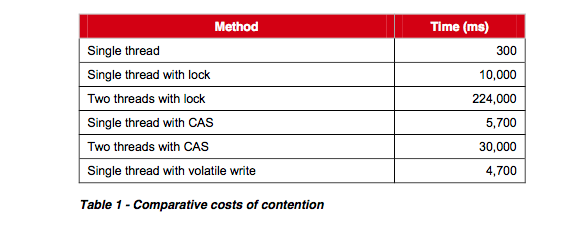

# 解读Disruptor

## 前言
继了解到软件设计中的[软硬件协同之单写原则](https://github.com/Schelor/Writing/blob/master/%5B%E8%AF%91%5D%E8%BD%AF%E7%A1%AC%E4%BB%B6%E5%8D%8F%E5%90%8C%E4%B9%8B%E5%8D%95%E5%86%99%E5%8E%9F%E5%88%99.md)后，我就一直想去了解Disruptor（对单写原则运用的炉火纯青的框架）。 为了掌握Disruptor, 我尝试用自己理解的视角来解读Disruptor. 内容包括有摘自官方论文的节选翻译、从原理到源码的实现解读等。通过文字记录与整理来更加深自己的理解，并进一步运用它传递的设计思想。

## 一些背景知识
> Disruptor：可替换有界队列来实现线程间通信的高性能框架

### 概要
LMAX是一个提供高性能金融交易的平台。为了设计这个系统，开发人员评估了很多种传统方案。当逐一评测这些方案时，都面临着一些底层的限制。许多应用基于队列来做线程通信，我们的测试表明，同等数量级的磁盘IO操作，使用队列的延迟消耗是戏剧性的慢，如果存在多个端到端的队列，还会从整体上增加数百微秒的延迟。所以在这个点上，有明显优化的空间。

进一步的调研并聚焦在计算机科学后，让我们意识到在基于队列、过程节点等的传统方案把很多固有的关注点混为一谈，导致多线程间产生很多竞争。因此这样暗示着也许还存在着一种更佳的方案。

考虑到现代CPU的工作方式，有时我们会称之为`软硬件协同`。 我们设计出一种数据结构和使用模式，这种模式我们命名为：Disruptor.

测试表明使用Disruptor作3级管道操作的平均延迟要比基于队列的同等操作的延迟低3个数量级。除此之外，在同等配置下，Disruptor能提高大约8倍的吞吐量。

这些性能提升表明，我们需要进一步思考并发编程。这种新的编程模式也适用于任何的异步事件编程架构。在LMAX，我们构建的订单匹配引擎，实时风险管理，高可用的内存事物处理系统都是基于Disruptor模式，而且都取得了很成功的结果。这些系统达到了一个新的性能标准，而且至今为止都还未被超越。

然而，这并不仅仅是金融行业相关的专家方案。Disruptor的通用机制是解决并发编程的复杂性，并最大化性能以及简化实现方式。尽管Disruptor涉及到一些非常规的概念，但是采用Disruptor模式构建的系统却比同类机制的实现方式要简易很多。

Disruptor显著地减少了写竞争，降低了并发的延迟开销，且是对缓存很友好。在平稳的处理器时钟率上，每秒2千500万的消息延迟低于50纳秒，此等性能已经前所未有，已非常接近现代处理器在线程通信上了理论值。

传统的队列型数据结构受限于其混合了生产者，消费者，数据存储等设计关注点，Disruptor则清晰的分离了这些，并以此思想来构建并发数据结构。

### 并发的复杂性
在本文描述的语境里，或者是在计算机科学中，并发不仅仅指计算机并行的执行两个或多个任务，还包含这些任务会去竞争资源。而资源可能是数据库、文件、套接字(Socket)、甚至是内存地址。

并发的执行代码关系到两件事：互斥访问与更改可见性。互斥需要控制更新竞争的资源状态，而更改可见性需要控制数据对其他线程的可见性。如果你不需要管理竞态条件，那么你可以避免使用互斥操作。如果你的算法可以保证只有单线程写所有的资源，那么也不需要使用互斥操作。读写操作要求所有的变更对其他线程具有可见性，然而只有写竞争才需要使用互斥来控制数据的可见性。

在任务并发环境中最大的消耗就是竞争写操作。多线程写相同的资源需要复杂且很大代价的协同，常常是采用锁策略来实现。

#### 锁消耗
锁提供互斥访问，能保证变更的有序执行。但是锁非常昂贵，因为发生竞争时需要操作系统来裁决。操作系统内核通过切换上下文来挂起线程并使该线程阻塞等待在锁上，直到锁的释放。上下文切换时会导致CPU执行期会丢失缓存数据和指令，这种情况会导致严重的性能影响。

我们用一个简单的演示来说明锁的消耗。如下的实验是调用一个函数来对一个64位的counter计数器做5亿次自增运算。在2.4Ghz Intel Westmere EP的机器上执行Java版单线程程序，仅仅消耗300毫秒。对于此实验来说，语言是不重要的，其他语言的执行结果也是类似的。引入锁来作互斥，即使没有发生竞争，其消耗也是比较明显。而引入多线程竞争，其消耗会增加几个数量级。
如下为上述实验的统计结果：



#### CAS消耗

CAS可用于替换锁的使用。它由处理器提供一些机器指令可原子的更新数据。针对“自增计数器实验”，每个线程可循环读取变量值并尝试原子的设置它的值为递增值。旧值和新的预期值都是指令的参数，如果指令执行成功，则更新成功。相反，预期的新值不匹配当前变量的值，则CAS更新失败。然后线程重试，重新读取变量的最新值，然后再次自增该值，直到CAS更新成功。CAS方案比锁要明显高效因为它不需要操作系统内核的上下文切换。然而，天下没有免费的午餐，CAS也有消耗。处理器必须锁住指令管道来确保原子性，并采用内存屏障使变更对其他线程可见。Java中可使用`java.util.concurrent.Atomic*`的类来执行CAS操作。

可使用多层CAS操作来编排复杂的竞争访问。使用锁来写并发代码是困难的，使用CAS来做无锁控制会更复杂，因为要保证结果的正确性会很难。

一个理想的算法则就是单线程写，多线程读。而在多处理环境中，读取数据需要使用内存屏障来使得数据对其他处理器的线程具有最新的可见性。

#### 内存屏障
现代处理器采用乱序执行指令，在主内存与执行单元中也是乱序load(载入)和store(存储)。 忽略顺序后，处理器只需要保证程序的逻辑执行结果，这种模式对于单线程程序则无伤大雅。然而在多线程间共享状态则要求一定的顺序。处理器采用内存屏障来表明代码区需要顺序更新，这就意味着在多线程间可在硬件层面顺序执行并能保证变更的可见性。
现代的CPU比当下的内存系统要快得多，为了连接两者，处理器使用了复杂的无链式的hashtable型缓存系统。这些缓存通过消息传递协议来保持一致性，而且处理器通过缓存一致性协议来失效缓存。

内存屏障之前的所有写操作都要写入寄存器、存储缓冲区，CPU的多级缓存层，内存。内存屏障之后的读操作都可以获得同步屏障之前的写操作的结果。因此，对于敏感的程序块，写操作之后、读操作之前可以插入内存屏障。Java内存模型用`volatile`关键字实现了读写内存屏障。

#### 缓存行
现代处理器使用缓存行来组织缓存，这对于高性能操作有巨大的重要性。处理器在缓存中读取数据和指令能极大的提升执行效率，相反，缓存失效也会带来很大的低效执行。
我们的硬件不会以字节或字的形式移动内存。为了效率，缓存被组织为缓存行的形式，每个缓存行典型的大小为32-256字节，大多数是64字节。这也是高速缓存一致性协议操作的粒度级别。这也意味着如果两个变量在同一个缓存行中，但他们由不同的线程写入，那么他们面临相同的写竞争问题，就像这两个变量是一个单变量一样，写入单个变量需要失效整个缓存行，这也是伪共享的概念。那么为了高性能，确保每个数据的独立性就显得尤为重要，如果把竞争降低到最低，并发写入时，数据则不会共享同一缓存行。
CPU访问内存时，当发现有连续的内存地址跨度区时，CPU会预读到缓存的缓存行中。比如遍历数组时，数据的内存地址存在连续的跨度，因此CPU会预读该内存区域到缓存行，用以提高访问效率。典型的小于2048字节的数据跨度很容易引起CPU的注意，然而像链表、树这样的数据结构，其内存分布跨度大，分布广泛，就没有可预读性，因此也不会进入缓存行，导致访问这类数据结构的效率要低2个数量级。
```
缓存行的大小是个物理参数，通常是64K.
在Linux上可使用命令：
cat /sys/devices/system/cpu/cpu0/cache/index0-3/size

Mac使用命令：
~ sysctl machdep.cpu
...
machdep.cpu.cache.linesize: 64
...
```
#### 队列的问题
队列通常会采用链表或数组来存储数据。内存级别的队列如果是无界的，那么则面临着酿成耗尽内存的悲剧。这一般是生产者的速率超过了消费者，无界队列很适应用在生产者速率能保证不会超过消费者的场景中，但是仍然存在风险，谁又能信誓旦旦的保证呢，万一消费者一直不消费呢。有界队列要么采用数组实现，要么需要跟踪队列的大小。

队列实现涉及到队首，队尾、队列大小的写竞争。在生产者与消费者场景中，队列如果满了则不能再添加，如果是空的话，则不能读取。实际中很少达到平衡的生产和消费速率。队列要么是总数满的，要么总数空的，这往往会导致高密度的竞争与缓存失效。这里的问题是队首与队尾采用了不同的对象来控制并发，例如会使用锁或CAS变量，一般而言这两个对象共享在同一缓存行中。

生产者会关注队首，而消费者会关注队尾。队列若采用大粒度的锁来控制`put`、	`take`操作，实现起来比较简单但却有吞吐量上的瓶颈。在Java世界中，还有另一个问题，就是GC。首先，需要分配对象并放置到队列中，其次，如果是链表型队列，还需要分配节点列表。如果不再引用节点时，队列需要支持能回收这些对象。

### Disruptor的设计
当试图解决上述问题时，需要设计一套方案，并严格的分离各种关注点。LMAX 开源的Disruptor就是用于解决这些问题的，包括：优化内存分配，缓存友好操作，并最优的在硬件中执行。Disruptor的核心机制在于预先分配有界数据结构(RingBuffer)。数据添加到RingBuffer后，可被一个或多个生产者以及消费者处理。

#### 内存分配
RingBuffer在初始化后会预分配内存。RingBuffer可以存储对象数组也可以存储单个对象结构。由于Java语言的限制，RingBuffer中的对象以指针关联到实际的对象。这些对象不是用来消息传递的，而本身就是数据载体，预分配对象消除了GC的问题，因为这些对象会不断的被重用，会存活在整个Disruptor运行期间。这些对象会被放置到一个连续的内存区域，因此便于处理器读取到缓存行中。

像Java这样的语言，开发低延迟的系统时，GC会是一个问题。分配更多的内存会增加GC的负担，GC更喜欢那些短命的对象，RingBuffer中预分配的对象是永久存活的，进入老年代后，只要发起GC时，那么都不会去执行清理，因此也表明只会有更低的GC负担。

有些负载很高的由队列构建的系统，为了减少内存分配，往往会让一些对象存活的长久些，因此会被提升到老年代。这种方式会带来两方面的影响：其一，需要在不同年代间复制对象，从而造成延迟抖动。其二，在老年代收集这些对象，代价更昂贵，还会增加`Stop The World`的可能性，同时还需要压缩碎片内存。 在大内存堆的系统中，常常是每GB会带来数秒的暂停。

#### 分离关注点(Teasing Apart the Concerns)
从队列中我们分离出一些关注点：
1. 存储需要交换的数据
2. 协调生产者申领下一个数据项，并填充数据
3. 当有可用的新数据项时，协调消费者被感知到

当用GC型语言设计金融交易系统时，太多的内存分配会造成问题。因此我们会觉得链表型队列不是一种好的方案。预分配会降低GC负担，进一步说，最好是预分配均匀的内存块，这样在遍历时可以更好的利用缓存策略。
预填充好的数组能满足这种数据结构，在创建RingBuffer使用一个抽象工厂模式来分配对象。当生产者申领到一个数组槽时，再复制数据到槽关联的对象Entry中。

在确定RingBuffer中的槽索引时，处理器执行求余计算也有不小的消耗。Disruptor限定RingBuffer的大小需为2的N次幂，这样在计算数组下标时可利用位运算`(size - 1) & sequence`来提高效率。

之前提到过，有界队列的队首，队尾存在写竞争。RingBuffer则可以避免此类竞争，因为它把这些关注点分散成生成者、消费者屏障。这些屏障的逻辑描述如下：

Disruptor最常见的使用场景是单生产者。单线程的生产者不存在写数组Entry的竞争。在特殊的多生产者场景中，生产者将竞争RingBuffer中下一个可用的Entry, 而这类竞争可通过CAS来管理。
生产者申领到一个Entry后，复制相应的数据到该对象中，然后通过提交Entry对应的序列号来发布，这样对消费者才是可见的。消费者消费RingBuffer中的Entry需要等待有可用的序列号(sequence), 当等待时，有多种可用的策略。如果CPU资源非常珍贵，可等待在锁的条件变量上，由生产者来唤醒等待的消费者。这种策略适用于CPU资源比延迟和吞吐量都重要的场景。 消费者还可以采取循环的自检查序列号的下标是否可用，重试多次后，可让出CPU，这种策略可平衡CPU的资源与延迟。

#### 制定序列(Sequencing)
在Disruptor中序列号是很核心的概念。每个生产者与消费者都严格用序列号与RingBuffer交互。生产者申领RingBuffer中的Entry时，需要先申领下一个可用的序列号。 在单线程环境中序列号可以是简单的计数器，在多线程环境中，则是CAS操作的原子计数器。
一旦申领到序列号，则可获取对应的Entry并可写入数据。生产者完成写入数据后，需要发布此次更新，然后这个Entry才对消费者可见。

## Disruptor为什么快
通过论文呈现的内容，总结下来有：
1. 无锁操作(Lock-Free), 没有竞争所以非常快
2. 高效的RingBuffer数据结构，预分配内存，复用数组中的Entry，GC友好
3. 所有访问者都记录自己的序号的实现方式，允许多个生产者与多个消费者共享相同的数据结构
4. 在每个对象中都能跟踪序列号， 没有为伪共享和非预期的竞争
5. 增加缓存行补齐， 提升cache缓存命中率

## Disruptor核心组件

**Ring Buffer**
最新的稳定版，RingBuffer主要负责存储和更新事件的数据。
**Sequence(序列号)**
Disruptor通过顺序递增的序号来管理通过其进行交换的数据，对数据的处理过程总是沿着序号逐个递增处理。Sequence支持CAS操作，为了提高效率，Sequence通过padding来避免伪共享。

**Sequence Barrier**
SequenceBarrier用来在消费者之间以及消费者和RingBuffer之间建立依赖关系。在Disruptor中，依赖关系实际上指的是Sequence的大小关系，消费者A依赖于消费者B指的是消费者A的Sequence一定要小于等于消费者B的Sequence，这种大小关系决定了处理某个消息的先后顺序。因为所有消费者都依赖于RingBuffer，所以消费者的Sequence一定小于等于RingBuffer中名为cursor的Sequence，即消息一定是先被生产者放到Ringbuffer中，然后才能被消费者处理。 SequenceBarrier在初始化的时候会收集需要依赖的组件的Sequence，RingBuffer的cursor会被自动的加入其中。需要依赖其他消费者和/或RingBuffer的消费者在消费下一个消息时，会先等待在SequenceBarrier上，直到所有被依赖的消费者和RingBuffer的Sequence大于等于这个消费者的Sequence。当被依赖的消费者或RingBuffer的Sequence有变化时，会通知SequenceBarrier唤醒等待在它上面的消费者。

**Wait Strategy(等待策略)**
Disruptor 定义了 com.lmax.disruptor.WaitStrategy 接口用于抽象 Consumer 如何等待新事件，这是策略模式的应用。当消费者等待在SequenceBarrier上时，Disruptor 提供了多个WaitStrategy的实现，每种策略都具有不同性能和优缺点。在延迟和CPU资源的占用上有所不同，根据实际运行环境的CPU的硬件特点选择恰当的策略，并配合特定的JVM的配置参数，能够实现不同的性能提升。
- BusySpinWaitStrategy：自旋等待，类似Linux Kernel使用的自旋锁。低延迟但同时对CPU资源的占用也多。
- BlockingWaitStrategy ：使用锁和条件变量。CPU资源的占用少，延迟大。
- SleepingWaitStrategy ：在多次循环尝试不成功后，选择让出CPU，等待下次调度，多次调度后仍不成功，尝试前睡眠一个纳秒级别的时间再尝试。这种策略平衡了延迟和CPU资源占用，但延迟不均匀。
YieldingWaitStrategy ：在多次循环尝试不成功后，选择让出CPU，等待下次调度。平衡了延迟和CPU资源占用，但延迟比较均匀。

**EventProcessor**
在Disruptor中，消费者是以EventProcessor的形式存在的，实现了Runnable接口。EventProcessor持有特定消费者(Consumer)的Sequence，并提供用于调用事件处理实现的事件循环(Event Loop)。

**EventHandler**
Disruptor 定义的事件处理接口，由用户实现，用于处理事件，是Consumer的真正实现。

**Producer**
即生产者，只是泛指调用 Disruptor 发布事件的用户代码，Disruptor 没有定义特定接口或类型。

## Disruptor使用
Github上官方的示例说明的很详细，参考地址：
https://github.com/LMAX-Exchange/disruptor/wiki/Getting-Started

## Disruptor源码解读
Distrustor重构和优化了很多次([Changelog](https://github.com/LMAX-Exchange/disruptor)，从当下最新的版本是3.3.6，研究用的最普遍的单生产者，单消费者工作模型的实现原理，从源码中逐一验证论文里提到的核心点。

### RingBuffer
#### 数据结构设计
RingBuffer上层的缓存填充结构设计
```
abstract class RingBufferPad
{
	// 分配连续的long数据，可被处理器预读到缓存行
    protected long p1, p2, p3, p4, p5, p6, p7;
}
abstract class RingBufferFields<E> extends RingBufferPad
{
	// 缓存填充补齐对象的数量，初始化后为常量
    private static final int BUFFER_PAD;
    // RingBuffer数组起始元素的偏移地址,初始化后为常量
    private static final long REF_ARRAY_BASE;
    // 位移数量，初始化后为常量
    private static final int REF_ELEMENT_SHIFT;
    // Unsafe操作类
    private static final Unsafe UNSAFE = Util.getUnsafe();

static
    {
	    // 获取数组中每个元素的地址增量
        final int scale = UNSAFE.arrayIndexScale(Object[].class);
        if (4 == scale)
        {
	        // 在计算每个元素的地址时，本可以直接用base + n * 4
	        // 但是为了效率采用n << 2， 表示乘以4
            REF_ELEMENT_SHIFT = 2;
        }
        else if (8 == scale)
        {
	        // 同上
            REF_ELEMENT_SHIFT = 3;
        }
        else
        {
            throw new IllegalStateException("Unknown pointer size");
        }
        // 填充多少个Buffer对象
        BUFFER_PAD = 128 / scale;
        // 初始化RingBuffer的Entries时，实际大小为bufferSize + 2倍BUFFER_PAD
        // 数组首部填充BUFFER_PAD个对象，尾部填充BUFFER_PAD个对象。中间部分才是真正的数据区域, 所以数组实际起始元素的偏移地址需要为：base + BUFFER_PAD * 4 (或者8, 为了效率换成左移)
        REF_ARRAY_BASE = UNSAFE.arrayBaseOffset(Object[].class) + (BUFFER_PAD << REF_ELEMENT_SHIFT);
    }
```

**关于UNSAFE.arrayBaseOffset&UNSAFE.arrayIndexScale**
>arrayBaseOffset方法可获取数组第一个元素的偏移地址, arrayIndexScale可获取数组中元素的增量地址。

接下来是RingBuffer的实际数据层
```
// 下标位计算的掩码，初始化后为常数:size - 1
private final long indexMask;

// 存储数据的数组
private final Object[] entries;

// ringbuffer数据存储区的大小，需要满足2的n次方
protected final int bufferSize;

// 生成序列号的序列器
protected final Sequencer sequencer;
```
构造方法
```
RingBufferFields(
        EventFactory<E> eventFactory,
        Sequencer sequencer)
    {
	    // 由用户觉得采用是单生产者或多生产者序列生产器
        this.sequencer = sequencer;
        // 用户指定的存储BufferSize
        this.bufferSize = sequencer.getBufferSize();
        // 约定bufferSize为2的n次方
        if (Integer.bitCount(bufferSize) != 1)
        {
            throw new IllegalArgumentException("bufferSize must be a power of 2");
        }
		// 计算Size-1，记录下来
        this.indexMask = bufferSize - 1;
        // 创建数组Entries,实际大小为：bufferSize + 2倍PAD
        this.entries = new Object[sequencer.getBufferSize() + 2 * BUFFER_PAD];
        // 预填充
        fill(eventFactory);
    }
```
预分配数组
```
    private void fill(EventFactory<E> eventFactory)
    {
        for (int i = 0; i < bufferSize; i++)
        {
	        // 数据元素分配：前32个null + 中间的有效Entry + 后32个null
            entries[BUFFER_PAD + i] = eventFactory.newInstance();
        }
    }
```
取RingBuffer中的Entry
```
protected final E elementAt(long sequence)
    {
	    // 先计算实际索引: sequence & (size - 1), size - 1 用indexMask常量替换, 再乘以增量地址, 用左移替换, 最后加上数组实际的起始位置

        return (E) UNSAFE.getObject(entries, REF_ARRAY_BASE + ((sequence & indexMask) << REF_ELEMENT_SHIFT));
    }
```

RingBuffer可以创建单生产者或者多生产者。 如果你确定你的程序就只有一个生产者，可以选择使用单生产者，性能更好。它相应的会使用SingleProducerSequencer或者MultiProducerSequencer类。
```
createSingleProducer(factory, bufferSize, waitStrategy);
or
createMultiProducer(factory, bufferSize, waitStrategy);

```

### Sequence
Sequence是控制序列号的类，属于竞争的资源，Disruptor采用的设计思路：
1. 避免伪共享，只有一个有效的数据字段，并独占缓存行，根据实际运行时，采用左填重或右填充。
```
class LhsPadding
{
	// CPU预加载这七个long,合理情况下，加上value, 组成64个字节
    protected long p1, p2, p3, p4, p5, p6, p7;
}

class Value extends LhsPadding
{
	// value 一般情况会处于缓存行的尾部、中部，或首部
    protected volatile long value;
}

class RhsPadding extends Value
{
	// 因为虚拟机位数的干扰，可能需要再补齐
    protected long p9, p10, p11, p12, p13, p14, p15;
}
```
2. 多场景写方案，单写，CAS写，volatile写，内存屏障保证可见性
```
// volatile 语义
protected volatile long value;
// 单写
public void set(final long value)
{
        UNSAFE.putOrderedLong(this, VALUE_OFFSET, value);
}
// volatile 写
public void setVolatile(final long value)
{
        UNSAFE.putLongVolatile(this, VALUE_OFFSET, value);
}
// CAS写
public boolean compareAndSet(final long expectedValue, final long newValue)
{
        return UNSAFE.compareAndSwapLong(this, VALUE_OFFSET, expectedValue, newValue);
}
```

### 申领下一个可用的Sequence
生产者向RingBuffer申领序列号，RingBuffer委托给内部的序列号生成器(Sequencer)来负责颁发。
```
public long next()
    {
        return sequencer.next();
    }
```
根据不同的场景，决定不同的生成方式。如性能最佳的单线程环境：
```
public long next() {
   return next(1); // 逐一递增
}
public long next(int n) {
  long nextValue = this.nextValue;
  long nextSequence = nextValue + n;
  中间部分是处理生产者过快，产生新的一轮，避免覆盖还没有消费完的序号，需要作Park
  this.nextValue = nextSequence;
  return nextSequence;
}
```
引用一段描述：http://colobu.com/2014/12/22/why-is-disruptor-faster-than-ArrayBlockingQueue/
> 申请Sequence主要注意两个边界条件。
1) 如果producer生产的快，追上消费者的时候
可以通过gatingSequences让生产者等待消费者消费。
这个时候是通过LockSupport.parkNanos(1L);不停的循环，直到有消费者消费掉一个或者多个事件。
2) 如果消费者消费的快，追上生产者的时候
这个时候由于消费者将自己最后能处理的sequence写回到Cursor后sequence.set(availableSequence);， 如果生产者还没有写入一个事件， 那么它就会调用waitStrategy.waitFor等待。 如果生产者publish一个事件，它会更改光标的值：cursor.set(sequence);，然后通知等待的消费者继续处理waitStrategy.signalAllWhenBlocking();

申请到可用的Sequence后，取出对应的Entry, 填充生产数据
```
long sequence = ringBuffer.next();  // 获取下一个序列号
try {
      LongEvent event = ringBuffer.get(sequence); // 根据序列号获取预分配的数据槽
     event.set(bb.getLong(0));  // 向数据槽中填充数据
 } finally {
     ringBuffer.publish(sequence);
 }
```
发布Sequence，设置当前RingBuffer的Cursor为处理过的Sequence
```
public void publish(long sequence) {
        cursor.set(sequence);
        waitStrategy.signalAllWhenBlocking();
}
```

### 消费者处理
消费者在独立的线程中运行EventProcessor， EventProcessor本身实现了Runnable, 因此可以直接在扔到线程里。以最常用的BatchEventProcessor为例, 循环检查是否有可用的Sequence，然后逐个或批量获取Entry，调用用户自定义的Handler,执行消费逻辑。
```
public void run() {
	T event = null;
    long nextSequence = sequence.get() + 1L;
    while (true) {
		final long availableSequence = sequenceBarrier.waitFor(nextSequence);
	   // 有连续的可用的Sequence
       while (nextSequence <= availableSequence){
	     // dataProvider就是RingBuffer
         event = dataProvider.get(nextSequence);
         // 用户自定义处理
         eventHandler.onEvent(event, nextSequence, nextSequence == availableSequence);
         nextSequence++;
        }
       sequence.set(availableSequence);

	}

}
```

## 最后

终于写到最后了，翻译真痛苦啊。
洋洋洒洒的写了近万字的文字，才几乎理清了思路，理解了Disruptor的核心设计思想与实现细节。总结下来Disruptor传递的是一种设计思想，设计高性能低延迟的系统需要有"Mechanical Sympathy"的考虑，这也为我们提供、开拓、启发了新思路。

## 参考资料
http://lmax-exchange.github.io/disruptor/files/Disruptor-1.0.pdf
http://lmax-exchange.github.io/disruptor/
https://github.com/LMAX-Exchange/disruptor
http://colobu.com/2014/12/22/why-is-disruptor-faster-than-ArrayBlockingQueue/
