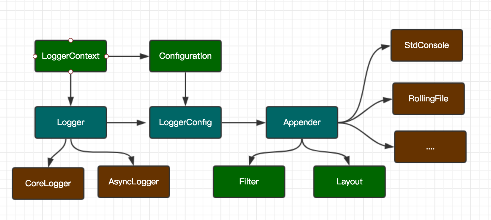
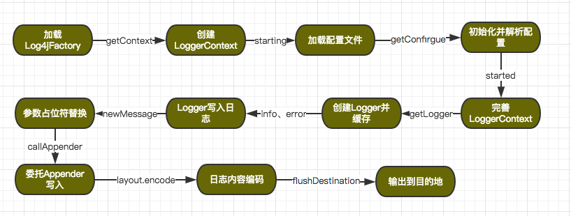

# Log4j2写日志的艺术

[TOC]

> 在程序的世界里，抽象让人像是雾里看花。抽象让程序具有很好的扩展性，同时还显得很优雅，但是却增加了理解与阅读代码的复杂度，很多流行的框架都具有高度的抽象设计，Log4j2也不例外。但对代码抽丝剥茧后，掀开层层封装，层层引用，看到最本质的代码逻辑往往是很基础很简单的代码实现，往往这个过程充满挑战，但却蛮有意思。

本文主要记录我对Log4j2源码阅读后的一些个人理解，包括的内容有：Log4j2的组件、同步写、异步写原理、以及中间技术的个人思考。`而log4j2的使用与配置稍显简易，可在很多地方找到说明，本文则不重点讨论这部分的内容`。

## Log4j2中的组件


Log4j2以插件的方式来配置各个组件，在配置中可自由的插拔组件，并支持自动生效(配置monitorInterval)。

### 从配置开始
Log4j2支持多种格式配置文件，xml、json、yaml、properties。相应地，初始化时会逐个查找并加载这类文件。以最常用的xml配置为例，Log4j2默认的文件名称为`log4j2.xml`,主要配置如下：
```
<?xml version="1.0" encoding="UTF-8"?>
<!-- 此次配置的status如果trace级别，则log4j2会输出log4j自身的执行日志 -->
<Configuration status="info">
    <Properties>
	    <!-- 支持属性占位符-->
        <Property name="fileName">target/rolling.log</Property>
    </Properties>
	<Appenders>
        <Console name="Console" target="SYSTEM_OUT">
            <PatternLayout pattern="%d %p %c{1.} [%t] %m%n"/>
        </Console>
		<RollingRandomAccessFile name="RollingRandomAccessFile" fileName="${fileName}" filePattern="target/rolling-%d{MM-dd-yyyy}-%i.log.gz">
            <PatternLayout pattern="%d %p %c{1.} [%t] %m%n"/>
            <Policies>
                <SizeBasedTriggeringPolicy size="500 MB" />
                <TimeBasedTriggeringPolicy />
            </Policies>
        </RollingRandomAccessFile>
        <Async name="Async">
            <AppenderRef ref="Console"/>
            <AppenderRef ref="RollingRandomAccessFile"/>
        </Async>
   </Appenders>
 <Loggers>
	   <Logger name="RollingRandomAccessFileLogger" level="info">
            <AppenderRef ref="RollingRandomAccessFile"/>
        </Logger>
        <Logger name="AsyncLogger" level="info" additivity="false">
            <AppenderRef ref="Async"/>
        </Logger>
        <Root level="debug">
            <AppenderRef ref="Console"/>
        </Root>
      </Loggers>
</Configuration>
```
如上配置的对象有：
1. `Configuration`: 表示日志环境的一份配置描述，用于构建一份运行时的`LoggerContext`
2. Logger表示日志记录器，可有多个。示例中有2个普通记录器，1个根记录器。一个记录器需要指定Appender,可指定多个，表示日志记录到哪里。
3. Appenders表示日志的输出源，可有多个。示例中有3个，`Console`表示通过标准输出流输出到控制台，`RollingRandomAccessFile`表示可滚动的记录日志，日志文件到达一定的大小后，会启用压缩。
`Async` 表示一种异步的输出端，通过异步线程与队列的方式写入日志到其关联的实际Appender中。

### API基本使用
```
 // 获取Logger
 private static final Logger logger = LogManager.getLogger("HelloWorld");
 private static final Logger logger = LogManager.getLogger(Class.getName());
 logger.info("Hello, World!");
 
logger.debug("Logging in user {} with birthday {}", user.getName(), user.getBirthdayCalendar());
 
logger.debug("Logging in user %s with birthday %s", user.getName(), user.getBirthdayCalendar());

```
### 小细节
`Log4j2`在对外的`info`，`warn`等API上在内置了`logIfEnabled`的判断，而不用在程序中显示的写上：
```
if (logger.isInfoEnabled()) {
	logger.info();
}
if (logger.isWarnEnabled()) {
	logger.warn();
}       
```

所以在写日志时，放心的直接用logger.info，logger.warn吧。

## 写日志的原理

## 主要流程


### 同步写
如上流程是典型的同步写的过程，多线程并发写是通过临界区来实现。简要过程如下：


相关代码：
AbstractOutputStreamAppender#directEncodeEvent
以常用的基于PatternLayout的日志格式为例：
```java
private void encodeSynchronized(final CharsetEncoder charsetEncoder, final CharBuffer charBuffer,
            final StringBuilder source, final ByteBufferDestination destination) {
      // 临界区阻塞式Encode
        synchronized (destination) {
            try {
                TextEncoderHelper.encodeText(charsetEncoder, charBuffer, destination.getByteBuffer(), source,
                        destination);
            } catch (final Exception ex) {
               ..
            }
        }
    }
// 根据不同的Appender用OutputStream.writeBytes
public synchronized void flush() {
        flushBuffer(byteBuffer);
        flushDestination();
}
```

### 异步写

如上配置的`Async`表示一种异步输出器，对应的实现为`AsyncAppender`。 异步Appender使用异步线程加阻塞队列(`BlockingQueue`)来实现异步写的功能。默认情况下通过`BlockingQueueFactory`创建缺省的队列类型为：`ArrayBlockingQueue`，队列大小为128.

#### 顺便说一下ArrayBlockingQueue
> ArrayBlockingQueue是一种有界的阻塞队列，内部采用定长环形数组来存储队列中的数据，相比较LinkedBlockingQueue具有很好的空间节省，对于记日志有很好的适用性，这样可以避免内存的伸缩产生波动，同时也会增加GC的负担。入队出队时由内部的重入锁来控制并发，同时默认采用非公平锁的性质来处理活跃线程的闯入(Barge)，从而提高吞吐量。
ArrayBlockingQueue在处理数据的入队提供了`offer`和`put`方法。两者的区别是：如果队列满了，offer丰富直接返回给调用线程false, 而不用等待，这种场景较适合异步写日志，即使没有入队成功，仍然可以接受。而put方法则会让当前线程进入等待队列，并再次去竞争锁。
类似的，处理出队时提供了`poll`和`take`方法，区别也是是否阻塞调用线程。

##### notFull 与 notEmpty
`put`和`take`阻塞调用线程是借用`notFull`和`notEmpty`两个条件对象来实现的。

> 需要预先了解的是：无论是基于JVM的内置锁还是基于AQS的API锁，都维持着对应的两个队列。一个是线程因竞争锁失败而自动进入的等待队列或叫同步队列，另一个是线程主动调用wait方法或Conditiond.await方法，则该线程会进入一个条件队列去等待，直到另一线程显示调用notify或notifyAll 或Condition.signal或signalAll方法，该线程才会被唤醒，然后进入同步队列去参与竞争锁。

所以在理解这两个词的意思时，看看Doug Lea给的注释:
```
	等待take的条件
    private final Condition notEmpty;

    等待put的条件
    private final Condition notFull;
```
换言之，此处的notEmpty表示为：只有队列在notEmpty的条件下才能take,  如果队列为empty，那么当前take的线程则需要等待。类似的，当队列在notFull时，才能put, 如果队列为full, 那么当前put的线程则需要等待。

#### 异步写是怎么玩的


业务线程并发调用同一个Logger写日志时，Log4j2内部把内容解析成LogEvent，然后投递到队列中，由异步的线程来负责消费。

相关代码：
投递到队列：
```java
public void append(final LogEvent logEvent) {
        
	     ...
	     获取不可变的副本对象
        final Log4jLogEvent memento = Log4jLogEvent.createMemento(logEvent, includeLocation);
        if (!transfer(memento)) { // 投递到队列失败，降级策略
            if (blocking) { // 新版本默认为true
                // 根据策略不同，可丢弃、可等待、可由当前线程执行
                final EventRoute route = asyncQueueFullPolicy.getRoute(thread.getId(), memento.getLevel());
                route.logMessage(this, memento);
            } else {
                // 交由error-appender处理
                logToErrorAppenderIfNecessary(false, memento);
            }
        }
    }

// 投递LogEvent到队列，新版本可指定队列为LinkedTransferQueue
private boolean transfer(final LogEvent memento) {
        return queue instanceof TransferQueue
            ? ((TransferQueue<LogEvent>) queue).tryTransfer(memento)
            : queue.offer(memento);
}
```
消费写LogEvent
```
消费
while (!queue.isEmpty()) {
     try {
           final LogEvent event = queue.take();
           if (event instanceof Log4jLogEvent) {
               final Log4jLogEvent logEvent = (Log4jLogEvent) event;
               logEvent.setEndOfBatch(queue.isEmpty());
               // 在异步线程中调用Appender写日志
               callAppenders(logEvent); 
          } else {
               ...
          }
       } catch (final InterruptedException ex) {
           不处理异常，继续写日志
       }
 }
```

#### 巧妙的异步写设计
实际环境中，很多业务线程在并发的写日志到队列中，并由一条异步消费者线程负责消费写。高并发的场景下，很容易造成生成的速度大于消费的速度。 为了不阻塞生成，投递LogEvent时选择的是队列的`offer`方法，如果成功入队，则执行马上返回给应用。如果队列满了，则默认降级为在同步写，这种设计能极大的提供性能 。而消费时选择的队列的`take`方法，如果生产的日志较少，则`park`消费者线程，让出CPU。 注意到`offer`方法在入队成功时，也会调用notEmpty.signal()方法，进而唤醒消费者，从而让它继续工作。

### ByteBuffer与RandomAccessFile 
项目中常常会用到`RollingRandomAccessFile`这种Appender，而在Log4j2中都是基于ByteBuffer来管理字节缓冲，并用于处理字节流与字符流的高效转换。最后采用RandomAccessFile来写Bytes到文件。Log4j2官方给出的性能测试报告提到相较于`BufferedOutputStream`,ByteBuffer + RandomAccessFile有20-200%的性能改善。
> ByteBuffer具有高效的字节流管理方式，通过内部的状态变量（position、limit、capacity）与对外访问方法（flip,clear etc）来实现内外的交互，每一个读/写操作都会改变ByteBuffer的状态。通过记录和跟踪这些变化，缓冲区就可能够内部地管理自己的资源。
Log4j2用一个CharBuffer、ByteBuffer来处理编码过程，并分别缓存到ThreadLocal中，避免重复的创建，编码完成后再把缓冲流复制到待write的ByteBuffer中。默认情况下，分配8Kb的缓冲区，示例代码：
```
private ByteBuffer getByteBuffer() {
        ByteBuffer result = byteBufferThreadLocal.get();
        if (result == null) {
            result = ByteBuffer.wrap(new byte[byteBufferSize]);
            byteBufferThreadLocal.set(result);
        }
        return result;
}
```
在输出ByteBuffer时，根据Appender的不同选择不同的输出策略。基于RandomAccessFile的输出为：
` randomAccessFile.write(byteBuffer.toArray(), 0, byteBuffer.limit());`

### Garbage-free(避免创建多余对象)
 Log4j2提倡创建最少的对象做更多事，尽量避免创建多余的对象。在内部有很多细节代码，这里分析2个例子。
1.  API设计上避免创建变长数组
用`void info(String message, Object p0, Object p1, Object p2, Object p3)` 这类参数明确的api替换带变长数组的api.

2.  提供工具来避免基础类型参数的自动装箱. 
自动装箱会创建大量的对象，Log4j2提供Unbox工具类来转换为StringBuilder.

### 异步Logger
事实上log4j2的异步logger才是性能改善最卓越的部分。异步Logger内部采用 Disruptor来实现，它是一个用于代替队列的无锁化线程间的通信的工具库，可以明显的提高吞吐量并降低延迟。
自己后续会对[Disruptor](http://lmax-exchange.github.io/disruptor/)做一个学习与分析。感谢关注。

### 性能
Log4j2的性能改善是明显的，官方文档：http://logging.apache.org/log4j/2.x/performance.html 提供了大量的场景对比结果，有兴趣的可以去了解一下。

## 写在最后
The log4j1.x amost has became End of Life。So upgrade it and learn about it. 

哦，对了，升级的时候可以用SLF4J来做统一的外观，然后引入`log4j-api`，`log4j-core`, `slf4j-api`,还有slf4j到log4j2的桥接器`log4j-slf4j-impl`就行。但是需要注意的是：
**咱们内部中间件大多默认依赖了slf4j-log4j12，因此需要把这类依赖全部排出**， 可以用如下的tip:
```
		<dependency>
          <groupId>org.slf4j</groupId>
          <artifactId>slf4j-log4j12</artifactId>
          <version>999-not-exist</version>
      </dependency>
```

Good luck. Tks.


