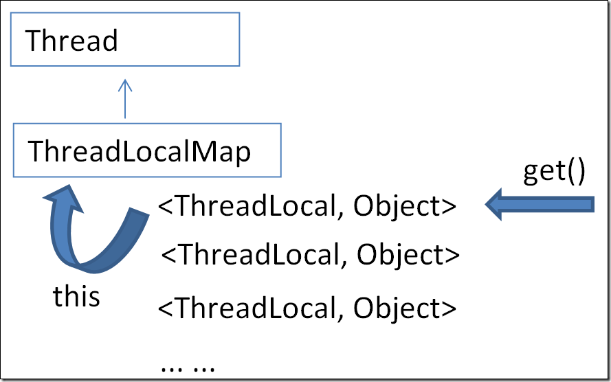
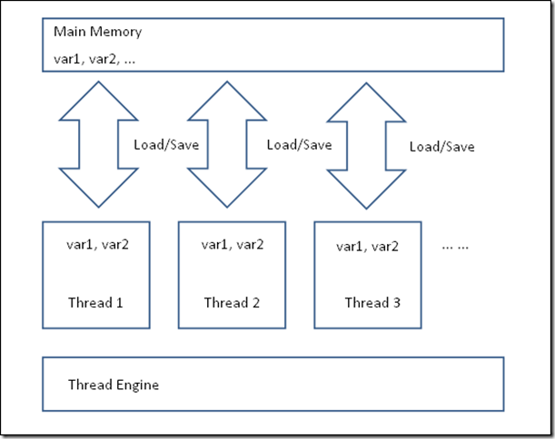

# 前言
在一段时间里，对于Java多线程，自我觉得还是蛮了解的，自从看到了四火写的一篇文章(http://www.raychase.net/698)，
深受启发，思考问题以及作文该如此啊。于是想在该文的基础上，做些自己的解读，顺便学习一下其作文思路。

# 开始
假如别人问道你一个问题，提到Java的多线程编程，你会想到什么？我能想到的是：
- synchronized、volatile、锁机制
- 竞争和同步
- 线程池和队列
- Disruptor、单写原则（之前研究过Disruptor）

四火同志提到有：
1. 模型（Java内存模型）JCM(Java并发模型)
2. 使用：JDK中的并发包
3. 实践：怎样写出线程安全的代码
4. 排错：使用工具来分析并发问题

同时作者提到一种思路，从历史的角度来看Java多线程编程是怎样演变的，在这个过程中，采取了哪些正确的决定，犯了哪些错误？未来有哪些发展趋势.
As Linus said: Anyway, We all talk is cheap, show me the code, 所以作者尽量用代码说话。

# Java多线程编程历史
## 从Java诞生开始
Java的基因来自于1990年12月Sun公司的一个内部项目，目标设备正是家用电器，但是C++的可移植性和API的易用性都让程序员反感。旨在解决这样的问题，于是又了Java的前身Oak语言，但是知道1995年3月，它正式更名为Java，才算Java语言真正的诞生。

## JDK 1.0
抢占式和协作式是两种常见的进程/线程调度方式，操作系统非常适合使用抢占式方式来调度它的进程，它给不同的进程分配时间片，对于长期无响应的进程，它有能力剥夺它的资源，甚至将其强行停止（如果采用协作式的方式，需要进程自觉、主动地释放资源，也许就不知道需要等到什么时候了）。Java语言一开始就采用协作式的方式，并且在后面发展的过程中，逐步废弃掉了粗暴的stop/resume/suspend这样的方法，它们是违背协作式的不良设计，转而采用wait/notify/sleep这样的两边线程配合行动的方式。

一种线程间的通信方式是使用中断：
```java
/**
 * @author xiele
 * @date 2017/10/18
 */
public class InterruptCheck extends Thread {


    @Override
    public void run() {
        System.out.println("Start");
        while (true) {
            if (Thread.currentThread().isInterrupted()) {
                break;
            }
        }
        System.out.println("SubThread Exit");
    }

    public static void main(String[] args) {

        InterruptCheck ic = new InterruptCheck();
        ic.start();

        try {
             sleep(3000);
        } catch (InterruptedException e) {

        }
        // 主线程发起让子线程中断，子线程在while(true)中感知到中断后，退出
        ic.interrupt();

        System.out.println("Main Exit");

    }
}

```
这是中断的一种使用方式，看起来就像是一个标志位，线程A设置这个标志位，线程B时不时地检查这个标志位。另外还有一种使用中断通信的方式，如下：
```java
public class InterruptWait extends Thread {

    // 监视器
    private Object lock = new Object();

    @Override
    public void run() {
        System.out.println("SubThread Start");
        // 进入锁临界区，
        synchronized (lock) {
            try {
                // 让出当前锁，进入等待中(条件队列)
                lock.wait();
            } catch (InterruptedException e) {
                System.out.println("SubTread是否中断: " + Thread.currentThread().isInterrupted());
                Thread.currentThread().interrupt();
                System.out.println("SubTread是否中断: " + Thread.currentThread().isInterrupted());
                e.printStackTrace();
            }
            System.out.println("SubTread Exit");
        }
    }

    public static void main(String[] args) {
        Thread t = new InterruptWait();
        t.start();
        try {
            sleep(3000);
        } catch (InterruptedException e) {
            e.printStackTrace();
        }
        t.interrupt();
        System.out.println("Main Exit");

    }
}

```
在这种方式下，如果使用wait方法处于等待中的线程，被另一个线程使用中断唤醒，于是抛出InterruptedException，`同时，中断标志清除，这时候我们通常会在捕获该异常的地方重新设置中断，以便后续的逻辑通过检查中断状态来了解该线程是如何结束的`。
在比较稳定的JDK 1.0.2版本中，已经可以找到Thread和ThreadUsage这样的类，这也是线程模型中最核心的两个类。整个版本只包含了这样几个包：java.io、 java.util、java.net、java.awt和java.applet，所以说Java从一开始这个非常原始的版本就确立了一个持久的线程模型。

四火同志提到，在JDK 1.x中就已经设计好了AtomicXXX等原子类，同时给出一个并发计数器的代码案例，启动多个线程访问同一个实例变量nonAtomicCounter，并作自增操作，由于`++`操作不是原子性的，存在先读取，再写入的先后问题，会导致数据不一致现象，而AtomicInteger中的incrementAndGet方法则采取CAS来控制原子性。此处代码示例比较简单，暂时不屠版于此了。

早期的JDK已经提供了内置锁的操作，用一段代码来描述锁同步的全部用法。
```Java
public class SynchronizedLock {

    /**
     * 演示对象锁，this锁，同步块，静态方法锁，动态方法锁
     */

    private Object monitor = new Object();

    private static SynchronizedLock lock = new SynchronizedLock();

    // Lock on 实例方法
    public synchronized void lockInstanceMethod() {
        System.out.println("Enter Instance Method");
        sleepSilently(2000);
    }

    // Lock on This块
    public void lockThisBlock() {
        synchronized (this) {
            System.out.println("Enter This Block");
            sleepSilently(2000);
        }
    }

    // Lock on an object
    public void lockObject() {
        synchronized (monitor) {
            System.out.println("Get Monitor Lock");
            sleepSilently(2000);
        }
    }

    // Lock on static method
    public synchronized static void lockStaticMethod() {
        System.out.println("Enter Static Method");
        sleepSilently(2000);
    }

    // Lock on the class
    public static void lockClassBlock() {
        synchronized (SynchronizedLock.class) {
            System.out.println("Enter Class Lock");
            sleepSilently(2000);
        }
    }

    private static void sleepSilently(long millis) {
        try {
            Thread.sleep(millis);
        } catch (InterruptedException e) {
            e.printStackTrace();
        }
    }

    public static void main(String[] args) {

        System.out.println("对象锁测试");
        // 线程1 获取实例方法锁
        new Thread(() -> lock.lockInstanceMethod()).start();

        // 线程2 获取this锁
        new Thread(() -> lock.lockThisBlock()).start();

        // 线程3 获取对象锁
        new Thread(() -> lock.lockObject()).start();

        sleepSilently(2000);
        System.out.println("类锁测试");
        // 线程4 获取静态方法锁
        new Thread(() -> lock.lockStaticMethod()).start();

        // 线程5 获取类锁
        new Thread(() -> lock.lockClassBlock()).start();

    }
}

```
上述代码描述的竞争锁的使用，因此也证明synchronized的使用：
- 非静态方法(实例方法)使用synchronized修饰，相当于synchronized(this)
- 静态方法使用synchronized修饰，相当于synchronized(Some.class)


## JDK1.2
1998年年底的JDK1.2版本正式把Java划分为J2EE/J2SE/J2ME三个不同方向。在这个版本中，Java试图用Swing修正在AWT中犯的错误，例如使用了太多的同步。可惜的是，Java本身决定了AWT还是Swing性能和响应都难以令人满意，这也是Java桌面应用难以比及其服务端应用的一个原因，在IBM后来的SWT，也不足以令人满意，JDK在这方面到JDK 1.2后似乎反省了自己，停下脚步了。值得注意的是，JDK高版本修复低版本问题的时候，通常遵循这样的原则：
1. 向下兼容。所以往往能看到很多重新设计的新增的包和类，还能看到deprecated的类和方法，但是它们并不能轻易被删除。
2. 严格遵循JLS（Java Language Specification），并把通过的新JSR（Java Specification Request）补充到JLS中，因此这个文档本身也是向下兼容的，后面的版本只能进一步说明和特性增强，对于一些最初扩展性比较差的设计，也会无能为力。
在这个版本中，正式废除了这样三个方法：stop()、suspend()和resume(). 四火用几段代码演示了为何这几个方法会被废弃。
```java
public class Stop extends Thread {
    @Override
    public void run() {
        try {
            while (true)
                ;
        } catch (Throwable e) {
            e.printStackTrace();
        }
    }

    public static void main(String[] args) {
        Thread thread = new Stop();
        thread.start();

        try {
            sleep(1000);
        } catch (InterruptedException e) {
        }

        thread.stop(new Exception("stop")); // note the stack trace
    }
}

```
从上面的代码你应该可以看出两件事情：
使用stop来终止一个线程是不讲道理、极其残暴的，不论目标线程在执行任何语句，一律强行终止线程，最终将导致一些残缺的对象和不可预期的问题产生。
被终止的线程没有任何异常抛出，你在线程终止后找不到任何被终止时执行的代码行，或者是堆栈信息（上面代码打印的异常仅仅是main线程执行stop语句的异常而已，并非被终止的线程）。

使用suspend(挂起)方法，有引起死锁的隐患：
```java
public class Suspend extends Thread {
    @Override
    public void run() {
        synchronized (this) {
            while (true)
                ;
        }
    }

    public static void main(String[] args) {
        Thread thread = new Suspend();
        thread.start();

        try {
            sleep(1000);
        } catch (InterruptedException e) {
        }

        thread.suspend();

        synchronized (thread) { // dead lock
            System.out.println("got the lock");
            thread.resume();
        }
    }
}
```
从上面的代码可以看出，Suspend线程被挂起时，依然占有锁，而当main线程期望去获取该线程来唤醒它时，彻底瘫痪了。由于suspend在这里是无期限限制的，这会变成一个彻彻底底的死锁。

相反，看看这三个方法的改进品和替代品：wait()、notify()和sleep()，它们令线程之间的交互就友好得多：
```java
public class Wait extends Thread {

    @Override
    public void run() {
        synchronized (this) {
            System.out.println("Enter ...");
            try {
                System.out.println("Give up Lock and Waiting...");
                wait();
                System.out.println("Wake up, Regain the lock");
            } catch (InterruptedException e) {
                e.printStackTrace(); // notify 不会抛异常
            }
        }
    }

    public static void main(String[] args) throws InterruptedException {

        Thread t = new Wait();

        t.start();

        sleep(20000);

        synchronized (t) {
            System.out.println("Notify the Thread t and release the lock");
            t.notify();
        }

    }
}

```
在wait和notify搭配使用的过程中，注意需要把它们锁定到同一个资源上（例如对象a），即：
- 一个线程中synchronized(a)，并在同步块中执行a.wait()
- 另一个线程中synchronized(a)，并在同步块中执行a.notify()

而`sleep`方法不会释放锁，所以有时候需要一个timeout参数，同时设计成static，意为是每让当前线程sleep，如果是实例方法，则需要指定某个线程对象，不能代表当前运行的线程。示例代码：
```java
public class Blocked extends Thread {

    public void run() {
        synchronized (this) {
            System.out.println("Enter ...");
            try {
                sleep(20000);
                System.out.println("Release The Lock");
            } catch (InterruptedException e) {
                e.printStackTrace(); // notify 不会抛异常
            }
        }
    }

    public static void main(String[] args) throws InterruptedException {

        Thread t = new Blocked();

        t.start();
        sleep(1000);
        synchronized (t) {
            System.out.println("Get Lock");
        }

    }
}
```

用jstack工具可以找到锁相关的信息，如果线程占有锁，但是由于执行到wait方法时处于wait状态暂时释放了锁，会打印waiting on的信息：
```
"Thread-0" #11 prio=5 os_prio=31 tid=0x00007fcaa911f000 nid=0x5903 in Object.wait() [0x000070000dace000]
   java.lang.Thread.State: WAITING (on object monitor)
        at java.lang.Object.wait(Native Method)
        - waiting on <0x000000076ae972e0> (a empty.multithread.Wait)

```
如果程序持续占有某个锁（例如sleep方法在sleep期间不会释放锁），会打印locked的信息：
```
"Thread-0" #11 prio=5 os_prio=31 tid=0x00007f995e893800 nid=0x5903 waiting on condition [0x0000700007344000]
   java.lang.Thread.State: TIMED_WAITING (sleeping)
        at java.lang.Thread.sleep(Native Method)
        at empty.multithread.Wait.run(Wait.java:14)
        - locked <0x000000076ae97298> (a empty.multithread.Wait)

```
而如果是线程希望进入某同步块，而在等待锁的释放，会打印waiting to的信息, 如上述Block类中的sleep方法，main线程堆栈：
```
"main" #1 prio=5 os_prio=31 tid=0x00007f9470814000 nid=0x1b03 waiting for monitor entry [0x000070000934c000]
   java.lang.Thread.State: BLOCKED (on object monitor)
        at empty.multithread.Blocked.main(Blocked.java:28)
        - waiting to lock <0x000000076ae97440> (a empty.multithread.Blocked)
        at sun.reflect.NativeMethodAccessorImpl.invoke0(Native Method)
        at sun.reflect.NativeMethodAccessorImpl.invoke(NativeMethodAccessorImpl.java:62)
        at sun.reflect.DelegatingMethodAccessorImpl.invoke(DelegatingMethodAccessorImpl.java:43)
        at java.lang.reflect.Method.invoke(Method.java:498)
        at com.intellij.rt.execution.application.AppMain.main(AppMain.java:147)

```

除此之外，当前版本的JDK还引入了ThreadLocal类



每一个线程都挂载了一个ThreadLocalMap。ThreadLocal这个类的使用很有意思，get方法没有key传入，原因就在于这个key就是当前你使用的这个ThreadLocal它自己。所以当前线程写数据时，会数据会存到当前线程中的Map, 如果涉及到线程间拷贝上下文，可以使用`InheritableThreadLocal`

## JDK 1.4

在2002年4月发布的JDK1.4中，正式引入了NIO。JDK在原有标准IO的基础上，提供了一组多路复用IO的解决方案。
通过在一个Selector上挂接多个Channel，通过统一的轮询线程检测，每当有数据到达，触发监听事件，将事件分发出去，而不是让每一个channel长期消耗阻塞一个线程等待数据流到达。所以，只有在对资源争夺剧烈的高并发场景下，才能见到NIO的明显优势。
此版本的NIO特性，与主题多线程关联不大，但NIO可以延伸出很多网络相关的知识，以及像Netty,Mina等基于NIO的框架，这些都足足聊很久。

## JDK 5.0

2004年9月起JDK 1.5发布，并正式更名到5.0。有个笑话说，软件行业有句话，叫做“不要用3.0版本以下的软件”，意思是说版本太小的话往往软件质量不过关——但是按照这种说法，JDK的原有版本命名方式得要到啥时候才有3.0啊，于是1.4以后通过版本命名方式的改变直接升到5.0了。

JDK 5.0不只是版本号命名方式变更那么简单，对于多线程编程来说，这里发生了两个重大事件，JSR 133和JSR 166的正式发布。

### JSR 133
JSR 133重新明确了Java内存模型，事实上，在这之前，常见的内存模型包括连续一致性内存模型和先行发生模型。

对于连续一致性模型来说，程序执行的顺序和代码上显示的顺序是完全一致的。这对于现代多核，并且指令执行优化的CPU来说，是很难保证的。而且，顺序一致性的保证将JVM对代码的运行期优化严重限制住了。

但是JSR 133指定的先行发生（Happens-before）使得执行指令的顺序变得灵活：
- 在同一个线程里面，按照代码执行的顺序（也就是代码语义的顺序），前一个操作先于后面一个操作发生
- 对一个monitor对象的解锁操作先于后续对同一个monitor对象的锁操作
- 对volatile字段的写操作先于后面的对此字段的读操作
- 对线程的start操作（调用线程对象的start()方法）先于这个线程的其他任何操作
- 一个线程中所有的操作先于其他任何线程在此线程上调用 join()方法
- 如果A操作优先于B，B操作优先于C，那么A操作优先于C

而在内存分配上，将每个线程各自的工作内存（甚至包括）从主存中独立出来，更是给JVM大量的空间来优化线程内指令的执行。主存中的变量可以被拷贝到线程的工作内存中去单独执行，在执行结束后，结果可以在某个时间刷回主存：


但是，怎样来保证各个线程之间数据的一致性？JLS给的办法就是，默认情况下，不能保证任意时刻的数据一致性，但是通过对synchronized、volatile和final这几个语义被增强的关键字的使用，可以做到数据一致性。
- volatile 保证内存可见性，避免指令重排序
- final 避免指令重排序
- synchronized 临界区同步

### JSR 166
JSR 166的贡献就是引入了java.util.concurrent这个包。前面曾经讲解过AtomicXXX类这种原子类型，内部实现保证其原子性的其实是通过一个compareAndSet(x,y)方法（CAS），而这个方法追踪到最底层，是通过CPU的一个单独的指令来实现的。这个方法所做的事情，就是保证在某变量取值为x的情况下，将取值x替换为y。在这个过程中，并没有任何加锁的行为，所以一般它的性能要比使用synchronized高。

Lock-free算法就是基于CAS来实现原子化“set”的方式，比较常用的方式如下：
```java
private AtomicInteger updater = new AtomicInteger();

public void set(int newValue) {
    int current;
    do {
        current = updater.get();
        if (newValue <= current) {
            break;
        }
    } while (!updater.compareAndSet(current, newValue));
}

```
CAS操作有一种场景是ABA问题。借用四火举的栈的例子：


1.线程t1先查看了一下栈的情况，发现栈里面有A、B两个元素，栈顶是A，这是它所期望的，它现在很想用CAS的方法把A pop出去。

2.这时候线程t2来了，它pop出A、B，又push一个C进去，再把A push回去，这时候栈里面存放了A、C两个元素，栈顶还是A。

3.t1开始使用CAS：head.compareAndSet(A,B)，把A pop出去了，栈里就剩下B了，可是这时候其实已经发生了错误，因为C丢失了。

为什么会发生这样的错误？因为对t1来说，它两次都查看到栈顶的A，以为期间没有发生变化，而实际上呢？实际上已经发生了变化，C进来、B出去了，但是t1它只看栈顶是A，它并不知道曾经发生了什么。
那么，有什么办法可以解决这个问题呢？

最常见的办法是使用一个计数器，对这个栈只要有任何的变化，就触发计数器+1，t1在要查看A的状态，不如看一下计数器的情况，如果计数器没有变化，说明期间没有别人动过这个栈。JDK 5.0里面提供的AtomicStampedReference就是起这个用的。

JDK5中还引入了一些线程安全的容器:


其中：
- unsafe这一列的容器都是JDK之前版本有的，且非线程安全的；
- synchronized这一列的容器都是JDK之前版本有的，且通过synchronized的关键字同步方式来保证线程安全的；
- concurrent pkg一列的容器都是并发包新加入的容器，都是线程安全，但是都没有使用同步来实现线程安全。

再说一下对于线程池的支持。在说线程池之前，得明确一下Future的概念。Future也是JDK 5.0新增的类，是一个用来整合同步和异步的结果对象。一个异步任务的执行通过Future对象立即返回，如果你期望以同步方式获取结果，只需要调用它的get方法，直到结果取得才会返回给你，否则线程会一直hang在那里。Future可以看做是JDK为了它的线程模型做的一个部分修复，因为程序员以往在考虑多线程的时候，并不能够以面向对象的思路去完成它，而不得不考虑很多面向线程的行为，但是Future和后面要讲到的Barrier等类，可以让这些特定情况下，程序员可以从繁重的线程思维中解脱出来。把线程控制的部分和业务逻辑的部分解耦开。
```java
import java.util.concurrent.Callable;
import java.util.concurrent.ExecutionException;
import java.util.concurrent.ExecutorService;
import java.util.concurrent.Executors;
import java.util.concurrent.Future;

public class FutureUsage {

    public static void main(String[] args) {
        ExecutorService executor = Executors.newSingleThreadExecutor();

        Callable<Object> task = new Callable<Object>() {
            public Object call() throws Exception {

                Thread.sleep(4000);

                Object result = "finished";
                return result;
            }
        };

        Future<Object> future = executor.submit(task);
        System.out.println("task submitted");

        try {
            System.out.println(future.get());
        } catch (InterruptedException e) {
        } catch (ExecutionException e) {
        }

        // Thread won't be destroyed.
    }
}

```
上面的代码是一个最简单的线程池使用的例子，线程池接受提交上来的任务，分配给池中的线程去执行。对于任务压力的情况，JDK中一个功能完备的线程池具备这样的优先级处理策略：
1. 请求到来首先交给coreSize内的常驻线程执行
2.如果coreSize的线程全忙，任务被放到队列里面
3.如果队列放满了，会新增线程，直到达到maxSize
4.如果还是处理不过来，会把一个异常扔到RejectedExecutionHandler中去，用户可以自己设定这种情况下的最终处理策略

对于大于coreSize而小于maxSize的那些线程，空闲了keepAliveTime后，会被销毁。观察上面说的优先级顺序可以看到，假如说给ExecutorService一个无限长的队列，比如LinkedBlockingQueue，那么maxSize>coreSize就是没有意义的。当采用有界队列时，如果队列push失败，则会开启maxSize-coreSize的线程，直到达到maxSize,此时根据keepAliveTime来决定是否终止这些线程。线程池的工作原理如下：


除线程池这样的高级货之外，JDK5中还引入了CountDownLatch，CyclicBarrier这些并发控制组件，用以配合多线程间的协作，还有可代替synchronized的Reentrant重入锁，可谓是工具库全面升级。
这样的类出现标志着，JDK对并发的设计已经逐步由微观转向宏观了，开始逐步重视并发程序流程，甚至是框架上的设计，这样的思路我们会在下文的JDK 7.0中继续看到。

### JDK 6.0
JDK 6.0 在JVM层对锁做了一些优化，比如锁自旋、锁消除、锁合并、轻量级锁、所偏向等，这些在JVM内部，具体细节不太了解。

### JDK 7.0
2011年的JDK 7.0进一步完善了并发流程控制的功能，比如fork-join框架，主要是提高易用性，提高性能，增加JSR 292

### JDK 8.0
JDK8引入了函数式编程思想，引入Lambda表达式，Stream API，让编程用法更加简洁，以及进一步提高性能
```java

new Thread(() -> lock.lockInstanceMethod()).start();

```

### JDK9.0

JDK9主要是模块化（JPMS），以及进一步提高性能；还趁着模块化功能新加了jimage、jlink、jaotc等新玩意儿，以及新增jshell改善易用性；
