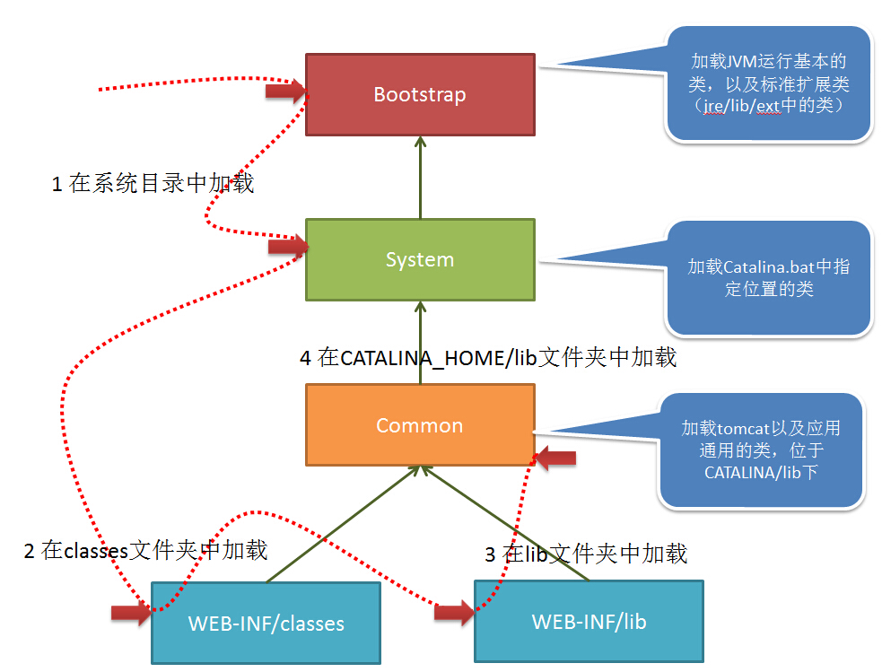

# 类加载器

当tomcat启动时，会创建几种类加载器：
1) Bootstrap 引导类加载器
加载JVM启动所需的类，以及标准扩展类（位于jre/lib/ext下）

2) System 系统类加载器
加载tomcat启动的类，比如bootstrap.jar，通常在catalina.bat或者catalina.sh中指定。位于CATALINA_HOME/bin下。

3)Common 通用类加载器
加载tomcat使用以及应用通用的一些类，位于CATALINA_HOME/lib下，比如servlet-api.jar

4)webapp 应用类加载器
每个应用在部署后，都会创建一个唯一的类加载器。该类加载器会加载位于 WEB-INF/lib下的jar文件中的class 和 WEB-INF/classes下的class文件。
当应用需要到某个类时，则会按照下面的顺序进行类加载：
1. 使用bootstrap引导类加载器加载
2. 使用system系统类加载器加载
3. 使用应用类加载器在WEB-INF/classes中加载
4. 使用应用类加载器在WEB-INF/lib中加载
5. 使用common类加载器在CATALINA_HOME/lib中加载
