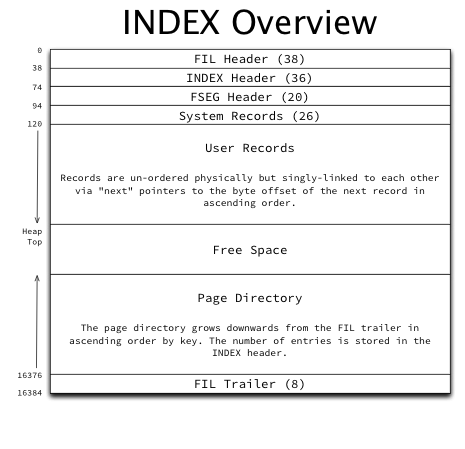
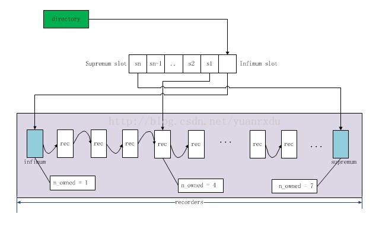
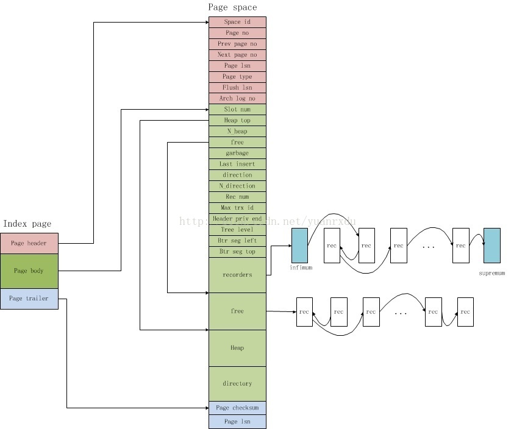

##  Mysql B-Tree索引原理分析及实践

###  前言
作为偏后端的开发者，就或者是Java开发者，数据库是绕不开的话题。但很多时候对数据库都是CRUD，通过自动生成ORM配置，打通程序或项目与数据库直接的通道后，接下来就很少再去理会数据库了，甚至很少再去思考我们发送给数据库的sql到底经历了什么过程。有时候，在遇到查询性能很慢时，我们常常会添加索引来应对。诚然，在大多时候索引是可以解决慢查询场景的。但是有的查询，索引已经是最满最优了，查询性能仍然改善不佳，这是为何？ 事实上，索引不是万能的，掌握了索引的工作原理，内部数据组织方式，在此基础上去理解数据库事物，Redo Log、Undo Log也会豁然开朗。
写作缘由：在最近的大客商品池2.0项目中，涉及到了很多数据库的读写。为了解决实际的问题，尝试深入学习了Mysql相关的知识，本文是对Mysql数据库索引学习或探索后的总结分享，文章包括的内容主要有B-Tree(B+Tree)的简单介绍，Innodb 索引结构及工作原理分析，表关联查询的原理，最后如果篇幅允许的话，再介绍一下我们常用的Explain返回的查询计划的具体含义。

### Mysql 索引初探

#### 一些概念
Mysql内部逻辑架构有Server层，存储引擎层等，而索引与存储引擎的有关。不同的存储引擎的索引结构不同，如Innodb表是基于B+Tree的聚簇索引而建立的，MyISAM引擎则用单独的索引文件来存储索引数据，通过引用数据的物理地址来引用数据行。

索引是一种是数据结构，并用该数据结构来组织数据的存储。Mysql可以利用索引快速找到指定的数据行或数据列。当我们在谈论Mysql索引的时候，其实潜台词就是在说B-Tree索引。单在Mysql中就索引而言，亦有很多概念。

**索引的类型**  
Mysql有B-Tree索引，Hash索引，全文索引，本文主要介绍我们用的最多的B-Tree索引。

**聚簇索引**
聚簇索引不是一种单独的索引类型，而是一种数据存储方式，与具体的存储引擎有关，具体依赖其实现方式。在Innodb中，B+Tree中存储了索引数据和表数据，具体通过叶子节点和非叶子节点来管理。(见后文)

**主键索引**
Innodb需要主键，用于定位唯一的行数据。合理的主键策略可以避免Mysql在存取数据的效率浪费，例如频繁的页分裂，大量的随机读场景。我们常用的Auto_Increment就是Mysql建议使用的。
Innodb表需要有主键索引，如果在建表时，没有用`Primary Key`显示指定主键的话，Mysql会使用表中第一个非空唯一索引来默认作主键。如果表中没有这样的字段，Innodb会生成一个隐式的48位(6字节)长的RowId作为表的主键。需要了解的是，Innodb的主键索引是一种聚簇索引。

**二级索引**
除了聚簇索引(Innodb的主键索引)以外的都是二级索引。或者这样说，默认情况下，除了主键，其余的都是二级索引。如一张表里id是主键索引，index `name`, index `(name,age)`
这些都是二级索引。

二级索引的叶子页中存储的是主键索引，索引二级索引需要两次查找.(见后文)

**复合索引**
就是多个列组合成一个索引，如`(name,age)`, `(first_name, last_name)`.

**覆盖索引**
覆盖索引与查询相关，指的是一个索引(复合索引)包含所有的需要查询字段的值，我们称之为覆盖索引。例如 `index (name,age)`, sql为`select name, age from table`.

#### 关于Index和Key
Mysql的索引创建、修改、删除相信大家都会熟练。这里简单的说明一个细节。
在Mysql的DDL语法里，`index` 和`key`是同义词。`index`是标配，`key`是为了保持与其他数据库sql的兼容性，也就是说下面的sql都是一样的含义。
```
create table t_index (
	index[key] xxx
);
alter table t_index add index[key] xxx
```
详情可参见Mysql官方[文档](https://dev.mysql.com/doc/refman/5.7/en/sql-syntax-data-definition.html)

### 从B-Tree说起
`算法导论`对B数的描述为：B数是为磁盘或其他直接存储的辅助存储设备而设计的一种平衡搜索树。B树类似于`红黑树`. 红黑树基于内存的操作效率较好，但是B树在磁盘I/O操作数方面要更好。许多数据库系统使用B树或其变种如B+树来存储信息。`注：本文不作算法讨论，因此不对B-Tree、B+Tree作定义说明，他们本身作为一种数据结构有很多特性，详情可参见算法导论。`

从该描述中可以理解到，B树这种结构可以解决磁盘I/O相关的很多问题，程序的很多性能瓶颈点无外乎磁盘I/O, 网络等。因此这里先介绍一下磁盘I/O和预读。
#### 预读
磁盘读取数据靠的是机械运动，每次读取数据花费的时间可以分为寻道时间、旋转延迟、传输时间三个部分，寻道时间指的是磁臂移动到指定磁道所需要的时间，主流磁盘一般在5ms以下；旋转延迟就是我们经常听说的磁盘转速，比如一个磁盘7200转，表示每分钟能转7200次，也就是说1秒钟能转120次，旋转延迟就是1/120/2 = 4.17ms；传输时间指的是从磁盘读出或将数据写入磁盘的时间，一般在零点几毫秒，相对于前两个时间可以忽略不计。因此磁盘存取主要消耗在寻道和磁臂旋转，现在主流的商用磁盘的平均存取时间在8~11ms范围内。
计算机科学中的局部性原理：` 当一个数据被用到时，其附近的数据也通常会马上被使用，程序运行期间所需要的数据通常比较集中`。所以当磁头定位到相应的磁道时，顺序读取盘片相邻的扇区而不用再旋转磁臂，这也是顺序读取效率高的原因，此时，预读可以提供I/O效率。
预读的长度一般为页（page）的整倍数。页是计算机管理存储器的逻辑块，硬件及操作系统往往将主存和磁盘存储区分割为连续的大小相等的块，每个存储块称为一页（在许多操作系统中，页得大小通常为4k），主存和磁盘以页为单位交换数据。当程序要读取的数据不在主存中时，会触发一个缺页异常，此时系统会向磁盘发出读盘信号，磁盘会找到数据的起始位置并向后连续读取一页或几页载入内存中，然后异常返回，程序继续运行。

#### B+Tree
B+树，是一种B-Tree的变种，Mysql普遍使用B+Tree实现其索引结构。B树的内层节点(非叶子页)不存储数据，只有外层节点(叶子页)才存储数据。下图是一个简单的B+Tree示意图(注:来自[文章](http://blog.codinglabs.org/articles/theory-of-mysql-index.html))。


在B+Tree的每个叶子节点增加一个指向相邻叶子节点的指针，就形成了带有顺序访问指针的B+Tree。做这个优化的目的是为了提高区间访问的性能，例如图4中如果要查询key为从18到49的所有数据记录，当找到18后，只需顺着节点和指针顺序遍历就可以一次性访问到所有数据节点，极大提到了区间查询效率。
#### 数据查找过程
主要思路为：通过在多分支B树上作多次的二分查找，来最终定位具体的节点。如图，假如要查找49对应的数据，则先二分查找确定49在15与56之间。在读取到15的next引用，取回其子节点，在通过二分查找，定位到49的next子节点，最后取回数据.(过程较简化)。

#### 关于B+Tree的小结
简而言之，B+Tree是一种高效的解决磁盘I/O树的数据结构，一种数据存取思想。但是，许多应用数据库都会在此思想上作自定义的数据结构封装，因此上文对B+Tree的描述可能稍显简单，因为我们的着重讨论Mysql的索引实现，而Mysql的索引在B+Tree的基础特性上不断的添砖加瓦，其目的只有一个：优化、优化，直至最佳。

而在Mysql的基本概念中，Mysql的B+Tree中存储的是page(见后文)，非叶子节点存储的page的编号，叶子节点存储的具体的page，包含有索引相关的字段和用户数据。所以，接下来，我们着重介绍Mysql的B+Tree索引结构。

### Innodb 索引结构及原理
在Mysql中，Innodb使用表空间作为数据存储模型，表空间有时也成为文件空间。每个表空间包含了多个逻辑文件,如在Mysql的数据目录中有idbdata1,idbdata2文件等。每个表空间都用一个32位的integer类型的ID. 每个表空间被分成了很多`页(Page)`, 通常每页大小为16Kb, 每页有一个32位integer类型的页编号，因此每个Innodb表最大容量为：2^32 x 16 KiB=64TiB。

Innodbd的数据单位有段(Segment),区(Extent), 页(Page). 页是Innodb组织数据的最小单位，索引叶子页中存储的最小数据单位就是页。64块连续的页成为区(64 * 16Kb=1Mb), 而64个区又组成一个段。 而页又分为`index page`, `undo page`。 本文只探讨index page.

index page 的整体结构如下：


如图，索引页包含多个部分，如文件头(FIL Header), Index Header, System Recorder，User Recorders，Page Directory等。 下面说明一下较重要的几个部分：
 - FIL Header 和 Trailer：所有类型的页都有这两部分，FlL可以认为是File的缩写。Innodb的索引页是通过双写链表链接起来的，FIL中的prev、next字段分别记录了上一页和下一页的page no。
 - Index Header：包含了许多与索引页、索引记录相关的字段，详细见下文。
 - System Record：Innodb 的索引页在创建时，会创建两条系统记录，一个称为`infimum` 表示最大下界，一个称为`supremum`表示最小上界。这两条记录存储在page中固定的位置，因此可以通过偏移量直接找到。
 - User Records : 表示实际的表数据，每条记录都有个变长的header，以及实际的列数据。header中还记录了next recorder,用于链接下一条行记录。User Recorder内部用单链表的形式在page中升序链接。
 - Page Directory: Innodb为了快速查找记录，在body的后面定义了一个称之为directory的目录槽（slots）,每个槽位占用两个字节，采用的是逆序存储，也就是说infimum的槽位总是在directory的最后2个字节上，supremum位于最前的两个字节，其他的一次类推。每个槽位可以引用多条user recordes记录，用`n_owned`来表示。infimum只能引用一条record, supremun可以引用1~8条record，而普通的slot可以引用4~8条记录。
 简要可如图描述所示：
 

其中，index header 还包含有很多字段，如page directory slots 的数量，record的数量，最大事物Id, 用于MVCC的回滚指针，页的level，主键值, 还有一些与空间回收利用相关的字段。所以有些资料上也把index page 概括为:`page header` 也就是FIL Header, `page body` 包含了system reorder、user recorder、index header， 还有`page trailer` 包含了page的校验和、lsn, 这些值用于保证页的完整性。

所以整合起来，可以用一张图来概括Index page的结构([来源](http://blog.csdn.net/yuanrxdu/article/details/42215981))：


**如何定位到一条数据**
前文我们已提到，Innodb采用聚簇索引来组织数据，当通过主键查找数据数据时，先在B+Tree中作B树二分查找，定位到最终的page页后，采用预读理论，基于page 的链表形式，加载多个page到内存中。然后读取目标index page中的page directory slot 数量，从infimum和supremum开始，作二分查找，找到目标的slot，然后读取slot的`n_owned`值，顺序遍历该slot引用的record， 如果找到则读取数据行，如果没找到，则返回查找失败。

那如果是非主键查找呢，如果是根据无索引的字段查找目标行呢。此时Innodb则执行的就是我们常说的全表扫描了。先在内存中查找已缓存的page, 如果找到则直接返回。如果没有找到，则循环的预读很多页到内存，再用上述规则查找，然后循环这一过程...

那如果是通过二级索引查找呢，这就是接下来我们要讨论的二级索引了。

#### 二级索引
Innodb中，除了主键索引以外的索引都是二级索引。

二级索引的page结构也主键索引的page的结构一致，只是类型和存储的数据不同。如下图：

二级索引叶子页节点记录的数据是主键值。也就是说，如果根据二级索引查找数据需要两次索引查找。第一次找到具体的主键，第二次根据主键再查找具体的行数据。如上述叶子节点中的18、99、4700则表示聚簇索引页中的主键值。

二级索引如果是单个字段，则根据字段的类型作比较后再顺序插入到B+Tree中，如果是复合类型的索引，如`(first_name, last_name)`, 则先比较first_name, 如果相等再比较last_name.然后再决定新节点是位于B+Tree中的位置。 和我们平常用的Comparable是一个道理。索引在作复合查找时，也根据该规则，**这也是最左前缀匹配的根本原因**。


### 表关联查询的原理
单表查询和表关联查询是平常开发中处理最多的场景。单表查询的过程可参见上文[如何定位到一条数据]。 而表关联查询则相对复杂一些，Mysql对关联查询执行的是嵌套循环关联操作，即现在一个表中循环取出单条数据，然后嵌套循环到下一个表中采用二分查找匹配的行，依次下去，直到找到所有表中匹配的为止。然后根据各个表匹配的行，返回查询需要的各个列。

举一个例子：
创建两个表
```
create table t1 (
	id int primary key auto_increment,
	col1 int not null,
	col2 varchar(20) not null,
	col3 int not null,
	index `idx_col1` (`col1`)
);
create table t2 (
	id int primary key auto_increment,
	col1 int not null,
	col2 varchar(20) not null,
	col3 int not null
);
```
执行的Sql
```
select t1.col1, t2.col2
from t1 left outer join t2 on t1.col3 = t2.col3
where t1.col2 in (5,6)
```
上述查询过程为：
- 扫描二级索引col1,找到对应的数据页，load到内存，取出对应的行
- 循环t1取出的行，找到行中的col3的值，根据该值在查询表t2(可走索引，回表)，预读t2相关的page.
- 嵌套循环比较。
对应的嵌套伪代码如下：
```
outer_iter = iterator over table1 where col1 in(5,6)
outer_row = outer_iter.next
while outer_row
    -- 用已知的outer_row的col3在t2上作二分查找，或走索引，或回表
    inner_iter = iterator over t2 where col3 = outer_row.col3       
    inner_row = inner_iter.next
    if inner_row
        while inner_row
            output [outer_row.col1, inner_row.col2]
            inner_row = inner_iter.next
        end
    else
        output [outer_row.col1, NULL]
    outer_row = outer_iter.next
end
```
如果是多层关联，则逐层嵌套。但遵循一个原则：
```
MYSQL在From子句中遇到遇到子查询，先执行子查询然后将结果放到一个临时表中，然后将这个临时表当做一个普通表对待(派生表） 在遇到右外连接时，Mysql将其改写成等价的左外连接。
```

### Explain 查询计划解析
Mysql 在执行带Explain的Sql时，会在查询上设置一个标记. 在执行Explain Sql 时，该标记为返回该Sql的执行计划，而不会执行Sql本身.
`explain`返回的查询计划返回的字段有：`id、select_type, table、type、possible_keys, key、key_len、ref、rows`，在Mysql5.1+版本中，执行explain extended，该命令会额外增加一个filtered列,用以表示查询记录数的百分比,与rows相乘就是实际的估算的行数.

下面对其中较重要的字段作介绍。
`注：这一节可以参考高性能Mysql第三版的附录篇。`

#### Explain中的字段说明

**id 列**

这一列总是包含一个编号，标识SELECT 所属的行。如果在语句中没有子查询或Union查询，那么只会有唯一的SELECT, 于是每一行在这一列中都将显示一个1. 否则(带有子查询或Union查询)的SELECT 语句一般会顺序编号,对应于其在原始语句中的位置(原Sql中第几个select).

MYSQL将SELECT 查询分为简单和复杂类型， 复杂类型可分为三大类：简单子查询、派生表(在FROM子句中的子查询)以及UNION查询.

**select_type列**
这一列显示的简单查询，亦或复杂查询。如果是简单查询，则为`SIMPLE`, 这意味着查询不包含子查询和UNION查询。如果查询有任何复杂的子部分，则最外层标记为	`PRIMARY`， 其余最重要的部分标记如下。
- SUBQUERY  包含在select列表中的子查询的select标记为SUBQUERY.
- DERIVED 包含在FROM子句中的子查询select，Mysql将执行结果放到一个临时表中，服务器内部称之为派生表，因为该临时表是从子查询中派生来的。
- UNION 带Union的联合查询中，第二个和随后的select被标记为UNION.

**table列**
该列显示对应行正在访问哪个表或者该表的别名。
如果FROM子句中有子查询或有UNION,table列则复杂些。此时table列是`<derivedN>`形式，其中N是子查询的id, 这里的N常指向Explain输出中后面的一行。

**type 列**
这一列表示访问类型，也就是说Mysql决定如何查找表中的行。下面是最重要的访问方法，性能异常从最差到最优。

- ALL 全表扫描。

- index 这个跟全表扫描一样，只是MySQL扫描是按索引次序进行而不是行，优点是避免了排序。这仍然有很大的开销，因为仍需要按索引次序读取整个表。
- range 也就是范围扫描，而不用遍历全部索引。
- ref 这是一种索引访问或称为索引查找，返回所有匹配单个值的行。称其为ref,是因为索引要跟某个参考值相比较，这个参考值可能是常数，或者是来自多表查询前一个表里的值。
- const 常量匹配
- NULL 这种方式意味着，Mysql不用再访问表或索引

**possible_keys列**
这一列显示查询可以使用那些索引，但罗列出来的索引可能后期的优化而不会用到。

**keys 列**
这一列显示了MySQL决定采用哪个索引来优化对该表的访问。如果该索引未出现在possible_keys中，表示Mysql可能选择了一个覆盖索引。

**ref列**
这一列表示了之前的表在key列记录的索引中查找值所用的列或常量.

**Extra 列**
 - Using index 表示Mysql将使用覆盖索引，避免访问表
 - Using where 这意为着Mysql服务器将在存储引擎检索行后再用where条件作过滤。
 - Using temporary 这意味着Mysql对查询结果排序时会使用一个临时表
 - Using filesort 这意为着对结果使用一个外部排序。这种排序可能基于内存或磁盘，但Explain不会明确告诉我们Mysql将使用哪种文件排序。

### 最后

Mysql有太多的内容都需要我们去了解、去探索学习。本文对我们日常开发中涉及最多的索引作了一些分析和讨论。可以说，作后端开发，掌握了数据库，掌握了存储才算是修炼到了第7层。记得潘老师之前的分享：程序就是数据+逻辑。而Mysql就是我们最忠实的数据源。

**最后，希望感兴趣的朋友阅读后有所收获。但如果有错误的地方，还希望帮我指出，非常感谢。**

路漫漫其修远兮，吾将上下而求索。

### 参考资料
- 高性能MySQL 第三版
- https://blog.jcole.us/innodb/
- http://blog.csdn.net/yuanrxdu/article/details/42215981
- https://dev.mysql.com/doc
- http://blog.codinglabs.org/articles/theory-of-mysql-index.html
- http://tech.meituan.com/mysql-index.html
