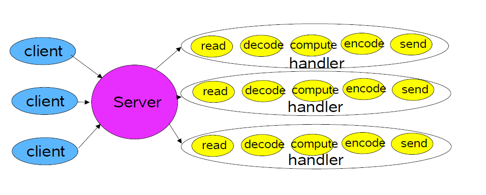
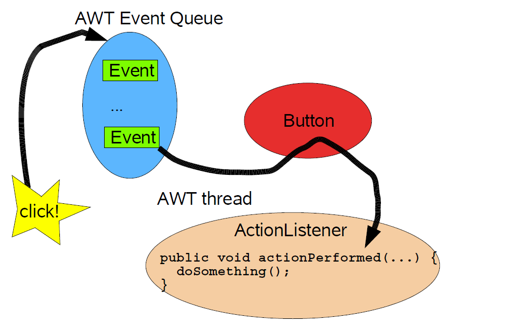
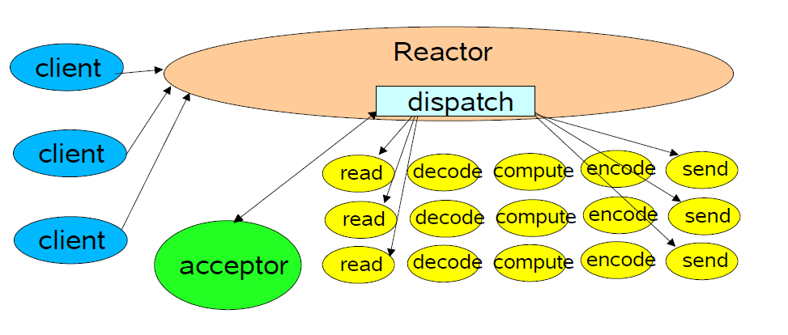
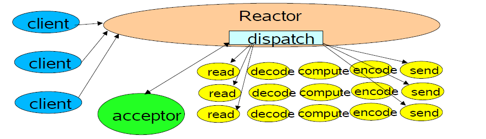
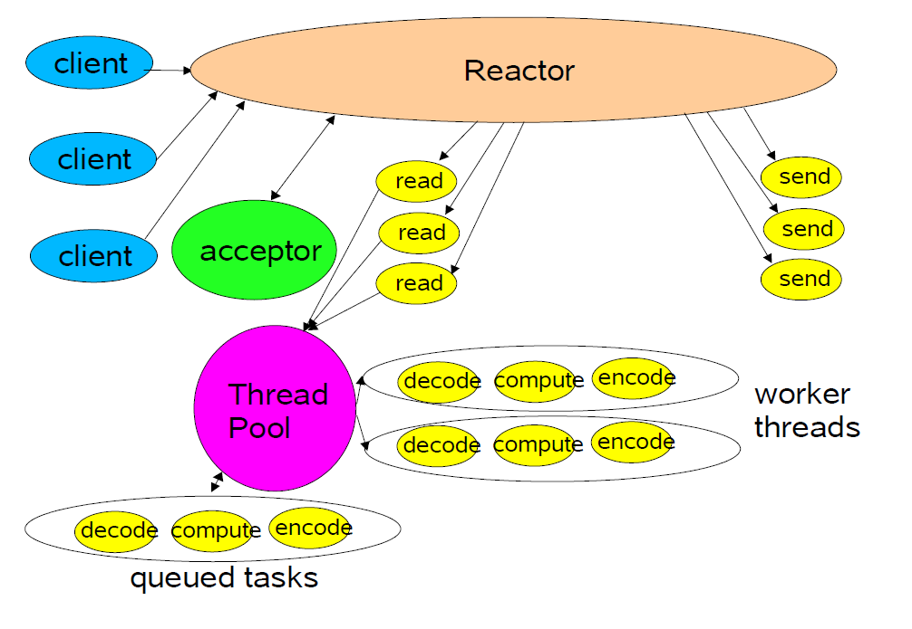
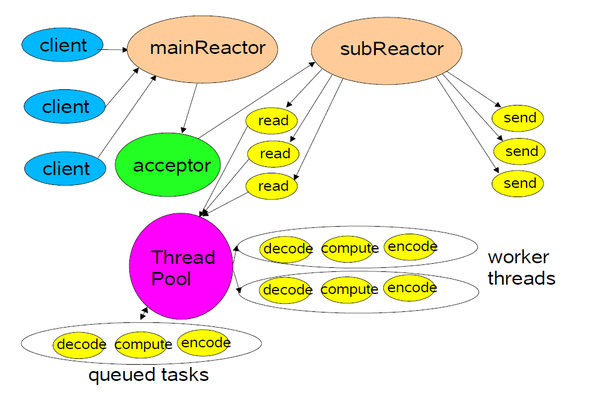
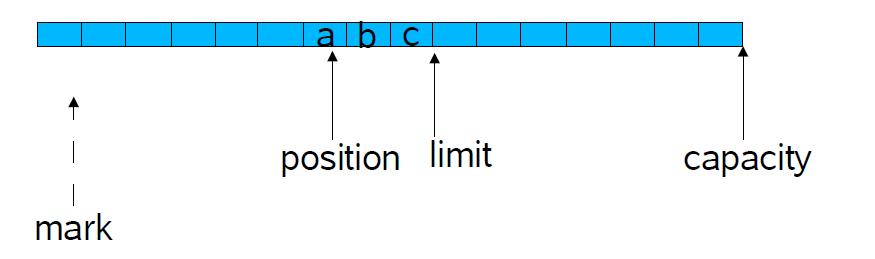

## Java IO模型&NIO
[TOC]

### 楔子
本文大部分内容翻译自Doug Lea 先生的幻灯片[http://gee.cs.oswego.edu/dl/cpjslides/nio.pdf]. 在此基础上，融入了一些自己的文字。欢迎浏览Doug Lea的个人主页[http://gee.cs.oswego.edu/dl/], 相关内容请尊重原作者。

### 概述
本文从主要讨论一下几个方面的内容：
- 可扩展的网络服务
- 事件驱动处理
- Reactor（反应堆）模式
	 基础版
	 多线程版
	 其他变体版
- Java NIO API 参考

### 网络服务
网络服务一般都涉及到Web服务，分布式对象等，但大多数服务端都有相同的基础步骤，如解析读请求（Read Request），请求解码，请求处理，响应编码，发送响应数据。但实际上，在具体的每个步骤上面所带来的性能消耗却每每不同，例如XML解析，文件传输，Web页面生成及渲染，或者其他计数服务这些不同的处理往往会有不同的性能消耗。

### 经典的服务设计

每个Handler都可以在各自的线程里执行所有的操作。

#### 经典的SocketServer循环阻塞
```
public class Server implements Runnable {

    public void run() {
        try {
            ServerSocket ss = new ServerSocket(PORT);
            while (!Thread.interrupted())
                new Thread(new Handler(ss.accept())).start();
                // 或单线程，或线程池
        } catch (IOException ex) { /* ... */ }
    }
    static class Handler implements Runnable {
        final Socket socket;
        Handler(Socket s) { socket = s; }
        public void run() {
            try {
                byte[] input = new byte[MAX_INPUT];
                socket.getInputStream().read(input);
                byte[] output = process(input);
                socket.getOutputStream().write(output);
            } catch (IOException ex) { /* ... */ }
        }
        private byte[] process(byte[] cmd) { /* ... */ }
    }

}
注：示例代码中，大多数异常处理都已省略
```
如你可见，这样的模式虽简单清晰，但却缺乏弹性伸缩的能力，当客户端并发量增加后，服务端的线程数量会不断增加，最终会耗尽系统资源。即使是中间采用线程池，仍然不能承受大量的并发请求。所以，我们需要新的方案，需要新的模式。但，当务之急是先明确一个目标。

### 可伸缩目标

- 在面临持续增长的负载（客户请求）压力时，可优雅的降级
- 可通过增加物理资源（CPU,内存，磁盘，带宽）来持续改进
- 仍需满足可用性和性能目标：潜在的短期内目标，高峰期需求指标，服务质量可调

面对上述的目标，分而治之通常是实现可伸缩，可扩展目标的最好的方式。

### 分而治之
 分而治之就是把处理过程折分成明确，职责单一的任务，每个任务采用非阻塞的方式来执行一个操作。 当任务状态是启用时，才开始执行。例如，一个IO事件通常是作为一种触发条件，感知到该事件才开始作相应的read -> decode -> compute -> encode -> send.

这种思想是Java NIO 提供的一种基础的机制。NIO 支持一种非阻塞的读写方式，还有通过感知到的IO事件来分发给相关的任务。

### 事件驱动设计
这种模式通常比其他的方式更有效，因为它用到的资源会偏少，不用为每个Client分配单独的线程。除此之外，所需开销会减少，因为减少了线程上下文切换，也减少了锁竞争的场景。但调度相应的请求会偏慢，因为需要手动的为事件绑定具体的执行操作。

好事多磨砺。这种模式虽然好处多多，但对于编写程序却不是一件容易的事。因为需要处处考虑把代码写成非阻塞的行为，还需记录并跟踪服务的状态
  
#### 背景知识：AWT 事件


IO事件驱动模式采用了类似的思想，但使用了不同的设计来实现。

### Reactor 模式
Reactor对IO事件的相应是转发到适配的处理器（Handler）上，这类似于AWT的线程。由Handler来执行一些非阻塞的行为。Reactor模式需要绑定Handler到具体的事件上，关于这种模式的详解可以去看这本书：《面向模式的软件架构：卷2》- Pattern-Oriented Software Architecture, Volume 2 (POSA2)。

#### Reactor基础模式

此外单线程版本，由acceptor接收请求并转发到线程中，由该线程来完成请求的处理。

#### Java NIO 支持
#### Channels
Channel是一种通道，可以连接到文件，套接字（Socket），用于支持非阻塞的读功能。
#### Buffers
Buffer是一种类似于数组的对象，可以被Channel直接读写。
#### Selectors
Selecttor是一种选择器，或叫多路复用选择器。用于在多个Channel直接感知IO事件，并作相应的隔离区分，然后负责把事件封装成对应的SelectionKey。
#### SelectionKeys
SelectionKey会维护事件的状态，并与事件绑定，通过SelectionKey来完成IO的读写。
### Reactor 模式实践
#### 第一步：初始化
```
public class Reactor implements Runnable {
    final Selector selector;
    final ServerSocketChannel serverSocket;
    
    public Reactor(int port) throws IOException {
        selector = Selector.open();
        serverSocket = ServerSocketChannel.open();
        serverSocket.socket().bind(
                new InetSocketAddress(port));
        serverSocket.configureBlocking(false);
        SelectionKey sk = serverSocket.register(selector, SelectionKey.OP_ACCEPT);
        sk.attach(new Acceptor());

        /*
            可选方式：使用明确的SPI提供者方式
            SelectorProvider provider = SelectorProvider.provider();
            Selector s  = provider.openSelector();
            ServerSocketChannel channel = provider.openServerSocketChannel();
        */
    }
   }
```
#### 第二步：循环分发
```
    public void run() { // 一般在新线程中作React
        try {
            while (!Thread.interrupted()) {
                selector.select();
                Set selected = selector.selectedKeys();
                Iterator it = selected.iterator();
                while (it.hasNext())
                    dispatch((SelectionKey) (it.next());
                selected.clear();
            }
        } catch (Exception e) {

        }
    }
    void dispatch(SelectionKey k) {
        Runnable r = (Runnable)(k.attachment());
        if (r != null)
            r.run();
    }
```
#### 第三步：接收者
```
class Acceptor implements Runnable { // inner
        public void run() {
            try {
                SocketChannel c = serverSocket.accept();
                if (c != null)
                    new Handler(selector, c);
            }catch(IOException ex) { /* ... */ }
        }
 }
```
如图示：


#### 第四步： Handler设置
```
final class Handler implements Runnable {
        private static final int MAXIN = 1024;
        private static final int MAXOUT = 1024;
        final SocketChannel socket;
        final SelectionKey sk;
        ByteBuffer input = ByteBuffer.allocate(MAXIN);
        ByteBuffer output = ByteBuffer.allocate(MAXOUT);
        static final int READING = 0, SENDING = 1;
        int state = READING;

        Handler(Selector sel, SocketChannel c) throws IOException {
            socket = c;
            c.configureBlocking(false);
            // Optionally try first read now
            sk = socket.register(sel, 0);
            sk.attach(this);
            sk.interestOps(SelectionKey.OP_READ);
            sel.wakeup();
        }

        boolean inputIsComplete() { /* ... */ }

        boolean outputIsComplete() { /* ... */ }

        void process() { /* ... */ }
  }
```
#### 第五步：请求处理
```
 public void run() {
            try {
                if (state == READING) read();
                else if (state == SENDING) send();
            } catch (IOException ex) { /* ... */ }
        }

        void read() throws IOException {
            socket.read(input);
            if (inputIsComplete()) {
                process();
                state = SENDING;
                // Normally also do first write now
                sk.interestOps(SelectionKey.OP_WRITE);
            }
        }

        void send() throws IOException {
            socket.write(output);
            if (outputIsComplete()) sk.cancel();
        }
```

#### 还有一种：状态Handler
就是借用GoF的状态对象模式，为每种状态都附带一个Handler，甚至根据状态重新绑定新的Handler。
```
    class Handler { 
        public void run() { // initial state is reader
            socket.read(input);
            if (inputIsComplete()) {
                process();
                sk.attach(new Sender());
                sk.interest(SelectionKey.OP_WRITE);
                sk.selector().wakeup();
            }
        }
        class Sender implements Runnable {
            public void run(){ // ...
                socket.write(output);
                if (outputIsComplete()) sk.cancel();
            }
        }
    }
```

### 多线程版本Reactor模型设计
首先，为了可扩展，可策略性的新增线程来适应多处理器的计算机。为了复用线程，需要工作者线程池。这种模式Reactor必须响应快速，在第一时间触发相应的Handler。还允许划分非IO的处理给其他线程执行。

除此之外，还可再扩展。当单一的Reactor线程池模式达到饱和时，还能扩展成多个Reactor，用以均衡负载CPU、IO速率。
使用线程池可以有助于调整和控制线程数量，一般数量会少于客户连接数。下图是基于线程池的模型：


#### 线程池Handler
```
    class Handler implements Runnable {
        
        // uses util.concurrent thread pool
        static Executor pool = new ThreadPoolExecutor()
        static final int PROCESSING = 3;
        
        synchronized void read() { 
            socket.read(input);
            if (inputIsComplete()) {
                state = PROCESSING;
                pool.execute(new Processer());
            }
        }
        synchronized void processAndHandOff() {
            process();
            state = SENDING; // or rebind attachment
            sk.interest(SelectionKey.OP_WRITE);
        }
        class Processer implements Runnable {
            public void run() { processAndHandOff(); }
        }
        
        public void run() {}
    }
```

#### 任务协作
##### 直接传递（Handsoff)
投递任务到线程池里后，然后执行该任务，完成后，又调用下一个任务。这样虽然快速，但却很生硬，不自然。
##### 回调（Callback)
回调Handler的分发器（Dispatcher)，然后执行状态变更，重新绑定Handler。这种类似GoF中的中介者模式。
##### 队列（Queue）
任务直接投递到队列中
##### 异步结果（Future）
异步执行任务，利用Wait/Notify机制来获取执行结果。

#### 使用线程池PooledExecutor

首先这必须是一个可调整的工作者线程池，由方法签名为`execute(Runnable r)`, 需要控制的参数有：
任务队列的类型、最大线程数量、最小线程数量、预热与按需分配线程数量，线程Keep-Alive时间，饱和策略（阻塞，丢弃，生产者执行等）。

#### 多Reactor线程池模型
这种模型主要用于静态或动态的协调控制CPU、IO速率，由一个主接收者分发Selector到其他的Reactor。
```
Selector[] selectors; // also create threads
	int next = 0;
	class Acceptor { // ...
		public synchronized void run() { ...
			Socket connection = serverSocket.accept();
			if (connection != null)
				new Handler(selectors[next], connection);
			if (++next == selectors.length) next = 0;
		}
}
```
模型图如示：


#### 使用NIO特性
NIO支持每个Reactor使用多个Selector，用以绑定不同的Handler到不同的事件中，但需要做好同步协作。还支持自动的文件到网络或网络到文件的复制传输，内存文件映射，直接内存分配。

### NIO API 参考

> Buffer
 ByteBuffer (CharBuffer, LongBuffer, etc not shown.)
Channel
SelectableChannel
SocketChannel
ServerSocketChannel
FileChannel
Selector
SelectionKey

下面对部分API作简单的介绍
>Buffer
```
abstract class Buffer {
	int capacity();
	int position();
	Buffer position(int newPosition);
	int limit();
	Buffer limit(int newLimit);
	Buffer mark();
	Buffer reset();
	Buffer clear();
	Buffer flip();
	Buffer rewind();
	int remaining();
	boolean hasRemaining();
	boolean isReadOnly();
}
```
很多方法都是见名之意，Buffer内部维护有四个状态变量：mark、position、limit、capacity. 其中mark表示标记的位置，而其余三者之间的关系是：position < limit < capacity. 如图：

这三个变量一起可以跟踪缓冲区的状态和它所包含的数据。

> Channel
```
interface Channel {
	boolean isOpen();
	void close() throws IOException;
}
interface ReadableByteChannel extends Channel {
	int read(ByteBuffer dst) throws IOException;
}
interface WritableByteChannel extends Channel {
	int write(ByteBuffer src) throws IOException;
}
interface ScatteringByteChannel extends ReadableByteChannel {
	int read(ByteBuffer[] dsts, int offset, int length) throws IOException;
	int read(ByteBuffer[] dsts) throws IOException;
}
interface GatheringByteChannel extends WritableByteChannel {
	int write(ByteBuffer[] srcs, int offset, int length) throws IOException;
	int write(ByteBuffer[] srcs) throws IOException;
}
```

Channel可看作IO操作的连接器。其子类来实现不同的行为，例如用于读，用于写的Channel, 还有聚合、分散功能的Channel。

> Selector
```
abstract class Selector {
	static Selector open() throws IOException;
	Set keys();
	Set selectedKeys();
	int selectNow() throws IOException;
	int select(long timeout) throws IOException;
	int select() throws IOException;
	void wakeup();
	void close() throws IOException;
}
```
Selector是一种多路复用选择器，Selector注册好的Channel是由SelectionKey来表示。