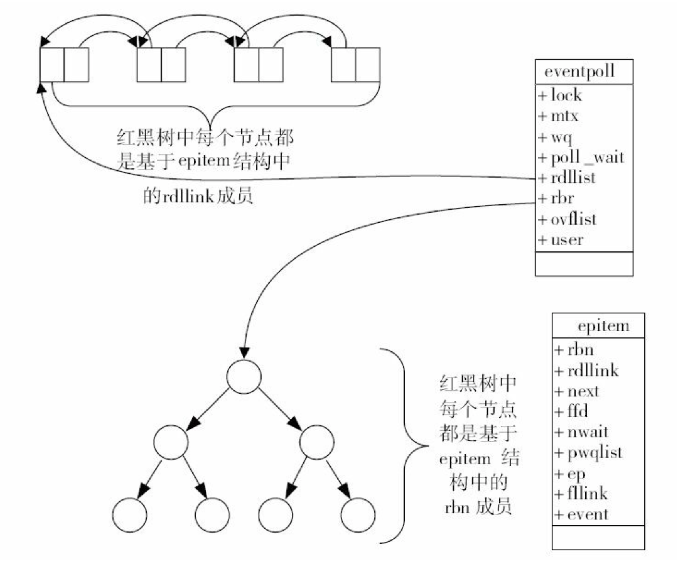

# Epoll模型原理探索

### epoll的原理和用法
select和poll模型会从用户态空间全量复制所有的连接(Socket)到内核态，再由操作系统来查找产生事件的某些连接，这个处理过程只能处理几千个连接且性能低效，浪费资源。所以在Linux2.6以后引入epoll模型来解决这个问题。

epoll模型把原来一个select和poll模型拆分成3个部分。调用epoll_create函数来建立一个epoll对象，然后再调用epoll_ctl函数向epoll对象添加或删除连接(来自客户端与服务端的Socket), 最后调用epoll_wait来收集发生事件的连接(一般是该连接上的写就绪事件，读就绪事件). 因此在同一时刻收集到的实际活动的连接并非巨量, 在这一层上优化效率。

当进程调用epoll_create函数时，Linux内核会创建一个eventpoll结构体，这个结构体有两个成员与epoll的使用方式密切相关，结构体主要定义如下：
```c++
struct eventpoll {

  红黑树根节点,树中存储所有添加到epoll对象的连接
  struct rb_root rbr;

  双向链表，链表中记录了epoll_wait返回给应用可用的连接
  struct list_head rdllist;
}

```
简略图如下：


每一个epoll对象都有一个独立的eventpoll结构体,这个结构体在内核空间中创建独立的内存,用以存储使用epoll_ctl方法想epoll对象中添加进来的连接与事件类型,这些数据封装成epitem结构体中，然后在挂到红黑树中。利用红黑树的平衡性质与去重性质，可以识别重复添加的连接。
所有添加到epoll中的连接都会与设备(网卡)驱动程序建立回调关系，相应的事件发生时会回调对应的方法，这个回调方法在内核中叫ep_poll_callback, 他会把产生事件的连接放到rdllist双向链表中，便于返回给应用可用的连接集合。epitem结构体主要代码如下：

```c++
struct epitem {
  红黑树的节点
  struct rb_node rbn;

  双向链表
  struct list_head rdllink;

  连接句柄,socket描述符
  struct epoll_filefd ffd;

  关联的eventpoll对象地址
  struct eventpoll *ep;

  每个连接注册的感兴趣的事件类型
  struct epoll_event event;
}
```

当应用调用epoll_wait检查是否有产生事件的连接时，内核只需要检查eventpoll对象中的rdllist双向链表是否有epitem节点，如果链表不为空，则把链表中的epitem复制到用户态内存中，同时返回可用的连接集合给应用。

#### 如何使用epoll
epoll模型通过下面3个系统调用为应用提供服务

(1) epoll_create系统调用
epoll_create在C库中的原型如下：
```c
int epoll_create(int size) size表示预期的连接的大致数量，作为参考值

```
epoll_create 返回一个epoll对象句柄，当创建好epoll句柄后，它就是会占用一个fd值，在linux下如果查看/proc/进程id/fd/，是能够看到这个fd的，所以在使用完epoll后，必须调用close()关闭，否则可能导致fd被耗尽。

(2) epoll_ctl系统调用
```c
int epoll_ctl(int epfd,int op,int fd,struct epoll_event* event);

```
epoll_ctl向epoll对象中添加，修改或删除感兴趣的事件，返回0表示成功，否则返回-1，此时需要根据errno错误码判断错误类型。
第一个参数为epoll_create返回的epoll句柄
第二个参数为操作类型，列表如下：
| op的取值 | 含义     |
| :------------- | :------------- |
| EPOLL_CTL_ADD      | 添加新的fd到epoll中      |
| EPOLL_CTL_MOD      | 修改已经注册的fd的监听事件       |
| EPOLL_CTL_DEL      | 删除epoll中的fd      |

第三个参数是需要监听的连接fd
第四个参数是告诉内核需要监听什么事件,使用epoll_event结构体，结构体定义如下：
```c
struct epoll_event {
  __uint32_t events;  /* Epoll events */
  epoll_data_t data;  /* User data variable */
};

```
events可以是以下几个宏的集合：
EPOLLIN ：表示对应的文件描述符可以读（包括对端SOCKET正常关闭）；
EPOLLOUT：表示对应的文件描述符可以写；
EPOLLPRI：表示对应的文件描述符有紧急的数据可读（这里应该表示有带外数据到来）；
EPOLLERR：表示对应的文件描述符发生错误；
EPOLLHUP：表示对应的文件描述符被挂断；
EPOLLET： 将EPOLL设为边缘触发(Edge Triggered)模式，这是相对于水平触发(Level Triggered)来说的。
EPOLLONESHOT：只监听一次事件，当监听完这次事件之后，如果还需要继续监听这个socket的话，需要再次把这个socket加入到EPOLL队列里.

data是对应的epoll_data_t是一个联合体，与具体的使用方式有关，定义如下：
```c
typedef union epoll_data {
  void *ptr;
  int fd;
  uint32_t u32;
  uint64_t u64;
} epoll_data_t;

```
(3) epoll_wait系统调用
```c
int epoll_wait(int epfd,struct epoll_event* events,int maxevents,int timeout);

```
epoll_wait负责收集epoll产生的事件，如果epoll中没有任何一个事件产生，最多等待timeout后返回。返回值表示当前产生的事件数量,如果为0表示本次调用没有事件发生，如果返回-1，则表示出现错误，需要检查错误码来判断错误类型。
第一个参数epfd是epoll对象句柄
第二参数events则是分配好的epoll_eventj结构体数组, 由epoll将发生的事件复制到events数组中(events不能为空,内核不管内存分配)
第三个参数maxevents表示本次返回的最大事件数量，通常与events数组大小一致
第四个参数表示等待的超时时间，单位毫秒。如果为0，则表示rdllist链表为空，立即返回，不会等待。

#### epoll工作模式
epoll对文件描述符的操作有两种模式：LT（level trigger）和ET（edge trigger）。LT模式是默认模式，LT模式与ET模式的区别如下：
　　- LT模式：当epoll_wait检测到描述符事件发生并将此事件通知应用程序，应用程序可以不立即处理该事件。下次调用epoll_wait时，会再次响应应用程序并通知此事件。
　　- ET模式：当epoll_wait检测到描述符事件发生并将此事件通知应用程序，应用程序必须立即处理该事件。如果不处理，下次调用epoll_wait时，不会再次响应应用程序并通知此事件。
ET模式在很大程度上减少了epoll事件被重复触发的次数，因此效率要比LT模式高。epoll工作在ET模式的时候，必须使用非阻塞套接口，以避免由于一个文件句柄的阻塞读/阻塞写操作把处理多个文件描述符的任务饿死。


## 参考资料
1. 深入理解Nginx模块开发与架构解析.陶辉著
2. http://www.cnblogs.com/Anker/archive/2013/08/17/3263780.html
3. http://www.cnblogs.com/lojunren/p/3856290.html
