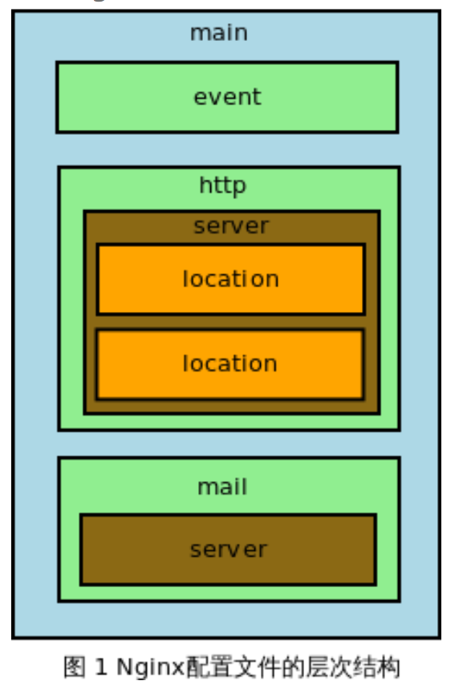

## Nginx配置文件
Nginx 服务启动时会读入配置文件，后续的行为则按照配置文件中的指令进行。Nginx 的配置文件是 纯文本文件，默认安装 Nginx 后，其配置文件均在 /usr/local/nginx/conf/ 目录下。其中，nginx.conf
为主配置文件。配置文件中以 # 开始的行，或者是前面有若干空格或者 TAB 键，然后再跟 # 的行，都被 认为是注释。这里只是了解主配置文件的结构。
Nginx 配置文件是以 block(块)形式组织，每个 block 都是以一个块名字和一对大括号 “{}” 表示 组成，block 分为几个层级，整个配置文件为 main 层级，即最大的层级;在 main 层级下可以有 event、http 、mail 等层级，而 http 中又会有 server block，server block中可以包含 location block。即块之间是可以嵌套的，内层块继承外层块。最基本的配置项语法格式是“配置项名 配置项值1配置项值2 配置项值3 ... ”;
每个层级可以有自己的指令(Directive)，例如 worker_processes 是一个main层级指令，它指定 Nginx 服务的 Worker 进程数量。有的指令只能在一个层级中配置，如worker_processes 只能存在于 main 中，而有的指令可以存在于多个层级，在这种情况下，子 block 会继承 父 block 的配置，同时如果 子block配置了与父block不同的指令，则会覆盖掉父 block 的配置。指令的格式是“指令名 参数1 参数2 ... 参数N;”，注意参数间可用任意数量空格分隔，最后要加分号。
下图是 Nginx 配置文件通常结构图示。



### Nginx基本配置项
Nginx 服务运行时，需要加载几个核心模块和一个事件模块，这些模块运行时所支持的配置项称为基 本配置;基本配置项大概可分为以下四类:
  - 用于调试、定位的配置项;
  - 正常运行的必备配置项;
  - 优化性能的配置项;
  - 事件类配置项;
各个配置项的具体实现如下:

#### 用于调试、定位的配置项
```
#以守护进程 Nginx 运行方式
#语法:daemon off | on;
#默认:daemon on;
#master / worker 工作方式
#语法:master_process on | off;
#默认:master_process on;

#error 日志设置
#路径 错误级别
#语法:error_log /path/file level;
#默认:error_log logs/error.log error;
#其中/path/file是一个具体文件;level是日志的输出级别，其取值如下:
#debug info notice warn error crit alert emerg
#从左至右级别增大;若设定一个级别后，则在输出的日志文件中只输出级别大于或等于已设定的级别;

```

#### 正常运行的配置项
```
#定义环境变量
#语法:env VAR | VAR=VALUE; #VAR 是变量名，VALUE 是目录;

#嵌入其他配置文件
#语法:include /path/file;
#include 配置项可以将其他配置文件嵌入到 Nginx 的 nginx.conf 文件中;

#pid 的文件路径
#语法:pid path/file;
#默认:pid logs/nginx.pid;
#保存 master 进程 ID 的 pid 文件存放路径;

#Nginx worker 运行的用户及用户组
#语法:user username [groupname]; #默认:user nobody nobody;

#指定 Nginx worker进程可打开最大句柄个数
#语法:worker_rlimit_nofile limit;

#限制信号队列
#语法:worker_rlimit_sigpending limit; #设置每个用户发给 Nginx 的信号队列大小，超出则丢弃;  

```
#### 优化性能配置项
```
#Nginx worker 进程的个数
#语法:worker_process number; #默认:worker_process 1;

#绑定 Nginx worker 进程到指定的 CPU 内核
#语法:worker_cpu_affinity cpumask [cpumask...]

#SSL 硬件加速 #语法:ssl_engine device;
#系统调用 gettimeofday 的执行频率
#语法:timer_resolution t;

##Nginx worker优先级设置
##语法: worker_priority nice (最高到最低: -20 ~ 19)
#默认:worker_priority 0;

```

#### 事件类配置项
```
#一般有以下几种配置:
#1、是否打开accept锁
# 语法格式:accept_mutex [on | off];

#2、lock文件的路径
#语法格式:lock_file path/file;

#3、使用accept锁后到真正建立连接之间的延迟时间 # 语法格式:accept_mutex_delay Nms;

#4、批量建立新连接
#语法格式:multi_accept [on | off];

#5、选择事件模型
#语法格式:use [kqueue | rtisg | epoll | /dev/poll | select | poll | eventport];

#6、每个worker进行的最大连接数
#语法格式:worker_connections number;
```

### HTTP 核心模块的配置(http块)

#### 虚拟主机与请求分发:server块
```
#监听端口
#语法:listen address:port[default | default_server | [backlog=num | rcvbuf=size | sndbuf=size |
# accept_filter | deferred | bind | ipv6only=[on | off] | ssl]];
# 默认:listen  80;

#说明:
#default或default_server:将所在的server块作为web服务的默认server块;当请求无法匹配配置文件中的 所有主机名时，就会选择默认的虚拟主机;
#backlog=num:表示 TCP 中backlog队列存放TCP新连接请求的大小，默认是-1，表示不予设置;
#rcvbuf=size:设置监听句柄SO_RCVBUF的参数;
#sndbuf=size:设置监听句柄SO_SNDBUF的参数;
#accept_filter:设置accept过滤器，只对FreeBSD操作系统有用;
#deferred:设置该参数后，若用户发起TCP连接请求，并且完成TCP三次握手，但是若用户没有发送数据， 则不会唤醒worker进程，直到发送数据;
#bind:绑定当前端口 / 地址对，只有同时对一个端口监听多个地址时才会生效; # ssl:在当前端口建立的连接必须基于ssl协议;

#主机名称
#语法:server_name name[...]; 正则匹配规则：首先选择完全匹配(www.e.com),其次选择前缀批量(*.e.com),然后选择后缀匹配(www.e.*), 最后选择~^\.e\.com$

#默认:server_name   "";

#server name 是使用散列表存储的, 每个散列桶占用内存大小
#语法:server_names_hash_bucket_size size;
#默认:server_names_hash_bucker_size 32|64|128;

#location语法:
location[= | ~ | ~* | ^~ | @] /uri/ {} #配置块范围:server
#location尝试根据用户请求中的URI来匹配 /uri表达式，若匹配成功，则执行{}里面的配置来处理用户请求, 说明如下：
#1. = 表示把URI当做字符串,以便于参数中的uri作完全匹配,如 location = / { 当请求为/，则使用该配置 }
#2. ~ 表示匹配URI时是字母大小写敏感的
#3. ~* 表示匹配URI时忽略字母大小写
#4. ^~ 表示匹配URI时只需要其前半部分与uri参数匹配即可，如 location ^~ images {以image开头的请求都会匹配上}
#5. @ 表示仅用于Nginx服务内部请求之间的重定向，带@符号的location不直接处理用户请求
#6. 支持正则表达式, 如 location ~* \.(gif|jpg|png)$ { 匹配以gif,jpg,png结尾的请求 }
#7. location是有顺序的，当以个请求能匹配多个location时，则被第一个location处理

#上述规则语义为：如果匹配，则执行。若需匹配所有的http请求，参数部分直接使用/, 如：
location / {
  #匹配所有请求
}
location /path {
  #匹配path开头的请求
}

#文件路径定义
#1. 以root设置资源路径
#语法: root path
#配重块：http server location if
#定义资源文件相对于Http请求的根目录, 如:请求为/download/test.htm, 返回html/test.htm
location /download/ {
  root html;
}

#以alias方式设置资源路径
#语法:alias path; #配置块范围:location

#访问主页
#语法:index file...;
#默认:index index.html;
#配置块范围:http、server、location    

#根据HTTP返回码重定向页面
#语法:error_page code [code...] [= | =answer-code] uri | @named_location;
#配置块范围:server、http、location、if
#对应某个请求返回错误码时，如果匹配error_page中设置的code,则重定向到新的URI中,如：
error_page 404      404.html
error_page 502 503  504 50x.html
error_403           http://err.example.com/error.html
error_page 404      @fetch

#返回重定向后实际处理的真实结果: error_page 404 /404.html
#请求返回的错误code想让另一个location处理, 如返回404的请求会被反向代理到后端处理：
location / {
  error_page 404 @fallback
}
location @fallback {
  proxy_pass http://backend;
}

#try_files
#语法:try_files path1 [path2] uri;
#配置块范围:server、location

```

#### 内存及资源分配与网络连接设置
```
#HTTP 包体只存储在磁盘文件中
#语法:client_body_in_file_only on | clean | off;
#默认:client_body_in_file_only off;
#配置块范围:http、server、location

#存储 HTTP 头部的内存buffer大小
#语法:client_header_buffer_size size;
#默认:client_header_buffer_size 1k; #配置块范围:http、server

#存储超大 HTTP 头部的内存buffer大小
#语法:large_client_header_buffer_size
#默认:large_client_header_buffer_size
#配置块范围:http、server

#存储 HTTP 包体的内存buffer大小
#语法:client_body_buffer_size size;
#默认:client_body_buffer_size 8k/16k;
#配置块范围:http、server、location

#HTTP 包体的临时存放目录
#语法:client_body_temp_path dir-path
#默认:client_body_temp_path client_body_temp;
#配置块范围:http、server、location

#存储 TCP 成功建立连接的内存池大小
#语法:connection_pool_size size;
#默认:connection_pool_size 256;
#配置块范围:http、server
#存储 TCP 请求连接的内存池大小
#语法:request_pool_size size;
#默认:request_pool_size 4k; #配置块范围:http、server

#读取 HTTP 头部的超时时间
#语法:client_header_timeout time;
#默认:client_header_timeout 60;
#配置块范围:http、server、location

#读取 HTTP 包体的超时时间
#语法:client_body_timeout time; # 默认:client_body_timeout 60;
# 配置块范围:http、server、location
# 发送响应的超时时间
# 语法:send_timeout time;
# 默认:send_timeout 60;
# 配置块范围:http、server、location

# TCP 连接的超时重置
# 语法:reset_timeout_connection on | off; # 默认:reset_timeout_connection off;
# 配置块范围:http、server、location
# 控制关闭 TCP 连接的方式
# 语法:lingering_close off | on | always;
# 默认:lingering_close on;
# 配置块范围:http、server、location
# always 表示关闭连接之前无条件处理连接上所有用户数据; # off 表示不处理;on 一般会处理;
# lingering_time
# 语法:lingering_time time;
# 默认:lingering_time 30s;
# 配置块范围:http、server、location
# lingering_timeout
# 语法:lingering_timeout time;
# 默认:lingering_time 5s;
# 配置块范围:http、server、location

```

#### MIME 类型设置
```
# MIME type 与文件扩展的映射
# 语法:type{...}
# 配置块范围:http、server、location
# 多个扩展名可映射到同一个 MIME type

# 默认 MIME type
# 语法:default_type MIME-type;
# 默认:default_type text/plain;
# 配置块范围:http、server、location

```

#### 客户端请求相关
```
# 按 HTTP 方法名限制用户请求
# 语法:limit_except method...{...}
# 配置块:location
# method 的取值如下:
# GET、HEAD、POST、PUT、DELETE、MKCOL、COPY、MOVE、OPTIONS、 # PROPFIND、PROPPATCH、LOCK、UNLOCK、PATCH
# HTTP 请求包体的最大值
# 语法:client_max_body_size size; # 默认:client_max_body_size 1m;
# 配置块范围:http、server、location
# 对请求限制速度
# 语法:limit_rate speed;
# 默认:limit_rate 0;
# 配置块范围:http、server、location、if # 0 表示不限速


# 忽略不合法的 HTTP 头部
# 语法:ignore_invalid_headers on | off; # 默认:ignore_invalid_headers on;
# 配置块:http、server
# HTTP 头部是否允许下划线
# 语法:underscores_in_headers on | off; # 默认:underscores_in_headers off;
# 配置块:http、server

# If_Modified_Since 头部的处理策略
# 语法:if_modified_since [off | exact | before]
# 默认:if_modified_since exact;

# 是否合并相邻的“/”
# 语法:merge_slashes on | off; # 默认:merge_slashes on;
# 配置块:http、server、location

# DNS解析的超时时间
# 语法:resolver_timeout time; # 默认:resolver_timeout 30s; # 配置块:http、server、location
# 返回错误页面是否在server中注明Nginx版本 # 语法:server_tokens on | off;
# 默认:server_tokens on;
# 配置块:http、server、location

```

### 配置示例(沙箱配置)
```
user                        admin;

#worker_processes            auto;
#worker_cpu_affinity         auto;
worker_rlimit_nofile        100000;

error_log                   "pipe:/opt/taobao/install/cronolog/sbin/cronolog /home/admin/cai/logs/cronolog/%Y/%m/%Y-%m-%d-error_log" warn;
pid                         /home/admin/cai/logs/nginx-proxy.pid;

events {
    use                     epoll;
    worker_connections      20480;
}
http {
    include                 mime.types;
    default_type            application/octet-stream;

    root                    /home/admin/cai/htdocs;
    sendfile                on;
    tcp_nopush              on;

    server_tokens           off;

    keepalive_timeout       0;

    client_header_timeout   1m;
    send_timeout            1m;
    client_max_body_size    3m;
    client_body_timeout     3600s;

   #error_page              400 http://err.taobao.com/error1.html;
   #error_page              403 http://err.taobao.com/error1.html;
   #error_page              404 http://err.taobao.com/error1.html;
   #error_page              405 http://err.taobao.com/error1.html;
   #error_page              408 http://err.taobao.com/error1.html;
   #error_page              410 http://err.taobao.com/error1.html;
   #error_page              411 http://err.taobao.com/error1.html;
   #error_page              412 http://err.taobao.com/error1.html;
   #error_page              413 http://err.taobao.com/error1.html;
   #error_page              414 http://err.taobao.com/error1.html;
   #error_page              415 http://err.taobao.com/error1.html;
   #error_page              500 http://err.taobao.com/error2.html;
   #error_page              501 http://err.taobao.com/error2.html;
   #error_page              502 http://err.taobao.com/error2.html;
   #error_page              503 http://err.taobao.com/error2.html;
   #error_page              506 http://err.taobao.com/error2.html;

    index                   index.html index.htm;

    log_format              proxyformat    "$remote_addr $request_time_usec $http_x_readtime [$time_local] \"$request_method http://$host$request_uri\" $status $body_bytes_sent \"$http_referer\" \"$http_user_agent\" \"$md5_encode_cookie_unb\" \"$md5_encode_$cookie_cookie2\" \"$eagleeye_traceid\"";
    # if want to do A/B test, please set the log format to abtest, and umcomment the include line
    #include    gray_conf/resource/gray-log-format.conf;

    access_log              "pipe:/opt/taobao/install/cronolog/sbin/cronolog /home/admin/cai/logs/cronolog/%Y/%m/%Y-%m-%d-taobao-access_log" proxyformat;
    log_not_found           off;

    gzip                    on;
    gzip_http_version       1.0;
    gzip_comp_level         6;
    gzip_min_length         1024;
    gzip_proxied            any;
    gzip_vary               on;
    gzip_disable            msie6;
    gzip_buffers            96 8k;
    gzip_types              text/xml text/plain text/css application/javascript application/x-javascript application/rss+xml application/json;

    server {
        listen              80;
        server_name         alink.smart.tbsandbox.com;

        location / {
           proxy_pass  http://100.69.196.80:7001;
        }

        location /api {
            proxy_pass http://alink_api_vip;
        }
        location /login/oauth2 {
            proxy_pass http://11.163.209.52:80;
        }

    }

    upstream alink_api_vip {
        server 11.162.252.212:80;
        server 11.163.209.52:80;
    }

    server {
      listen                 443;
      ssl                    on;
      server_name            alink.smart.tbsandbox.com;
      ssl_certificate        /home/admin/cai/conf/ssl/alink.smart.tbsandbox.com.cer;
      ssl_certificate_key    /home/admin/cai/conf/ssl/alink.smart.tbsandbox.com.key;

      ssl_session_timeout  5m;
      ssl_session_cache shared:NXSSL:256M;

      log_format  main  '$remote_addr - $remote_user [$time_local] "$request" '
                      '$status $body_bytes_sent "$http_referer" '
                      '"$http_user_agent" "$http_x_forwarded_for"';
      access_log /home/admin/logs/nginx/access.log main;

      ssl_protocols  SSLv3 TLSv1;
      ssl_ciphers  ALL:!aNULL:RC4+RSA:+HIGH:+MEDIUM:!LOW:!SSLv2:+EXP:!eNULL:!MD5:!EXPORT40;

      location /{
              proxy_pass http://100.69.196.80:7001;
      }
      location /api {
          proxy_pass http://alink_api_vip;
      }
    }
```

