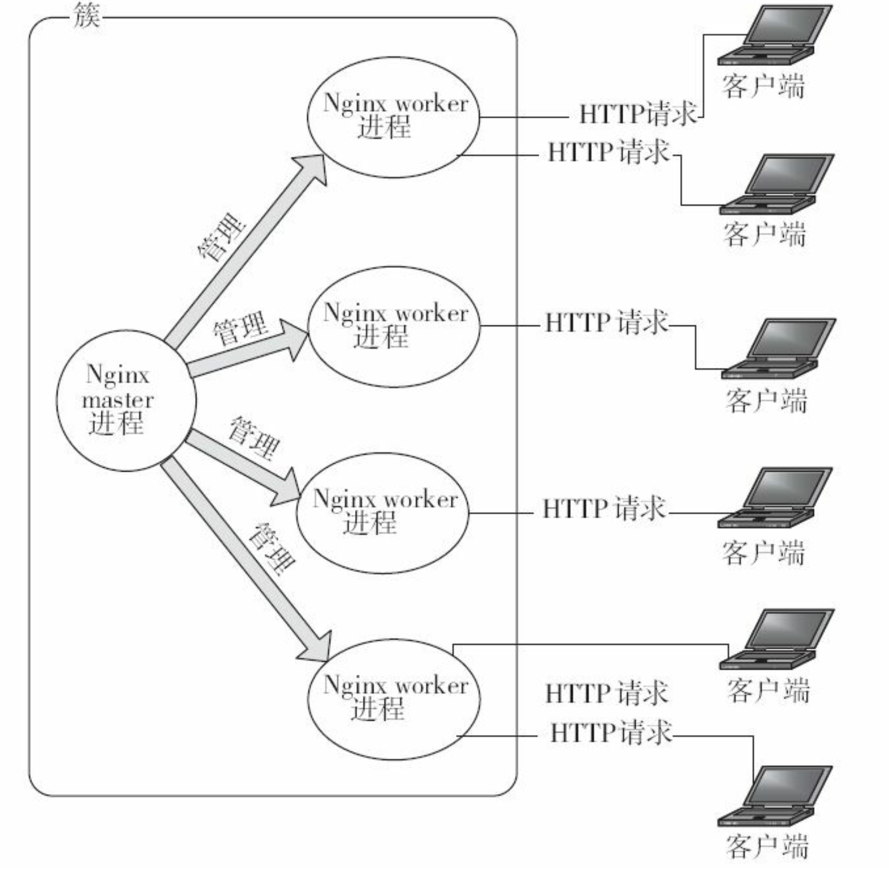
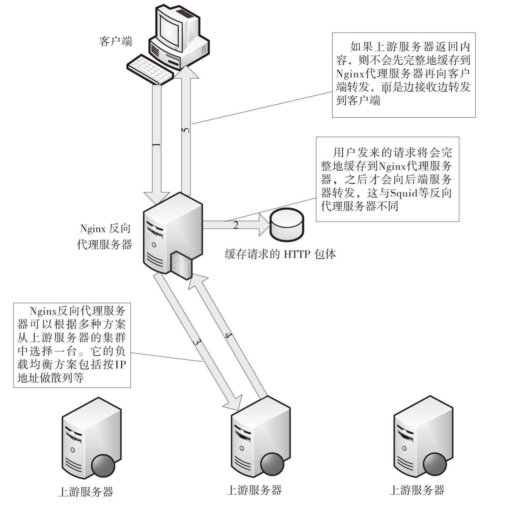
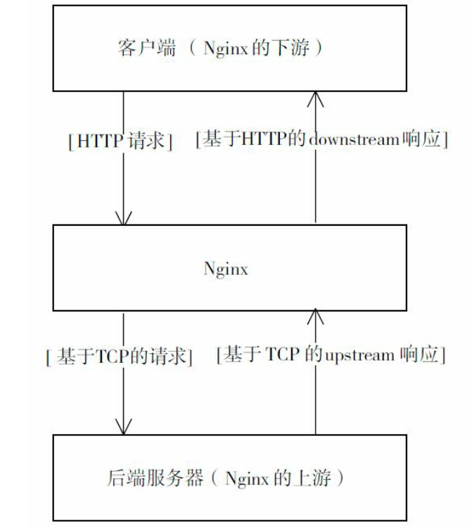
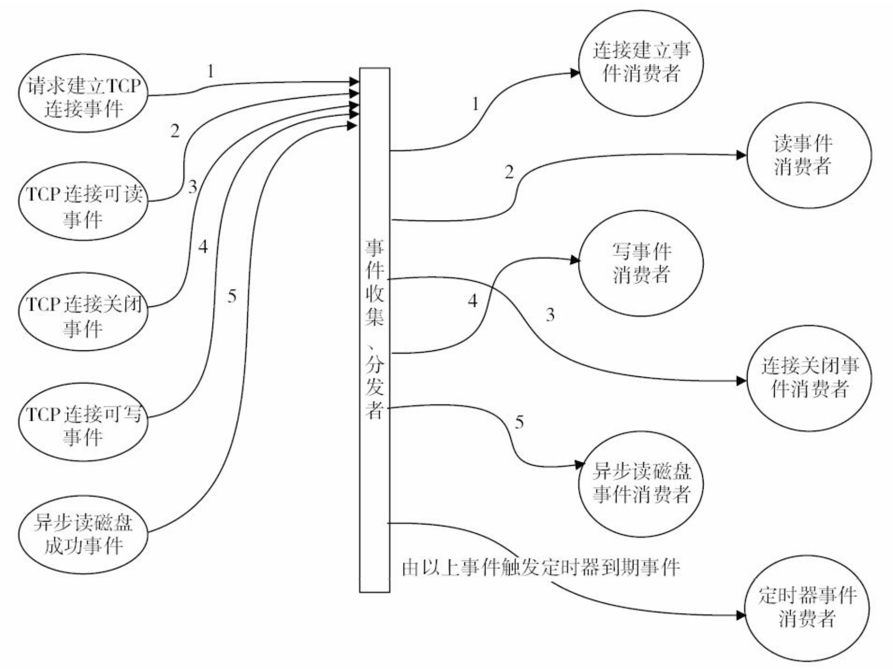
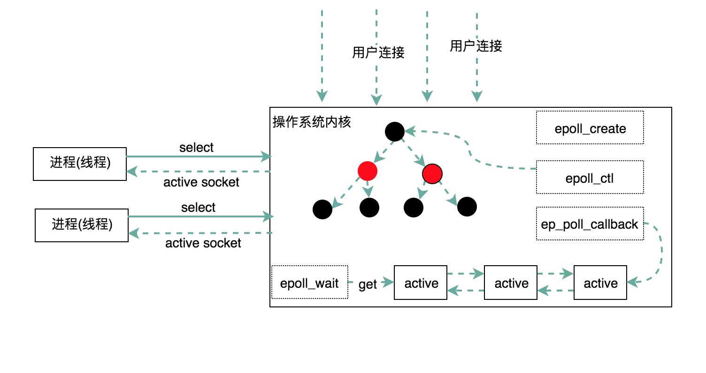
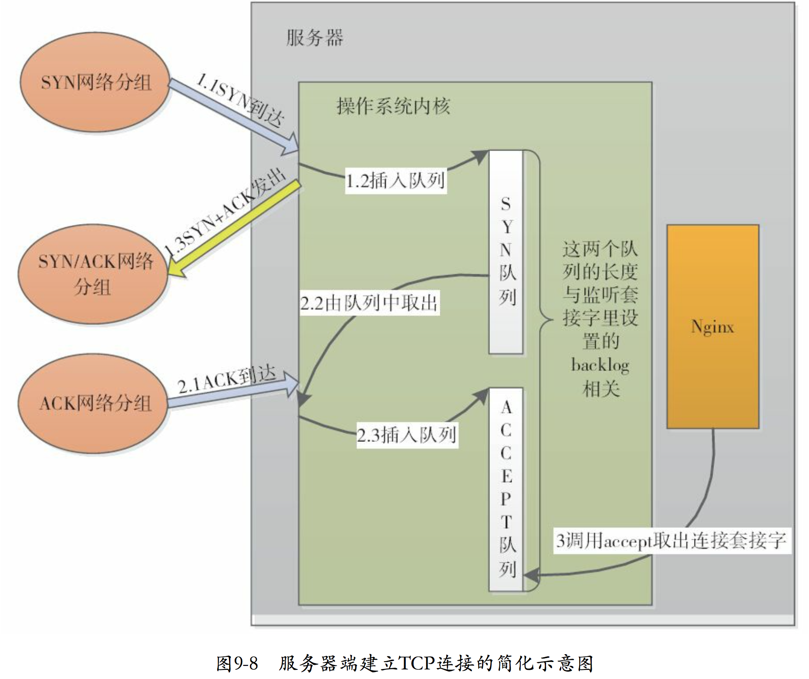
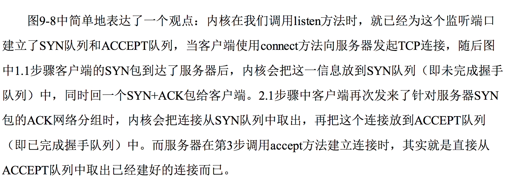
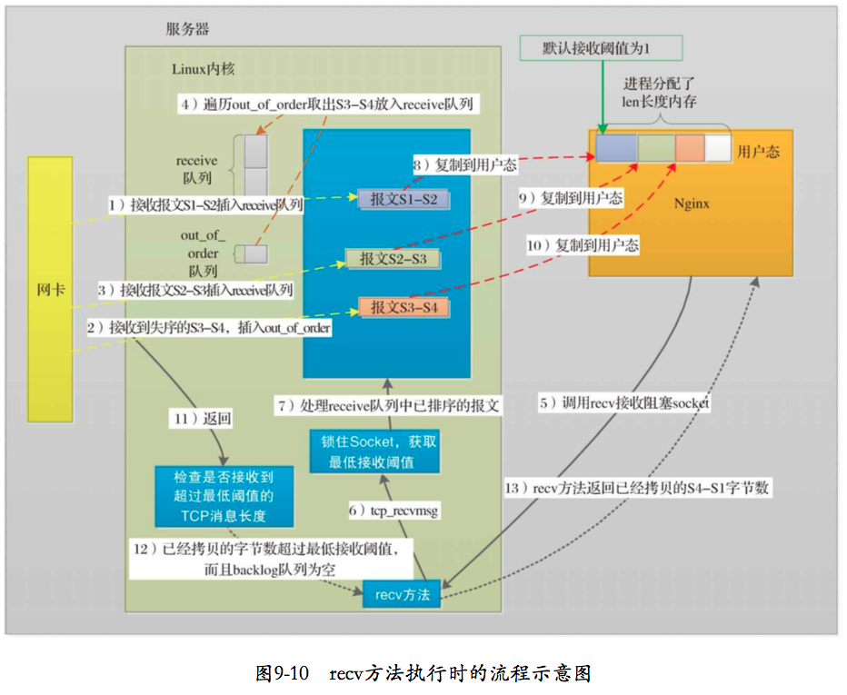
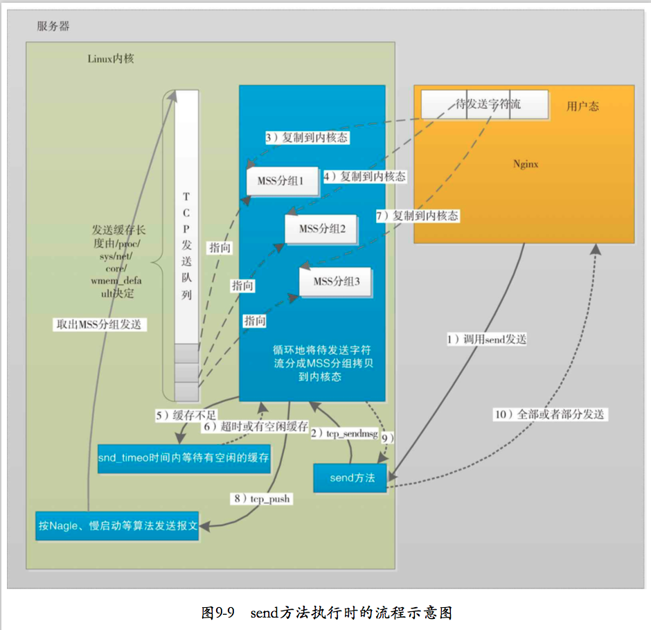

# Think in Nginx
## 概述
Nginx是一个高性能的跨平台Web服务器,相较于传统的Web服务器，Nginx能更快的响应客户端请求，其设计具有很好的扩展性，能由多个不同功能，不同层次，不同类型且耦合度很低的模块组成。同时Nginx还能提供高可靠，低内存消耗，单机支持10万以上的并发连接的服务。

### Mac使用brew安装
```
brew search nginx
brew install nginx

默认Shell路径：/usr/local/bin/nginx -> ../Cellar/nginx/1.12.2_1/bin/nginx
默认配置文件：/usr/local/etc/nginx/nginx.conf
Mac下的安装目录：/usr/local/Cellar/nginx/1.12.2_1(版本)
```
常用命令行说明:
```
安装成功后，启动：`sudo nginx`
启动成功后，测试：`http://localhost:8080`
停止nginx：sudo nginx -s stop （发送停止信号： kill -s SIGTERM <nginx master pid>)
静默停止nginx: sudo nginx -s quit （kill -s SIGQUIT <nginx master pid>）

显示版本信息：sudo nginx -v
测试配置信息是否错误: nginx -t

使运行中Nginx的重读配置生效: sudo nginx -s reload
显示帮助: sudo nginx -h

```
### 工作进程间的关系
Nginx 是使用一个 master 进程来管理多个 worker 进程提供服务。master 负责管理 worker 进程， 而 worker 进程则提供真正的客户服务，worker 进程的数量一般跟服务器上 CPU 的核心数相同，worker 之间通过一些进程间通信机制实现负载均衡等功能。Nginx 进程之间的关系可由下图表示:



## Nginx配置文件
[参见Nginx配置项](./Nginx配置项.md)

## Nginx upstream机制
upstream 机制使得 Nginx 成为一个反向代理服务器，Nginx 接收来自下游客户端的 http 请求，并 处理该请求，同时根据该请求向上游服务器发送 tcp 请求报文，上游服务器会根据该请求返回相应地响应 报文，Nginx 根据上游服务器的响应报文，决定是否向下游客户端转发响应报文。另外upstream机制提供了负载均衡的功能，可以将请求负载均衡到集群服务器的某个服务器上面。

#### 如下图，反向代理处理流程：



#### 而upstream机制场景示意图:



## Nginx事件驱动
所谓事件驱动，简单来说，就是由一些事件发生源来产生事件，有一个或多个事件收集器来收集、分发事件。而事件处理器会注册自己感兴趣的事件，同时会消费这些事件。
对应Nginx而言，一般会由网卡，磁盘产生事件，而事件模块负责收集、分发事件到事件消费者模块中。Nginx完全采用事件驱动架构来处理业务，传统服务器一般在TCP连接建立成功后，每个请求的处理都将一直占用着系统资源，直到连接关闭才会释放。
Nginx不会使用进程或线程来作为事件消费者，只有事件收集器、分发器才会占用进程资源，他们在分发某个事件时调用事件消费者模块使用当前占用的资源。

简要模型如图：



### Epoll模型的原理

select和poll模型会从用户态空间全量复制所有的连接(Socket)到内核态，再由操作系统来查找产生事件的某些连接，这个处理过程只能处理几千个连接且性能低效，浪费资源。所以在Linux2.6以后引入epoll模型来解决这个问题。

epoll模型把原来一个select和poll模型拆分成3个部分。调用epoll_create函数来建立一个epoll对象，然后再调用epoll_ctl函数向epoll对象添加或删除连接(来自客户端与服务端的Socket), 最后调用epoll_wait来收集发生事件的连接(一般是该连接上的写就绪事件，读就绪事件). 因此在同一时刻收集到的实际活动的连接并非巨量, 在这一层上优化效率。
每一个epoll对象都有一个独立的eventpoll结构体,这个结构体在内核空间中创建独立的内存,用以存储使用epoll_ctl方法想epoll对象中添加进来的连接与事件类型,这些数据封装成epitem结构体中，然后在挂到红黑树中。利用红黑树的平衡性质与去重性质，可以识别重复添加的连接。

所有添加到epoll中的连接都会与设备(网卡)驱动程序建立回调关系，相应的事件发生时会回调对应的方法，这个回调方法在内核中叫ep_poll_callback, 他会把产生事件的连接放到rdllist双向链表中，便于返回给应用可用的连接集合。epoll模型工作简要图：



### TCP协议与Nginx
作为Web服务器的Nginx，主要任务是处理好基于TCP的Http协议。TCP是一个面向连接的协议，它必须基于建立好的TCP连接来为通信的双方提供可靠的字节流服务，建立TCP连接是我们耳熟能详的的三次握手：
- 1) 客户端向服务端发起连接消息包(SYN)
- 2) 服务端确认收到并向客户端发送回复消息包(SYN + ACK)
- 3) 客户端收到服务端发送的消息，并发送确认消息包(ACK)

建立连接的过程是在操作系统内核中完成的，而如Ngnix这样的应用程序只是从内核中取出已经建立好的连接，内核处理TCP连接的建立过程如图：



**内核发送与接收报文**




综上，Nginx使用TCP协议主要是很好的利用CPU和内存，在必要的时候才调用TCP的send/recv方法，以避免无畏的CPU浪费. 例如只有在接收到报文甚至只有接收到足够多报文(SO_RCVLOWAT阈值),worker进程才有可能调用recv方法。同样只有在发送缓冲区有空闲才去调用send方法.

## 参考资料
1. 深入理解Nginx模块开发与架构解析.陶辉著
2. http://tengine.taobao.org/book/chapter_02.html#connection
