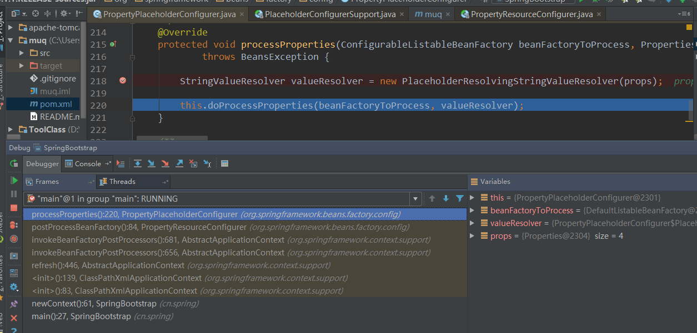
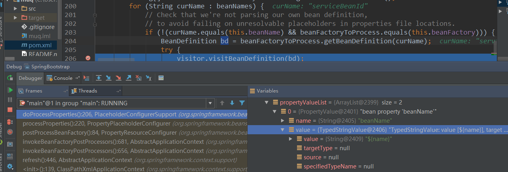
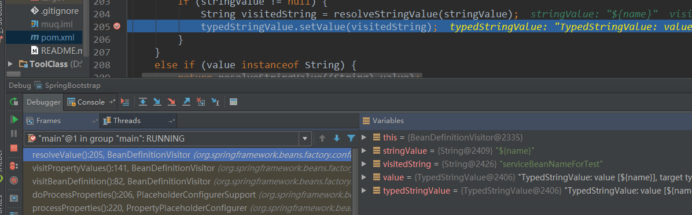
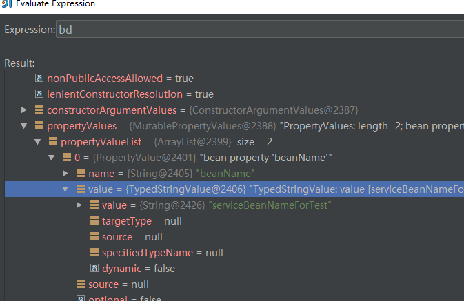
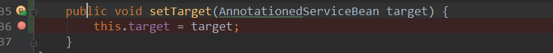
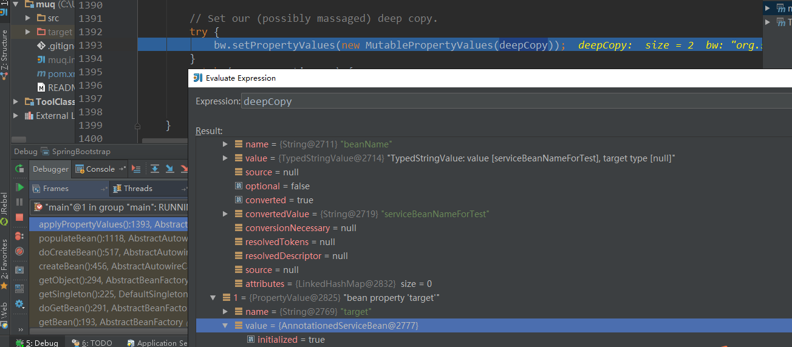
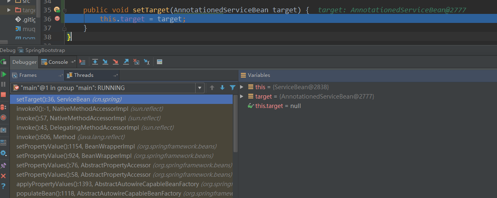
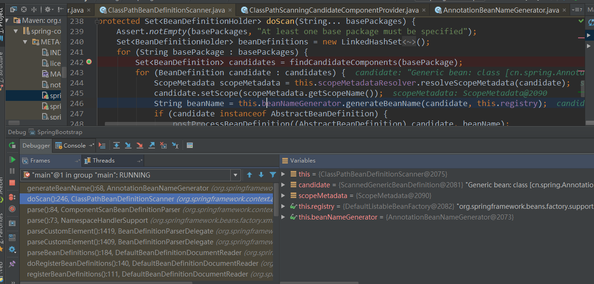

## Thinking in Spring

## 写在前面的话
该怎么开始呢。Spring从出现到如今已经过了十几个年头，并经大师之手不断的雕琢，现在已然成为JavaEE企业级开发的明星框架。对于Spring，我常局限于日常在功能上的肤浅使用，或借助其中的工具来快速实现业务逻辑，虽每每得心应手，但却十有八九存有敬畏之感，心中对其内部的原理时有零零散散的感知，但却不成体系，不得轮廓。因此，基于自己的疑惑与不解，尝试去探索与学习，并以问答的形式来表达，记录我的思考。
众所周知，Spring传播了一种叫控制反转或依赖注入的思想。看过一个比喻，在Spring的世界里，Bean就是演员，Context就是舞台，Core就是演员所需要的核心道具，而Bean、Context、Core这些组件就共同组成了一个IoC容器。演员可以借助道具在舞台上随意挥洒尽情表演，为观众带来很多享受，而IOC容器作为一种成功的软件工程产品，也能为我们带来灵活、便利的应用开发。 By 谢乐

## Spring是怎么载入XML配置的？
一般，在我们的Web应用里，都有类似的如下配置：
```
    <servlet>
        <servlet-name>springmvc</servlet-name>
        <servlet-class>org.springframework.web.servlet.DispatcherServlet</servlet-class>
        <init-param>
            <param-name>contextConfigLocation</param-name>
            <param-value>classpath:spring-config.xml</param-value>
        </init-param>
    </servlet>
```
或者在单元测试时，会使用到如下的代码：
```
      ApplicationContext context =  new ClassPathXmlApplicationContext("spring-config.xml");
```
无论是哪种方式，Spring都会去载入配置文件，那么Spring是怎么做的呢，以我们常用的Web配置为例。
Tomcat等Web服务器在加载Web应用时，按照Java EE的规范解析web.xml，然后初始化DispatcherServlet.
DispatcherServlet的继承结构主要为：
DispatcherServlet -> FrameworkServlet -> HttpServletBean -> HttpServlet
可以看到，DispatcherServlet本身是一个Servlet，因此具备Servlet的生命周期以及被容器实例化的能力，在构造DispatcherServlet时，会层级构造HttpServlet、HttpServletBean、FrameworkServlet，最后才执行DispatcherServlet的构造方法。继承体系中所有的类都构造完成后，容器会调用DispatcherServlet的init方法，我们看看它的init方法的主要实现代码。
```
        //从初始参数中设置bean属性
        //拿到ServletConfig, 并即获取到<init-param>中的值
        PropertyValues pvs = new ServletConfigPropertyValues(getServletConfig(), this.requiredProperties);
        //把当前Servlet包装成一个bean
            BeanWrapper bw = PropertyAccessorFactory.forBeanPropertyAccess(this);
            ResourceLoader resourceLoader = new ServletContextResourceLoader(getServletContext());
            bw.registerCustomEditor(Resource.class, new ResourceEditor(resourceLoader, this.environment));
            initBeanWrapper(bw);
            //根据参数名称，如contextConfigLocation，调用相应的set方法
            bw.setPropertyValues(pvs, true);
            // 让子类作个性化初始化
            initServletBean();
```
在DispatcherServlet中，有初始参数的set方法为证。
```
    /**
     明确设置context config配置，可以指定多个配置文件，用逗号或空格分隔即可
     */
    public void setContextConfigLocation(String contextConfigLocation) {
        this.contextConfigLocation = contextConfigLocation;
    }

```
在initServletBean方法中，会初始化一个Context，一般翻译为上下文，就是代码运行的全局环境。实际的Context为XmlWebApplicationContext，及名之意为用XML来构建的一个Web应用Context。

initServletBean方法会设置Web环境相关的配置，参数到Context中，例如ServletConfig,Namespace,然后添加一些监听器，用以感知应用的变更状态。然后会执行Context的refresh方法，这也是Context工作的核心原理之所在。

略览refresh方法，以及简要说明如下：

```
    public void refresh() throws BeansException, IllegalStateException {
                // 为刷新Context作准备，设置启动时间，设置Context的活动状态为true, 关闭状态为false.
                prepareRefresh();
                // 获取到子类所设定的BeanFactory，同时刷新该Bean工厂
                ConfigurableListableBeanFactory beanFactory = obtainFreshBeanFactory();
                ....
     }

```
refresh方法调用了obtainFreshBeanFactory方法，这个方法会创建一个默认的Bean工厂，这个工厂就是实际为Context而劳心劳力工作的工厂。有代码为证：

```
protected ConfigurableListableBeanFactory obtainFreshBeanFactory() {
        refreshBeanFactory();
        ConfigurableListableBeanFactory beanFactory = getBeanFactory();
        return beanFactory;
    }
protected final void refreshBeanFactory() throws BeansException {
        try {
            DefaultListableBeanFactory beanFactory = createBeanFactory();
            beanFactory.setSerializationId(getId());
            customizeBeanFactory(beanFactory);
            loadBeanDefinitions(beanFactory);
            synchronized (this.beanFactoryMonitor) {
                this.beanFactory = beanFactory;
            }
        }
        ...
    }

```
可以知悉，在创建工厂后，会执行loadBeanDefinitions方法，而该方法定义在不同的子类中。在此场景中，该方法位于XmlWebApplicationContext类中，其核心逻辑如下：

```java
protected void loadBeanDefinitions(DefaultListableBeanFactory beanFactory) throws BeansException, IOException {
        // 为指定的工厂创建一个Bean载入工具Reader
        XmlBeanDefinitionReader beanDefinitionReader = new XmlBeanDefinitionReader(beanFactory);
        // 为Reader设置环境，资源加载器，XML解析器
        beanDefinitionReader.setEnvironment(getEnvironment());
        beanDefinitionReader.setResourceLoader(this);
        beanDefinitionReader.setEntityResolver(new ResourceEntityResolver(this));
        // 允许子类对Reader作自定义的初始化行为，然后开始实际的载入XML
        initBeanDefinitionReader(beanDefinitionReader);
        loadBeanDefinitions(beanDefinitionReader);
    }
```
我们需要大概的知道，BeanDefinition这个接口对应的就是xml中的bean定义，形如
```
<bean id="serviceBeanId" class="cn.spring.ServiceBean">
        <property name="beanName" value="${name}"/>
    </bean>
```
loadBeanDefinitions方法会把xml中的配置的所有的bean都解析成对应的BeanDefinition，然后Context会把所有的BeanDefinition注册到默认Bean工厂的Map中，而Map的key为bean的名称(id属性), Bean工厂的属性形如:

```
Map<String, BeanDefinition> beanDefinitionMap = new ConcurrentHashMap<String, BeanDefinition>();

```
在loadBeanDefinitions的调用链中，最终会委托到doLoadBeanDefinitions方法上, 这个方法简要代码如下：
```
      int validationMode = getValidationModeForResource(resource);
       //读取文档
       Document doc = this.documentLoader.loadDocument(
                    inputSource, getEntityResolver(), this.errorHandler, validationMode, isNamespaceAware());
        //注册Bean
       registerBeanDefinitions(doc, resource);

```
见名知意，便可知道registerBeanDefinitions方法完成了bean的注册，调用逻辑简要代码为：
```
    BeanDefinitionDocumentReader documentReader = createBeanDefinitionDocumentReader();
    documentReader.registerBeanDefinitions(doc, createReaderContext(resource));
    ...
    //完成注册
    this.beanDefinitionMap.put(beanName, beanDefinition);

```

因此，Spring载入XML的过程大致就清晰了。

##Spring读取配置文件并设置到占位符中的过程是怎样的？
一般，我们的`spring-config.xml`文件或许会有这样的一段配置：
```
<!-- 属性文件读入 -->
    <bean class="org.springframework.beans.factory.config.PropertyPlaceholderConfigurer">
        <property name="locations">
            <list>
                <value>classpath:important.properties</value>
                <value>classpath:application.properties</value>
            </list>
        </property>
    </bean>
```
在application.properties中定义一个键值对，形如：
```
    name=serviceBeanNameForTest
```
再定义一个bean配置，并添加一个占位符。
```
 <bean id="serviceBeanId" class="cn.spring.ServiceBean">
        <property name="beanName" value="${name}"/>
    </bean>
```
如上文所言，Spring载入XML配置文件后，会解析所有的bean配置，然后把解析后的bean以BeanDefinition接口的形式注册到IoC容器中(用一个Map来存放)。注册完成后，AbstractApplicationContext的refresh方法会继续执行，在Bean工厂创建完成后，会作一些后置处理，例如调用如下两个方法：
```
    ...
    // 在子类的Context环境中添加一些PostProcessor
    postProcessBeanFactory(beanFactory);
    // 实例化并执行PostProcessors
    invokeBeanFactoryPostProcessors(beanFactory);
    ...
```
由于我们配置的`PropertyPlaceholderConfigurer`实现了`BeanFactoryPostProcessor`接口，同时业已被注册到了容器中，因此在invokeBeanFactoryPostProcessors方法中会调用
PropertyPlaceholderConfigurer类的processProperties方法，在IDEA中的Debug截图效果如下：


方法继续执行，最后会调用到BeanDefinitionVisitor类的visitBeanDefinition方法，接着调用visitPropertyValues方法把属性的占位符${name}替换成Properties文件中name对应的值，调用过程的主要逻辑运行结果如下：
配置了占位符的bean在替换前的BeanDefinition

替换时从Properties中取出占位符对应的值

替换后的BeanDefinition


因此，设置了占位符的bean在PostProcessor执行完成后，bean对应的完整信息都已经封装到BeanDefinition实例中，听候待用。

## Spring的依赖注入过程是怎样的？
一般而言，当配置了lazy-init=true时，我们向容器索要bean时，IoC才会主动创建目标bean。默认情况下，IoC会主动实例化bean，而目标bean如果依赖于其他bean时，IoC会找到其所依赖的所有bean，并把它们都创建出来，最后依次注入给我们的目标bean。这个过程发生在AbstractBeanFactory的doGetBean方法中。
以下面的一段配置，我们做一个试验。而相应的Bean结构很简单， 有一个String类型的字段beanName和一个引用字段annotationedServiceBean。
```
<bean id="annotationedServiceBean" class="cn.spring.AnnotationedServiceBean" />
    <bean id="serviceBeanId" class="cn.spring.ServiceBean">
        <property name="beanName" value="${name}"/>
        <property name="target" ref="annotationedServiceBean"/>
    </bean>
```
在setTarget()方法中打上断点，如图：

以单元测试的形式启动容器(Web方式也OK)，然后获取serviceBeanId对应的bean, 试验代码如下：
```
public static void main(String[] args) {
        ApplicationContext context =  new ClassPathXmlApplicationContext("spring-config.xml");
        ServiceBean bean  = (ServiceBean) context.getBean("serviceBeanId");
}
```
执行到断点处的方法调用栈帧如图：


Bean工厂创建出来后，会执行一些列初始化，比较重要的就是预实例化非lazy-init的bean，在上图的栈帧层中可以看到BeanFactory调用了preInstantiateSingletons方法。

在preInstantiateSingletons方法中，会遍历注册过的BeanDefinition，主要代码如下：
```
for (String beanName : beanNames) {
    RootBeanDefinition bd = getMergedLocalBeanDefinition(beanName);
    if (!bd.isAbstract() && bd.isSingleton() && !bd.isLazyInit()) {
        ...
        getBean(beanName);
    }
}
```
代码**主要**逻辑为：如果bean不是抽象类，而且是单例模式，同时还是非lazy-init, 则需要创建bean. 而默认情况下，bean对应的几个属性为(在RootBeanDefinition类中)：
```
    //默认为单例，容器主动创建
    private boolean singleton = true;
    private boolean prototype = false;
    默认为非抽象bean，容器主动创建
    private boolean abstractFlag = false;
    默认为非lazy-init，容器主动创建
    private boolean lazyInit = false;
```
Bean工厂通过getBean方法来主动实例化bean，然后再保存起来，留作待用。getBean方法通过委托doCreateBean方法来执行具体的创建行为，而doCreateBean再转交给populateBean方法，populate意为填入，注入的意思，因此这个方法就是依赖注入的入口方法。

在试验代码里，我们是通过property来注入的，因此会调用该属性的setter方法。
我们观察一下执行过程
准备注入，封装所有的属性

执行注入，调用属性的set方法


直到bean依赖的所有属性都注入完成，然后返回入口方法，便完成了bean的创建。

## @Component，@Service这些注解是怎么执行的？

我们都喜欢使用注解，因为它很简单。在我们的配置文件中，常常出现这样一行：
```
<!-- 采用注解方式注入 -->
    <context:component-scan base-package="cn.spring" />
```
Bean工厂在载入XML文件时，会委托XmlBeanDefinitionReader来完成，在入口方法doLoadBeanDefinitions中，先通过documentLoader把XML文件渲染成一颗文档树，并封装到Document对象实例中，这个过程完成了XML文件的载入。然后就把文档树种中包含的Element节点解析成一个BeanDefinition。解析时，默认的DefaultBeanDefinitionDocumentReader只能处理的节点前缀主要有：
```
        <beans>
        <alias>
        <import>
        <bean>  
```
所以，默认的DocumentReader不能识别`<context:component-scan>`, 因此需要新增一个解析处理器。我们需要为配置文件添加自定义的命名空间和schema路径，形如：
```
<?xml version="1.0" encoding="UTF-8"?>
<beans
       xmlns:context="http://www.springframework.org/schema/context"
       xsi:schemaLocation="
       http://www.springframework.org/schema/context
       http://www.springframework.org/schema/context/spring-context-3.1.xsd">
```
然后spring在类路径下的spring.handlers文件里，通过相应的命名空间找到对应的自定义标签处理器。映射代码如下：
```
http\://www.springframework.org/schema/context=org.springframework.context.config.ContextNamespaceHandler
```
而ContextNamespaceHandler则注册了我们需要的标签。
```
public class ContextNamespaceHandler extends NamespaceHandlerSupport {
    public void init() {
        registerBeanDefinitionParser("property-placeholder", new PropertyPlaceholderBeanDefinitionParser());
        registerBeanDefinitionParser("component-scan", new ComponentScanBeanDefinitionParser());
        ...
    }
}
```
然后component-scan标签的解析工作就转交给ComponentScanBeanDefinitionParser来处理了。
ComponentScanBeanDefinitionParser这个类会委托ClassPathBeanDefinitionScanner来完成扫描出base-package包下所有的@Service，@Controller等带有@Component性质的注解类，我们看一下方法调用栈帧。

可以看到，doScan方法办事还是雷厉风行的，先通过findCandidateComponents方法找到候选类，然后为其生成相应的beanName，如果注解类指定了名称，则使用原来的名称，生成一个默认的名称。最后把符合条件的后续类注册到IoC容器中。

我们可以看一下findCandidateComponents方法的主要逻辑，看看是怎么寻找注解类的。
```
public Set<BeanDefinition> findCandidateComponents(String basePackage) {
        //定义一个候选类集合
        Set<BeanDefinition> candidates = new LinkedHashSet<BeanDefinition>();
        try {
            String packageSearchPath = ResourcePatternResolver.CLASSPATH_ALL_URL_PREFIX +
                    resolveBasePackage(basePackage) + "/" + this.resourcePattern;
            //通过basePackage，拿到该路径下的所有类资源
            Resource[] resources = this.resourcePatternResolver.getResources(packageSearchPath);
            for (Resource resource : resources) {
                if (resource.isReadable()) { //如果资源可以被访问
                    try {
                        MetadataReader metadataReader = this.metadataReaderFactory.getMetadataReader(resource);
                        //如果该资源是候选注解类
                        if (isCandidateComponent(metadataReader)) {
                            ScannedGenericBeanDefinition sbd = new ScannedGenericBeanDefinition(metadataReader);
                            sbd.setResource(resource);
                            sbd.setSource(resource);
                            if (isCandidateComponent(sbd)) {
                                if (debugEnabled) {
                                    logger.debug("Identified candidate component class: " + resource);
                                }
                                candidates.add(sbd);
                                ...
```
而isCandidateComponent方法主要验证候选类是否具有Component这个注解性质，如果满足的话，则添加到候选集合中。而我们常用的@Controller，@Service 在定义时就添加了@Component注解，有代码为证：
```
    @Target({ElementType.TYPE})
    @Retention(RetentionPolicy.RUNTIME)
    @Documented
    @Component
    public @interface Service {
        String value() default "";
    }
```
因此，只要我们使用了@Service等注解来标注我们的类，那么他就会被Spring扫描到，并注册到Bean工厂中，留待它用。

## Spring中的设计模式有哪些，怎么运用的？
在阅读源码的时候，发现代码可谓是层峦叠嶂，完成一个功能可能需要多次的方法周转，提供一种服务，可能需要承接多次继承，实现多个接口。Spring为了尽量做到灵活，优雅，可扩展，当然用到了很多设计模式。像用的最多的模板方法模式，单例模式，工厂方法模式等就不用说了，因为这个就像旧时王谢堂前的雨燕，已经飞入寻常百姓家了。就说说我体会到的一些特殊的模式吧。
**访问者模式**
> 定义：封装一些作用于某种数据结构中的各元素的操作，它可以在不改变数据结构的前提下定义作用于这些元素的新的操作。

Spring读取属性配置文件并用来替换bean中的占位符时就用到了访问者模式。
看看PlaceholderConfigurerSupport类的doProcessProperties方法。
```
protected void doProcessProperties(ConfigurableListableBeanFactory beanFactoryToProcess,
            StringValueResolver valueResolver) {
        //用当前的valueResolver封装一个访问者
        BeanDefinitionVisitor visitor = new BeanDefinitionVisitor(valueResolver);
        String[] beanNames = beanFactoryToProcess.getBeanDefinitionNames();
        for (String curName : beanNames) {
            //我们不解析当前这个PropertyPlaceholderConfigurer bean, 所有不用访问它
            if (!(curName.equals(this.beanName) && beanFactoryToProcess.equals(this.beanFactory))) {
                BeanDefinition bd = beanFactoryToProcess.getBeanDefinition(curName);
                try {
                    //定义了很多访问方法
                    visitor.visitBeanDefinition(bd);
                }
            }
        }
```
而visitBeanDefinition方法定义了一组新增的访问方法。
```
public void visitBeanDefinition(BeanDefinition beanDefinition) {
        ...其余省略
        //最常用的就是访问bean的属性，如有有占位符，则用目标属性替换
        visitPropertyValues(beanDefinition.getPropertyValues());
        ...
    }
```
这里的访问者模式对目标对象做了很多自定义访问，同时也可以应用于Bean工厂中所有bean的占位符属性替换。这算是对迭代器模式的补充，可以遍历不同的对象，也就是针对访问的对象不同，然后执行不同的操作。

**策略模式**
>定义：策略模式定义了一组算法，将每个算法都封装起来，并且使他们之间可以互换。

策略模式需要一个Context，简单来说就是切换算法的执行场景，在Spring中运用的比较显著的就是创建Bean的代码实现了。
Spring提供的AbstractAutowireCapableBeanFactory作为一种Bean工厂产品，拥有一种自动注入bean的特性，在其内部定义了一个InstantiationStrategy接口，用以指定创建bean的策略。默认是使用的CglibSubclassingInstantiationStrategy，表示使用CGLIB的动态字节码技术来实例化bean. 简要的代码如下：
```
    private InstantiationStrategy instantiationStrategy = new CglibSubclassingInstantiationStrategy();
```
在某种场景下，可以通过set入口来切换策略实现。
```
    public void setInstantiationStrategy(InstantiationStrategy instantiationStrategy) {
        this.instantiationStrategy = instantiationStrategy;
    }
```
**拦截器模式**
在SpringMVC中，我们常常在用拦截器(，就觉得好用，但SpringMVC的设计者不仅仅希望它好用，而这是一种可挪为多用的模式。
在DispatcherServlet中的doDispatch方法里，有一段代码：
```
//拿到用户配置的拦截器
HandlerInterceptor[] interceptors = mappedHandler.getInterceptors();
                if (interceptors != null) {
                    for (int i = 0; i < interceptors.length; i++) {
                        HandlerInterceptor interceptor = interceptors[i];
                        //逐个取出，分别验证，如果前者验证失败，
                        //则结束请求处理过程，直接返回
                        if (!interceptor.preHandle(processedRequest, response, mappedHandler.getHandler())) {
                            triggerAfterCompletion(mappedHandler, interceptorIndex, processedRequest, response, null);
                            return;
                        }
                        interceptorIndex = i;
                    }
                }
```
这个节省了很多if与else的条件判断，在Web开发中作安全过滤，权限验证等几乎是最灵活的方案。
说到ifelse, 假设有一个场景，我用一段伪代码来描述。
```
    if (条件A) {do somethingA}
    else if(条件B) {do somethingB}
    else if(条件C) {do somethingC}
    ...
```
写完这样的代码后，完成了功能开发。但是有一天需求来了，需要新增一些判断条件D，或者需要在条件A判断前先判断条件某某， 于是代码结构变成了这样：
```
    if (条件某某) {do something}
    if (条件A) {do somethingA}
    else if(条件B) {do somethingB}
    else if(条件C) {do somethingC}
    else if (条件D) {do somethingD}
    ...
```
暂时这样修改没什么问题。时光静好，清风徐来，就这样过了很久也没有什么问题。但是有一天，有新增了10个条件，而且还各不相同。我可能会唱起那首歌："忽然之间，天昏地暗，这世界忽然什么都没有...."

假如一开始，大神告诉我用拦截器模式，于是代码可能是这样的, 定义一个条件处理接口和当下的具体条件。
```
interface ConditionHandler {
    boolean handle()
}
class ConditionA implements ConditionHandler{
    boolean handle() {
        do somethingA
    }
}
class ConditionB implements ConditionHandler{
    boolean handle() {
        do somethingB
    }
}
```
然后新增一个配置文件，例如添加一组添加过滤器。
```
<list>
    <bean class="ConditionA"/>
    <bean class="ConditionB"/>
</list>    
```
然后在执行场景中，添加一段如下的代码：
```
    List<ConditionHandler> handlers = getHandlers();
    for (ConditionHandler hander : handlers) {
        if (!hander.handle()) {
            return ;
        }
    }
}
```
假如新增了条件，只需要实现ConditionHandler，然后添加到配置中，还可以指定任意的位置，就可以完成对新条件判断的兼容，而不用修改原来的代码。这就是开闭原则。
然后大神看完后，嘴角微笑一下，也许会让你回味无穷。

## Spring是怎么实现开闭原则的？
>开闭原则的定义是：一个软件实体如类、模块和函数应该对扩展开发，对修改关闭。

就像Apple公司的设计理念一样：less is more. 这句话虽简短，但却意味深长。
那我也说说自己对Spring中的开闭原则的理解以及体会。
1. 我们可以在配置文件中，可以自由的配置我们的业务类，便可以实现很多业务功能。而这个过程，我们不用修改原来的代码，只需扩展新类，新方法。
2. Spring支持动态标签扩展，我们可以定义自己的XSD文件，定义自己的标签。然后只需要按照Spring的约定，在类路径中添加spring.handlers，配置解析标签的处理器，例如阿里巴巴的dubbo扩展：
```
<dubbo:application compiler="jdk" />
```
京东的JSF扩展：
```
    <jsf:registry > <jsf:server/>
```
我们想要基于Spring作扩展，我们想借用Spring的IoC，但是我们不能修过Spring的代码，我们能作的，就是做自己的事，不打扰别人，这就是涵养，这就是开闭原则。

最后，士不可以不弘毅，任重而道远。
