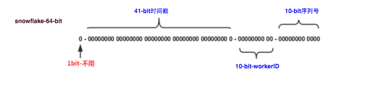

## 前言
分布式ID在多种场景下都有广泛的应用，如分库分表后生成全局用户Id,订单Id,分布式事物中的全局Id,消息队列中的全局消息Id.因此本文分析一下常用的分布式Id的常见实现方案。

## SnowFlake-雪花算法
SnowFlake是Twitter最早提出的一种全局ID生成算法，可以产生一个Time-Based的全局ID， 由于生成简单、ID趋势递增，业界采用的比较广泛。比如在snowflake中的64-bit分别表示如下图（图片来自网络）所示：


> 41-bit的时间可以表示（1L<<41）/(1000L*3600*24*365)=69年的时间，10-bit机器可以分别表示1024台机器。如果我们对IDC划分有需求，还可以将10-bit分5-bit给IDC，分5-bit给工作机器。这样就可以表示32个IDC，每个IDC下可以有32台机器，可以根据自身需求定义。12个自增序列号可以表示2^12个ID，理论上snowflake方案的QPS约为409.6w/s，这种分配方式可以保证在任何一个IDC的任何一台机器在任意毫秒内生成的ID都是不同的。

SnowFlakeID是一个64 bit，8 bytes的整数类型，结构如下：
bit[0]：最高位填0，保证ID是正整数。
bit[1-41]：时间戳，41 bit。表示自某个起始时间（可自行设定）以来的毫秒数，支持69年跨度。
bit[42-51]：Worker ID，10 bits。表示节点的唯一标识，能同时支持1024个不同的Worker。Worker ID可依赖外部配置中心生成，推荐前5位数据中心ID，后5位PID。
bit[52-63]：并发ID序列号，12 bits。用于同一毫秒内并发产生的ID自增序号，采用原子递增计数器实现，每毫秒重新归0，一毫秒内可以并发产生4096个ID。如果在这个毫秒内生成的数量超过4096，可以阻塞等待到下个毫秒来生成。

### 这种方式的优缺点
1）本地化生成，算法简单，效率高
2）适合主键字段：时间戳位于ID的高位，毫秒内自增序列在低位，ID趋势递增；长度8个字节，适合数据库存储。
3）不足之处：
3.1）依赖机器时钟，如果时钟错误比如时钟不同步、时钟回拨，会产生重复ID
3.2）每个节点的Worker ID要借助外部服务比如Zookeeper、Redis、MySQL分配
ID容量局限性：时间偏移量支持2^41ms=69年，可以在算法中自定义起始时间，年限略短，一般够用。

### Twitter SnowFlake实现
SnowFlake算法用来生成64位的ID，刚好可以用long整型存储，能够用于分布式系统中生产唯一的ID， 并且生成的ID有大致的顺序。 在这次实现中，生成的64位ID可以分成5个部分：
0 - 41位时间戳 - 5位数据中心标识 - 5位机器标识 - 12位序列号
5位数据中心标识跟5位机器标识这样的分配仅仅是当前实现中分配的，如果业务有其实的需要，可以按其它的分配比例分配，如10位机器标识，不需要数据中心标识。

```Java
/**
 * twitter的snowflake算法 -- java实现
 * @see @{https://github.com/beyondfengyu/SnowFlake?spm=ata.13261165.0.0.78d12ace8n92XX}
 * @author beyond
 * @date 2016/11/26
 */
public class SnowFlake {

    /**
     * 起始的时间戳
     */
    private final static long START_STMP = 1480166465631L;

    /**
     * 每一部分占用的位数
     */
    private final static long SEQUENCE_BIT = 12; //序列号占用的位数
    private final static long MACHINE_BIT = 5;   //机器标识占用的位数
    private final static long DATACENTER_BIT = 5;//数据中心占用的位数

    /**
     * 每一部分的最大值
     */
    private final static long MAX_DATACENTER_NUM = -1L ^ (-1L << DATACENTER_BIT);
    private final static long MAX_MACHINE_NUM = -1L ^ (-1L << MACHINE_BIT);
    private final static long MAX_SEQUENCE = -1L ^ (-1L << SEQUENCE_BIT);

    /**
     * 每一部分向左的位移
     */
    private final static long MACHINE_LEFT = SEQUENCE_BIT;
    private final static long DATACENTER_LEFT = SEQUENCE_BIT + MACHINE_BIT;
    private final static long TIMESTMP_LEFT = DATACENTER_LEFT + DATACENTER_BIT;

    private long datacenterId;  //数据中心
    private long machineId;     //机器标识
    private long sequence = 0L; //序列号
    private long lastStmp = -1L;//上一次时间戳

    public SnowFlake(long datacenterId, long machineId) {
        if (datacenterId > MAX_DATACENTER_NUM || datacenterId < 0) {
            throw new IllegalArgumentException("datacenterId can't be greater than MAX_DATACENTER_NUM or less than 0");
        }
        if (machineId > MAX_MACHINE_NUM || machineId < 0) {
            throw new IllegalArgumentException("machineId can't be greater than MAX_MACHINE_NUM or less than 0");
        }
        this.datacenterId = datacenterId;
        this.machineId = machineId;
    }

    /**
     * 产生下一个ID
     *
     * @return
     */
    public synchronized long nextId() {
        long currStmp = getNewstmp();
        if (currStmp < lastStmp) {
            throw new RuntimeException("Clock moved backwards.  Refusing to generate id");
        }

        if (currStmp == lastStmp) {
            //相同毫秒内，序列号自增
            sequence = (sequence + 1) & MAX_SEQUENCE;
            //同一毫秒的序列数已经达到最大
            if (sequence == 0L) {
                currStmp = getNextMill();
            }
        } else {
            //不同毫秒内，序列号置为0
            sequence = 0L;
        }

        lastStmp = currStmp;

        return (currStmp - START_STMP) << TIMESTMP_LEFT //时间戳部分
            | datacenterId << DATACENTER_LEFT       //数据中心部分
            | machineId << MACHINE_LEFT             //机器标识部分
            | sequence;                             //序列号部分
    }

    private long getNextMill() {
        long mill = getNewstmp();
        while (mill <= lastStmp) {
            mill = getNewstmp();
        }
        return mill;
    }

    private long getNewstmp() {
        return System.currentTimeMillis();
    }

    public static void main(String[] args) {
        SnowFlake snowFlake = new SnowFlake(1<<4, 1<<4);

        for (int i = 0; i < 5; i++) {
            System.out.println(snowFlake.nextId());
        }

    }
}
```

### Java UUID
UUID(Universally Unique IDentifier)是一个全局Id的规范,标准型式包含32个16进制数字，以连字号分为五段，形式为8-4-4-4-12的36个字符.示例如:`78f236de-a628-4ea7-9382-b6030fcd8454`. 典型实现如下:
```Java
for (int i = 0; i < 10; i++) {
    UUID uuid = UUID.randomUUID();
    System.out.println(uuid.toString());
}
```
优点是：本地生成，性能较好。缺点：不易于存储：UUID太长，16字节128位，通常以36长度的字符串表示，很多场景不适用，无顺序，不利于作DB主键。


### 单一数据库表自增
创建一个Sequence表,用MySQL的自增Id机制来生成序列。采用replace into 语法加select last_insert_id,由于两个sql预计不是原子的，需要包含在一个事物里。Sequence表结构如下：
```sql
CREATE TABLE `sequence` (
  `id` bigint(20) unsigned NOT NULL AUTO_INCREMENT,
  `name` char(8) NOT NULL,
  PRIMARY KEY (`id`),
  UNIQUE KEY `uk_name` (`name`)
) ENGINE=InnoDB DEFAULT CHARSET=utf8
```
事物中获取Id的SQL脚本类似如下：
```SQL
begin;
replace into sequence(`name`) value ('default2');
select last_insert_id();
commit;
```
>注:Mysql可配置自增起始值(@@auto_increment_increment)与步长(@@auto_increment_offset)来控制Id的生成策略,不同的业务可用不同的序列表来控制对应的Id序列。

#### JDBC实现代码
```Java
import java.sql.Connection;
import java.sql.DriverManager;
import java.sql.PreparedStatement;
import java.sql.ResultSet;
import java.sql.SQLException;

/**
 * 单一数据库表自增Id实现序列服务
 * 实现思路为：事物中执行replace into && select last_insert_id()
 *
 * @author xiele.xl
 * @date 2020-05-19 11:04
 */
public class SingleSequenceService implements SequenceService {

    private static final String jdbc_url = "jdbc:mysql://localhost:3306/spring_demo";
    private static final String user = "root";
    private static final String password = "Xiele";

    private static ThreadLocal<Connection> localConn = new ThreadLocal<>();

    static {
        try {
            Class.forName("com.mysql.jdbc.Driver");
        } catch (Exception e) {
            throw new RuntimeException("Can't register driver!");
        }

    }

    public static Connection getConnection() {

        try {
            Connection conn = localConn.get();
            if (conn == null) {
                conn = DriverManager.getConnection(jdbc_url, user, password);

                localConn.set(conn);
            }
            return conn;

        } catch (Exception e) {
            throw new RuntimeException("can not get connection, e=" + e);
        }

    }

    @Override
    public long nextId() {

        Connection con = getConnection();
        try {
            // 设置事物为非自动提交,并开启事物
            con.setAutoCommit(false);
            final PreparedStatement ps = con.prepareStatement(
                "replace into `sequence` (name) values ('default')");
            ps.executeUpdate();
            final ResultSet rs = ps.executeQuery("select LAST_INSERT_ID()");
            rs.next();
            long nextId = rs.getLong(1);
            con.commit();
            return nextId;

        } catch (SQLException e) {
            try {
                con.rollback();
            } catch (SQLException ex) {

            }
            throw new RuntimeException(e);
        }

    }

    public static void main(String[] args) {

        SingleSequenceService uss = new SingleSequenceService();
        for (int i = 0; i < 10; i++) {
            System.out.println(uss.nextId());
        }

    }
}
```
