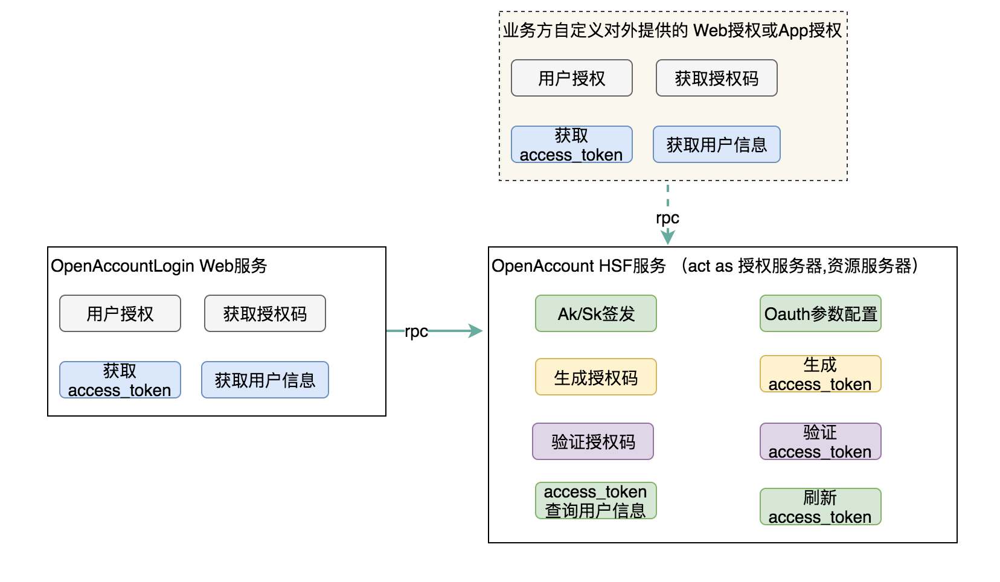
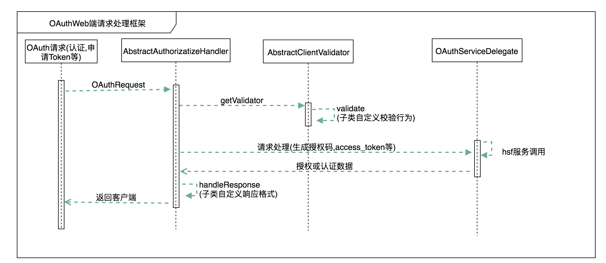
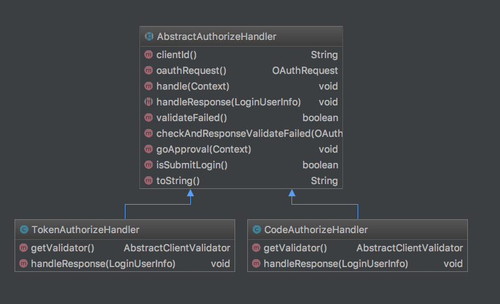
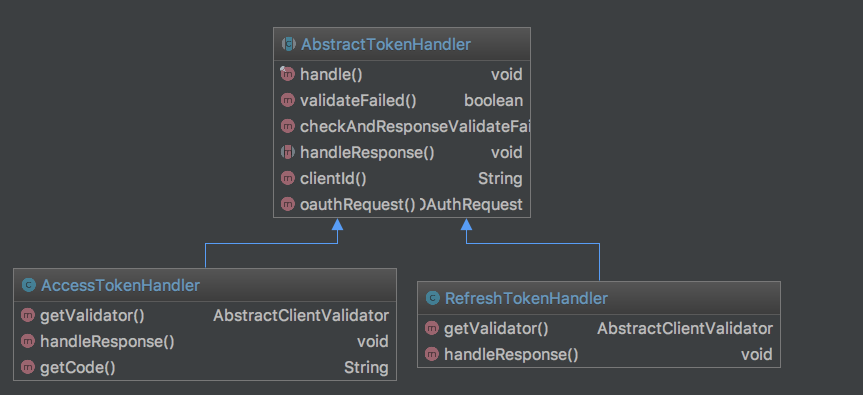
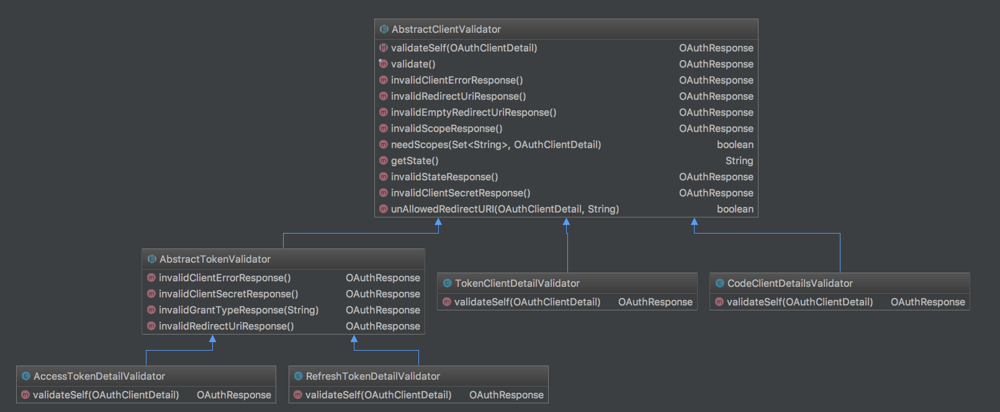

## 背景

OpenAccount作为开放的账户体系，用户能使用三方账号(如微信，微博，淘宝的账号)基于OAuth的标准登录OpenAccount. 在这一能力中，OA只承载了中间角色，业务需要自行在三方平台入驻，并在业务侧完成授权，然后提供三方颁发的access\_token, OA基于此access\_token取获取三方账号信息，最终再创建一个OA账号。因此OA现阶段提供的Oauth能力只是为业务提供了统一ID的作用。

目前IoT飞燕平台采用OpenAccount作为底层的账户服务，并将OA提供的账号能力对外供外部用户使用。其中在一些场景中，飞燕的一些服务需要使用自有账号作为账号Provider授权给外部厂商在他们的服务中使用，如提供给Amazon Alexa, Google Home，并且是基于OAuth 2.0 协议完成授权。

此外，OA也需丰富自身产品的能力，因此需要自建OAuth服务。

## 设计
### 概要
提供比较流行的两种授权模式，授权码模式和简化的Token模式。

### 整体运行流程
OAuth 2.0的运行流程如下图，摘自RFC 6749


步骤说明：
```plain
A）用户打开客户端以后，客户端要求用户给予授权。
B）用户同意给予客户端授权。
C）客户端使用上一步获得的授权，向认证服务器申请令牌。
D）认证服务器对客户端进行认证以后，确认无误，同意发放令牌。
E）客户端使用令牌，向资源服务器申请获取资源。
F）资源服务器确认令牌无误，同意向客户端开放资源。
```

### 客户端授权模式
#### 授权码模式


步骤说明：
```plain
A）用户访问客户端，后者将前者导向认证服务器。
B）用户选择是否给予客户端授权。
C）假设用户给予授权，认证服务器将用户导向客户端事先指定的"重定向URI"（redirection URI），同时附上一个授权码。
D）客户端收到授权码，附上早先的"重定向URI"，向认证服务器申请令牌。这一步是在客户端的后台的服务器上完成的，对用户不可见。
E）认证服务器核对了授权码和重定向URI，确认无误后，向客户端发送访问令牌（access token）和更新令牌（refresh token）。
```

#### 简化token模式


步骤说明：
```plain
A）客户端将用户导向认证服务器。
B）用户决定是否给于客户端授权。
C）假设用户给予授权，认证服务器将用户导向客户端指定的"重定向URI"，并在URI的Hash部分包含了访问令牌。
D）浏览器向资源服务器发出请求，其中不包括上一步收到的Hash值。
E）资源服务器返回一个网页，其中包含的代码可以获取Hash值中的令牌。
F）浏览器执行上一步获得的脚本，提取出令牌。
G）浏览器将令牌发给客户端。
```

## 实现
### 简要架构图



说明：用户数据归属与OA的业务方，因此有些场景下，OA封装Oauth的授权与资源相关的底层服务，业务方可自行定制Oauth的Web端或APP端的授权交互。

### 代码设计
#### 概述
对应客户端来说，授权码模式和简化的Token模式在不同的交互阶段，所必须的参数也是不同的。
对应授权码模式，申请认证的URI中，参数说明如下：
* response\_type：表示授权类型，必选项，此处的值固定为"code"
* client\_id：表示客户端的ID，必选项
* redirect\_uri：表示重定向URI，可选项
* scope：表示申请的权限范围，可选项
* state：表示客户端的当前状态，可以指定任意值，认证服务器会原封不动地返回这个值。

而申请access\_token的URI,参数说明如下：
* grant\_type：表示使用的授权模式，必选项，此处的值固定为"authorization\_code"。
* code：表示上一步获得的授权码，必选项。
* redirect\_uri：表示重定向URI，必选项，且必须与A步骤中的该参数值保持一致。
* client\_id：表示客户端ID，必选项。
* client\_secret: 表示客户端密钥

而上述两个阶段，返回参数自然也是不同的。同时，对应简化token授权模式，申请认证的URI，所需参数也存在特殊性，因此针对请求的参数校验，如果用常规的if-else则会很冗长且难以维护。

因此在代码设计上，需要抽象不同请求流的参数校验与数据响应。
在具体的实现中，借用[Apache Oltu](https://oltu.apache.org/)的工具库来简化代码在Oauth协议上的复杂度。Apache Oltu 是Java版的Oauth协议实现。

而auth\_code、access\_token, refresh\_token的生成，使用oltu库中的OAuthIssuer接口来生成对应的具体值，auth\_code, access\_token则存入缓存中，refresh\_token则持久化到数据库。

#### 引入oltu依赖
```xml
<dependency>
    <groupId>org.apache.oltu.oauth2</groupId>
    <artifactId>org.apache.oltu.oauth2.authzserver</artifactId>
    <version>1.0.2</version>
 </dependency>
 <dependency>
    <groupId>org.apache.oltu.oauth2</groupId>
    <artifactId>org.apache.oltu.oauth2.resourceserver</artifactId>
    <version>1.0.2</version>
</dependency>
```

### 详细设计
#### Web端请求处理整体框架



#### 框架类图
授权Handler 类图



获取TokenHandler类图



Validator类图



#### Token的生成

```java
public interface OAuthIssuer {
    public String accessToken() throws OAuthSystemException;

    public String authorizationCode() throws OAuthSystemException;

    public String refreshToken() throws OAuthSystemException;
}

 <bean id="oAuthIssuer" class="org.apache.oltu.oauth2.as.issuer.OAuthIssuerImpl">
        <constructor-arg>
            <bean class="org.apache.oltu.oauth2.as.issuer.MD5Generator"/>
        </constructor-arg>
</bean>
```

## 参考资料
[https://www.oauth.com/](https://www.oauth.com/)
[http://www.ruanyifeng.com/blog/2014/05/oauth\_2\_0.html](http://www.ruanyifeng.com/blog/2014/05/oauth_2_0.html)
