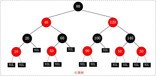
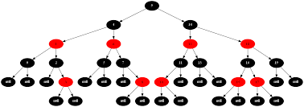
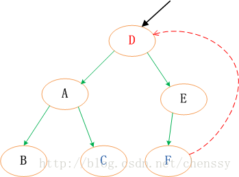

# 红黑树与TreeMap源码分析

## 写在前面
> 红黑树，对应英文名称为：`Red-Black Tree`,是一种比较复杂的数据结构。已有很多文章或文献对其作过全方位透析与介绍。本文为我学习红黑树算法思想后,然后参考Java语言的实现TreeMap作的一次心得总结。
> 一般而言，数据结构都会围绕某一算法然后提供相应的编程实现。因此很多文章都会先描述算法，然后对算法进行细节阐述，最后再介绍某一种语言实现。
> 本文尝试先从实际出发，夹杂算法思想与具体代码实现来对红黑树作解读，旨在了解红黑树，了解TreeMap。

## TreeMap 概述
用IDEA打开JDK中的`TreeMap`的源码后，可以看到其JavaDoc描述如下：
> TreeMap是一种基于`NavigableMap`的红黑树的具体实现：即TreeMap具体导航的性质，同时也是一颗红黑树。
TreeMap会根据`Key`的自然顺序,或者在构造TreeMap时传入的`Comparator`来作排序处理。TreeMap作为红黑树的一种具体实现，保证了对诸如`containsKey`,`get`, `put`,`remove`等方法具有`log(n)`的时间复杂度，采用的算法思想来自于Cormen, Leiserson, 和 Rivest's编写的**算法导论**。

需要注意的是，TreeMap不是同步的，如果有并发操作TreeMap的场景，需要在外部作同步控制。TreeMap实现了基本的Map接口，因此具有Map的所有特性，同时还实现了`SortedMap`和`NavigableMap`接口，因此TreeMap中的键值对是有序的,并且具作任意的导航定位，当然这些都是因为其本身是一颗红黑树而衍生出的扩展特性。我们使用TreeMap最多的方法还是存`Key-Value`, 取Value，删除不需要的`Key-Value`。最吸引开发者的地方也是因为它是`红黑树`.

## 红黑树是什么

> 可以先看看维基百科中的介绍：
https://zh.wikipedia.org/wiki/红黑树。
红黑树一种平衡排序二叉树，在实践中它具有高效的性能，它可以在O(log n)时间内做查找，插入和删除。

这里涉及到基本的树的概念，例如排序二叉树，平衡树，我这里不作过多的讨论。可以淡淡的理解为：红黑树是一种很复杂的树，掌握了红黑树就掌握了很多树的知识。

## 红黑树的性质
红黑树具有二叉查找树的所有特性，除此，红黑树的每个节点都是红色或黑色，红黑树要维持平衡和有序，还有些自身的约定性质：
1. 节点是红色或黑色。
2. 根是黑色。
3. 所有叶子都是黑色（叶子是NIL节点）。
4. 每个红色节点必须有两个黑色的子节点。（从每个叶子到根的所有路径上不能有两个连续的红色节点。）
5. 从任一节点到其每个叶子的所有简单路径都包含相同数目的黑色节点。

**下面是一些红黑树示例：**



## TreeMap
我们从源码切入来看TreeMap的内部结构：
```
public class TreeMap<K,V>
    extends AbstractMap<K,V>
    implements NavigableMap<K,V>, Cloneable, java.io.Serializable {
	//用于排序的比较器
    private final Comparator<? super K> comparator;
	//根节点
    private transient Entry<K,V> root = null;
    //Map的大小
    private transient int size = 0;
    //对Map作结构上(新增或删除元素)修改的次数
    private transient int modCount = 0;
}
```
可以看到TreeMap的属性字段不多，数据字段就是一个名为`root`	的Entry节点。而Entry的结构为：
```
static final class Entry<K,V> implements Map.Entry<K,V>{
     K key;
     V value;
     Entry<K,V> left = null;
     Entry<K,V> right = null;
     Entry<K,V> parent;
     boolean color = BLACK;
}
```
可以看到，TreeMap中的节点和`LinkedHashMap`中的节点类似，有`Key-Value`，有父节点，左子节点，右子节点。默认节点的颜色为黑色。

## 红黑树新增节点
红黑树添加节点走的是排序二叉树(排序二叉树又称为二叉查找树)的逻辑。
我们看看`TreeMap`的`put`方法。
貌似很复杂，但是细读后会发现put`Key-Value`的逻辑还是很清晰的。
```
public V put(K key, V value) {
	Entry<K,V> t = root;
        if (t == null) {
            compare(key, key); // 新增第一个元素时，作类型与null检查. Key必需实现Comparable接口或构造传入一个Comparator比较器
            root = new Entry<>(key, value, null); //新增根节点，其父节点为null
            size = 1; //Map的元素加1
            modCount++; //修改次数加1
            return null; //Map中没有带新增的Key,都统一返回null
        }
        //TreeMap是一颗树，新增跟节点后，则走else部分。新增元素需要遵守排序二叉树的规则：
        //若它的左子树不空，则左子树上所有节点的值均小于它的根节点的值
        //若它的右子树不空，则右子树上所有节点的值均大于它的根节点的值
        //它的左、右子树也分别为排序二叉树
        int cmp;
        Entry<K,V> parent; //parent变量用于找到待新增元素的父节点
        // 用于区分比较的执行路径
        //如果传入了comparator比较器则走if块，否则走自然顺序比较器else块, 两个执行路径的逻辑是一致的，从根节点开始不断的与新增的节点作对比
        Comparator<? super K> cpr = comparator;
        if (cpr != null) {
            do {
                parent = t;
                cmp = cpr.compare(key, t.key);
                if (cmp < 0)
                    t = t.left; //当前节点比新增节点小
                else if (cmp > 0)
                    t = t.right; //当前节点比新增节点大
                else
                    return t.setValue(value); //当前节点与新增的节点值相同，直接覆盖，并返回原值
            } while (t != null); //找到目的位置后，还没有该节点
        }
        else { //同上
            if (key == null)
                throw new NullPointerException();
            Comparable<? super K> k = (Comparable<? super K>) key;
            do {
                parent = t;
                cmp = k.compareTo(t.key);
                if (cmp < 0)
                    t = t.left;
                else if (cmp > 0)
                    t = t.right;
                else
                    return t.setValue(value);
            } while (t != null);
        }
        //已找到新增节点的父节点，开始构造新节点
        Entry<K,V> e = new Entry<>(key, value, parent);
        if (cmp < 0)
            parent.left = e; //位于父节点的左节点
        else
            parent.right = e; //位于父节点的右节点
        //按照排序二叉树的规则新增节点后，常常会导致树失衡，为了重新平衡树，需要按照红黑树的规则来修复树平衡性。思路为：为节点作色，标记为红或黑色。然后通过左旋或右旋维持红黑树的特性。详细见后文解释。  
        fixAfterInsertion(e); 
        size++; //大小加1
        modCount++; //修改次数加1
        return null; 
}
```

### 添加节点后修复红黑树
`fixAfterInsertion`方法的核心功能是修复排序二叉树，具体会根据红黑树的`5`条性质来调整树的平衡性。我们再次回顾一下这`5`条性质：
>1. 节点是红色或黑色。
>2. 根是黑色。
>3. 所有叶子都是黑色（叶子是NIL节点）。
>4. 每个红色节点必须有两个黑色的子节点。（从每个叶子到根的所有路径上不能有两个连续的红色节点。）
>5. 从任一节点到其每个叶子的所有简单路径都包含相同数目的黑色节点。

顾名思义，红黑树节点的颜色要么是`红色`,要么是`黑色`. 性质1比较容易满足。默认情况下，新增的每个节点的`left`和`right`节点是为`null`的，同时也是为黑色的。因此性质1和性质3是会一直保持的。我们重点关注怎么保证`性质2`,`性质4`,`性质5`。

几乎所有的关于红黑树的算法指导思想都来自**算法导论**, 因此接下来我们结合其介绍的算法思想和TreeMap的源码作一个解释与说明。
 
 红黑树会按照排序二叉树的规则定位到父节点，然后新增一个左子节点或右子节点。默认情况下把该新增的节点标记为红色。

接着就需要对红黑树执行具体的修复操作，并按照相应的规则来维持红黑树的5条性质。修复的方式包括：`左旋`、`右旋`、`重新着色`等。我们一起来看看算法描述。
在下文的描述中，我们约定将要插入的节点标为`N`，`N`的父节点标为`P`，`N`的祖父节点标为`G`，`N`的叔父节点标为`U`。在修复红黑树时，有几种可能出现的情形。

**情形一 :**
 红黑树中还没有根节点，新节点N位于树根。在这种情形下，我们把它重绘为黑色以满足性质2。因为它在每个路径上对黑节点数目增加一，性质5匹配。
TreeMap 中的实现代码略写如下：
```
if (t == null) {
			//默认Entry的color为黑色
	        root = new Entry<K,V>(key, value, null); 
            size = 1;
            modCount++;
            return null;
}
```
**情形二 :**
新节点的父节点`P`是黑色，则直接插入`N`,然后标记N为红色。在这种情形下，树仍然是有效的，性质4没有失效（新节点N为红色），性质5也能保持。尽管新节点有2个黑色叶子节点，但新节点N是红色，通过它的每个子节点的路径仍然具有相同数目的黑色节点。
实现的代码在`fixAfterInsertion`方法中,其逻辑为首先把N节点着色为红色,然后循环检查N的父节点是否为红色。如果不为红色，则把根节点标记为黑色后，直接返回。代码片段如下：
```
private void fixAfterInsertion(Entry<K,V> x) { //x 为新增的节点
    x.color = RED;
    //处理了父节点为黑色的情形...
    while (x != null && x != root && x.parent.color == RED) {
        ...
    }
    root.color = BLACK;
}
```


**情形三 :**
如果父节点`P`和叔父节点`U`二者都是红色，此时新增的节点N作为P的左子节点或右子节点都属于情形3。下图以P作为左子节点为例。

在此情形中，我们将P,U两节点重绘为黑色，并重绘祖父节点为红色（用来保持性质5），新节点N有了一个黑色的父节点P.因为通过父节点P或叔父节点U的任何路径都将通过祖父节点G,在这些路径上的黑节点数目没有改变。但是红色的G可能为根节点，这就违反了性质2，也有可能G的父节点也为红色，这也违反了性质4。**为了解决这个问题，我们在祖父节点G上递归地进行情形1的整个过程。（把G当成是新加入的节点进行各种情形的检查）**
代码片段如下：
```
while (x != null && x != root && x.parent.color == RED) {
	//父节点为左子节点
  if (parentOf(x) == leftOf(parentOf(parentOf(x)))) {
        Entry<K,V> y = rightOf(parentOf(parentOf(x)));
        if (colorOf(y) == RED) { // x的父节点、叔父节点都为红色
	        //设置新节点的父节点和叔父节点为红色
            setColor(parentOf(x), BLACK);
            setColor(y, BLACK);
            //设置新节点的祖父节点为红色，由于是在循环体中，因此会递归的再验证祖父节点
            setColor(parentOf(parentOf(x)), RED);
            x = parentOf(parentOf(x));
        } else { 
	        // 其他情形的代码逻辑...
		}
  } else { //父节点为右子节点
			Entry<K,V> y = leftOf(parentOf(parentOf(x)));
           if (colorOf(y) == RED) {
	           //设置新节点的父节点和叔父节点为红色
               setColor(parentOf(x), BLACK);
               setColor(y, BLACK);
               setColor(parentOf(parentOf(x)), RED);
               x = parentOf(parentOf(x));
           } else {
				// 其他情形的代码逻辑...
			}
	}
} 
```

`注意：在余下的情形下，我们假定父节点P是其父亲G的左子节点。如果它是右子节点，情形4和情形5中的左和右应当对调。`
**情形四:**
父节点P为其父节点的左子节点，叔父节点U为黑色或缺失，同时新增的节点N为P的右子节点。


在这种情况下，我们进行一次**左旋转**调换新节点和其父节点的角色。接着，我们按**情形5**处理以前的父节点P以解决仍然失效的性质4。注意这个改变会导致某些路径通过它们以前不通过的新节点N（比如图中1号叶子节点）或不通过节点P（比如图中3号叶子节点），但由于这两个节点都是红色的，所以性质5仍有效。
> 左旋：以节点P为转轴左旋时，P节点成为其右子节点N的左子节点。N节点成为P的父节点。旋转前和旋转后，以中序遍历为基准，并生成相同的输出结果。如图2号节点按照中序遍历规则，旋转后成为P节点的右子节点。实际的左旋转处理步骤：先记录P的右子节点N，让P的右子节点指向N的左子节点。让N的父节点指向P的父节点，P的父节点指向N，N的左子节点指向P。（对换角色）

对应的代码片段为：
```
while (x != null && x != root && x.parent.color == RED) {
	//父节点为左子节点
   if (parentOf(x) == leftOf(parentOf(parentOf(x)))) {
	   //叔父节点 y
	   Entry<K,V> y = rightOf(parentOf(parentOf(x)));
	   if (color(y) == RED) { 
		   // 叔父为红色走情形3
	   } else { //叔父为黑色或为null
		   //如果新增的节点x为右子节点，则围绕x的父节点左旋
		   if (x == rightOf(parentOf(x))) {
                 x = parentOf(x);
                 rotateLeft(x);
            }
            //其余情况走情形5
	   }
   }
   
```

**情形5**
父节点P为其父节点的左子节点，叔父节点U为黑色或缺失，同时新增的节点N为P的左子节点。


在这种情形下，我们祖父节点G作一次**右旋转**.在旋转产生的树中，以前的父节点P现在是新节点N和以前的祖父节点G的父节点。我们知道以前的祖父节点G是黑色，否则父节点P就不可能是红色（如果P和G都是红色,则已经触发了情形3，会早已作调整）。我们切换以前的父节点P和祖父节点G的颜色，结果的树满足性质4。性质5也仍然保持满足，因为通过这三个节点中任何一个的所有路径以前都通过祖父节点G，现在它们都通过以前的父节点P。在各自的情形下，这都是三个节点中唯一的黑色节点。
> 右旋：以节点G作右旋时，原来的节点P会成为节点G的父节点，节点G则成为P节点的右子节点。如上图3号节点按照中序遍历规则旋转后成为节点G的左子节点。（因为中序遍历输出顺序位于G前面）。具体的右旋转步骤和左旋转类似。

对应的代码片段如下：
```
while (x != null && x != root && x.parent.color == RED) {
	//父节点为左子节点
   if (parentOf(x) == leftOf(parentOf(parentOf(x)))) {
	   //叔父节点 y
	   Entry<K,V> y = rightOf(parentOf(parentOf(x)));
	   if (color(y) == RED) { 
		   // 叔父为红色走情形3
	   } else { //叔父为黑色或为null
		   //如果新增的节点x为右子节点，则围绕x的父节点左旋, 走情形4
		   if (x == rightOf(parentOf(x))) {
                 x = parentOf(x);
                 rotateLeft(x);
            }
            //其余情况为情形5
            //先设置父节点为黑色
            setColor(parentOf(x), BLACK);
            //在设置祖父节点为红色
            setColor(parentOf(parentOf(x)), RED);
            //最后以祖父节点为转轴，作右旋转
            rotateRight(parentOf(parentOf(x)));
	   }
   }
```
分析到此，已经介绍了红黑树新增节点后，修复其性质过程中的5种情形。这5中情形的处理方案可以使得二叉排序树始终保持很好的平衡性与红黑树的性质，最终使红黑树具有很稳定的算法效率。
接下来介绍红黑树删除节点的具体操作和修复红黑树性质的算法描述。

### 删除节点后修复红黑树
红黑树删除节点时需要定位到目标节点，执行删除后，需要再平衡树，使之维持红黑树的5条性质。

关于红黑树的删除节点的算法，我们直接阅读代码来尝试一窥究竟。
在这之前，我们需要记住一颗红黑树的轮廓大概就是下图这样：


在这之前，我们需要知道，`HashMap`中删除节点是直接remove Key对应的Entry，断开该Entry关联的引用，让其被GC回收，以实现删除的功能。而`TreeMap`删除节点采用了一个迂回的策略。如果被删除的节点有两个子节点，若直接删除父节点，则会破坏树的顺序，还需要选取一个新的父节点，还需要重新平衡树。所以这里的算法为：找到被删除节点D的中序遍历的后继节点F，然后替换D的值为F的值，F的值为D的值。这样对于树的顺序仍然是有序的，然后把F当做需要删除的节点，我们只需考虑怎么删除F以及删除后怎么来平衡红黑树。整体思路如下图：

注：该图片来自于CSDN的一篇[博客](http://blog.csdn.net/chenssy/article/details/26668941)，用这张图主要是描述找到被删除节点的后继节点，然后替换F的值并关注怎么删除F节点。

`TreeMap`中的`remove(Object key)`方法就是删除红黑树中的key映射的节点。所以第一步是需要先找到该节点。代码片段如下：
```
public V remove(Object key) {
		//按照二叉排序树的搜索算法找到目标节点
        Entry<K,V> p = getEntry(key); 
        if (p == null)
            return null;
        V oldValue = p.value;
        deleteEntry(p);
        return oldValue;
    }
```
第二步则是通过`deleteEntry(Entry<K,V> p)`方法执行删除。我们逐步来分析方法的代码思路。
```
 private void deleteEntry(Entry<K,V> p) {
		 modCount++; // 修改次数加1
        size--; //自然的,Map的大小减1
        //如上文所说, 如果被删除的节点p有两个儿子，则先找到p的后继节点s,替换s的key,value，然后关注怎么删除s.
        if (p.left != null && p.right != null) {
            Entry<K,V> s = successor (p);
            p.key = s.key;
            p.value = s.value;
            p = s;
        } //如果p 没有两个儿子 则不用迂回.
        
        Entry<K,V> replacement = (p.left != null ? p.left : p.right);
        // 如果p有一个儿子，left 或 right
        //p.left不为空，则只有p只有左儿子. p.right不为空,则p只有右儿子
        if (replacement != null) { 
            // 由于是要删除p,则需要把p的left或right的parent执行p的parent
            replacement.parent = p.parent;
            if (p.parent == null)// 如果是删除跟节点,则root为新的left或right.
                root = replacement;
            else if (p == p.parent.left) //如果p是祖父的左儿子，则祖父的左儿子指向新节点
                p.parent.left  = replacement;
            else // //如果p是祖父的右儿子，则祖父的右儿子指向新节点
                p.parent.right = replacement;

		    //解除引用,即删除p  
            p.left = p.right = p.parent = null;

            // 如果待删除的p是黑色，还行修复红黑树
            if (p.color == BLACK)
                fixAfterDeletion(replacement); (1)
        } else if (p.parent == null) { 
            root = null; // 这里代表：p既没有左儿子,有没有右儿子,p的parent还是null，那么p肯定是root, 是需要删除root， 那么把root置为null 就ok。
        } else { //  如果p不是root,但是也没有左儿子和右儿子，直接删除p
            if (p.color == BLACK)
	            //如果p是黑色的，还需要修复红黑树
                fixAfterDeletion(p); (2)

            if (p.parent != null) { //删除节点
                if (p == p.parent.left)
                    p.parent.left = null; 
                else if (p == p.parent.right)
                    p.parent.right = null;
                p.parent = null;
            }
        }
    }
```
那么我们再看看`fixAfterDeletion`方法，看看怎么修复红黑树。
在下面的代码片段中，把x的兄弟节点称为S，在下面的示意图中，我们还是使用P称呼x的父亲，SL称呼S的左儿子，SR称呼S的右儿子。
``` java
private void fixAfterDeletion(Entry<K,V> x) {
        while (x != root && colorOf(x) == BLACK) { // (1) (2) 都满足条件
            if (x == leftOf(parentOf(x))) { // 传入的x, x为其父亲的left节点
                Entry<K,V> sib = rightOf(parentOf(x)); //找到 x 的兄弟节点S
                // 如果S是红色
                if (colorOf(sib) == RED) { 
                    setColor(sib, BLACK);//把S设置为黑色
                    setColor(parentOf(x), RED);//把x的父亲P设置为红色
                    rotateLeft(parentOf(x)); //再以x的父亲P作左旋
                    sib = rightOf(parentOf(x));
                }
				// 如果S是黑色
                if (colorOf(leftOf(sib))  == BLACK &&
                    colorOf(rightOf(sib)) == BLACK) { //SL、SR都是黑色的
                    setColor(sib, RED);//重新作色S为红色
                    x = parentOf(x); //还要递归的处理父节点
                } else {
                    //其他情况省略...
                }
            } else { 传入的x, x为其父亲的right，
	            //处理情况和上阙代码类似。
            }
        }
        setColor(x, BLACK);
    }
    
```

### 总结

二叉排序树具有很好的查找性能，但是极端情况下会退化成链表，因此这种情况则性能受限。所以引入了二叉平衡树的概念。二叉平衡树约定了左子树和右子树的深度不能相差太大。比较流行的平衡树有：AVL树（子树的高度差不能大于1或者小于-1），红黑树（节点颜色只有红色和黑色，并约定5条性质）等。
AVL树通过大量的旋转来维持平衡，因此针对插入、删除节点有很多的耗时，所以很适合查询比较多的场景。而红黑树利用红黑节点和自身的性质约束来执行插入和删除节点，能维持比较稳定的log(n)的效率。


### 参考引用

1. 红黑树的算法思想学习自[维基百科-红黑树](https://zh.wikipedia.org/wiki/%E7%BA%A2%E9%BB%91%E6%A0%91)
2. http://blog.csdn.net/chenssy/article/details/26668941
3. 代码参考自JDK中的源码`TreeMap.java`


