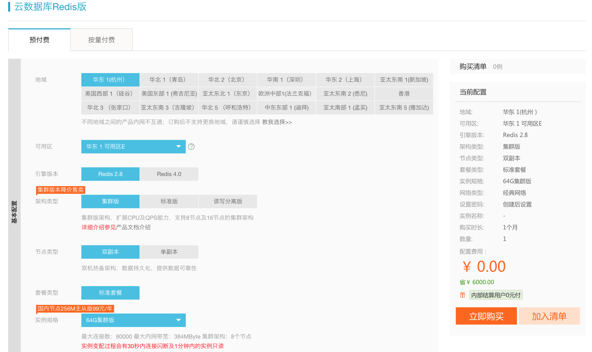
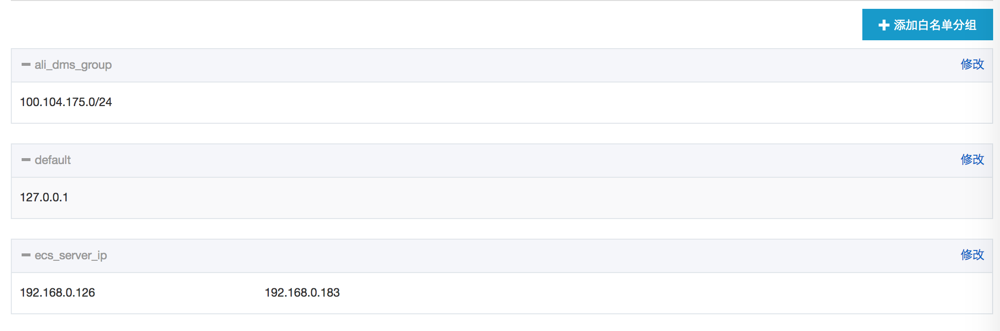
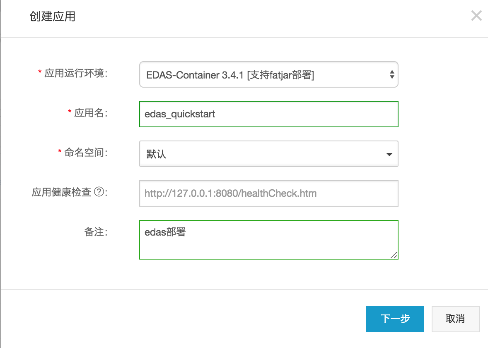
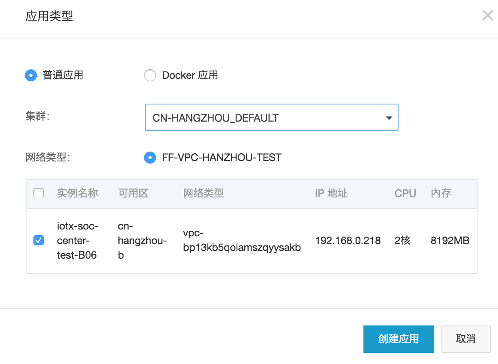
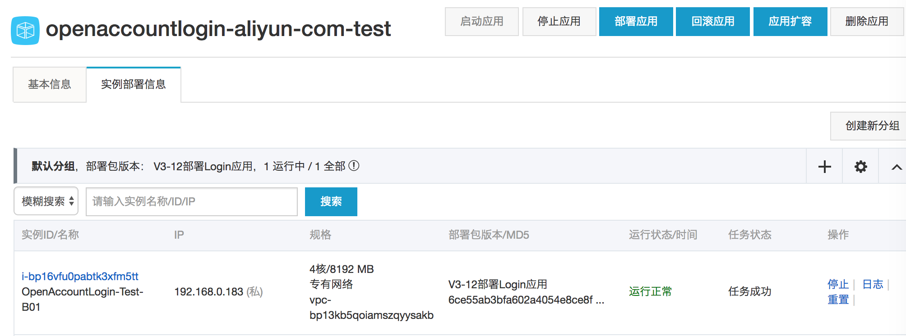
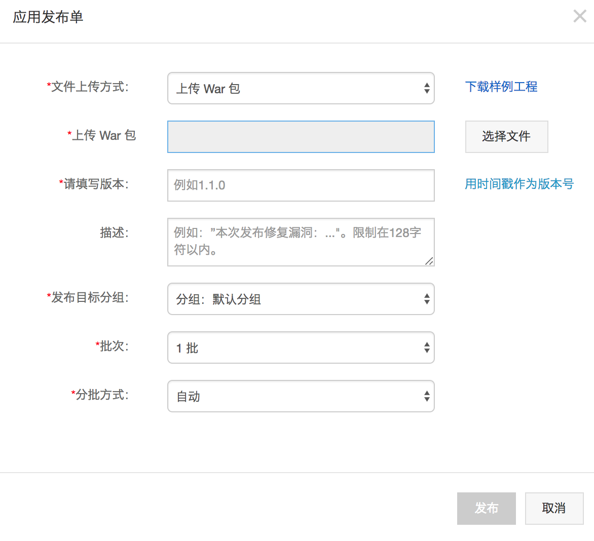
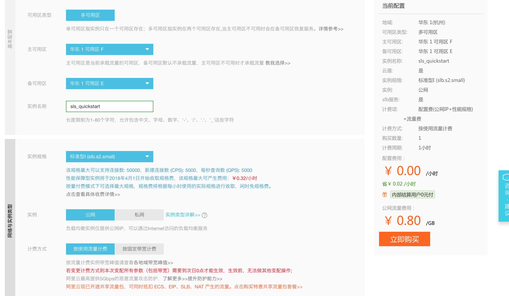
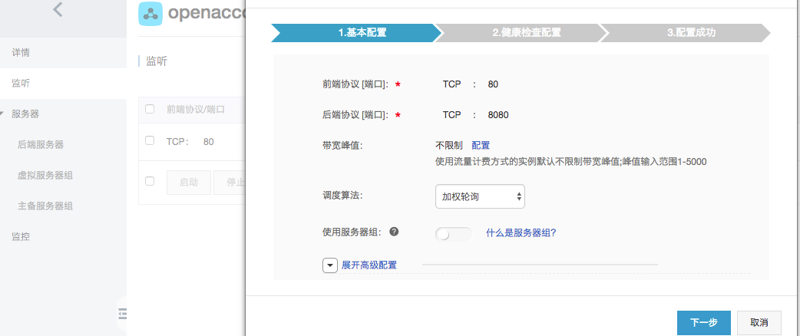

# 基于阿里云的基础服务部署应用
## 前言
阿里云提供的云计算基础服务有很多，例如
- 云服务器（ECS)
- 云缓存（Redis)
- 云数据库(RDS)
- 企业级分布式应用服务（EDAS,目前适用于Java部署包)
- SLB(负载均衡服务,本质上应该是LVS+Nginx)
- 域名与DNS服务
- Elastic Search、表格存储等存储服务

可谓数不胜数,基本可以解决中小型企业所面临的从硬件到软件层面的资源问题，本文尝试从零开始，组合这些产品和服务并分享一下如何部署JavaWeb包，用以模拟实际企业可能面临的阿里云部署操作。

## 购买服务器(ECS)
对应软件产品而言，需要依赖具体的运行服务器，因此我们先从服务器开始。
首先，从阿里云的产品列表中找到云服务器ECS( Elastic Compute Service), 产品地址：https://www.aliyun.com/product/ecs?spm=5176.8142029.388261.248.6d796d3eb9FvNl

ECS包含了多种硬件选型，我们需要根据实际的业务规模选择合适的CPU，网络带宽，内存配置。
进入管理控制台，此时需要登录账户，对应企业而言可单独注册一个企业账号，对应个人来说，可直接用淘宝账号登录，此为账户开通流程，本文将不在此屠版。

成功登录后，进入ECS的[管理控制台](https://ecs.console.aliyun.com/?spm=5176.2020520101.0.0.715b4df5YwXmwP#/home),选择创建实例。一般，需要提前明确计费方式,地域,地域选择应尽量选择靠近目前客户,如华东1区域在杭州，华东2区域在上海.
示例截图：


如示例，选择计费方式为：包年包月，区域为：华东1可用区B, 机器配置：通用网络增强型sn1ne，8核16G
镜像安装选择CentOS 7.2 64位，磁盘选择SSD 40G
网络（需要提前创建）、公网带宽、安全组，网卡这些根据实际情况选择，在系统配置页面，设置登录服务器的密码，并为服务器创建一个名字，最好是见名知意，使用者能很便利的知晓此服务器的用途。

如无意外，则来到了订单确认页面，选择购买周期，是否自动续费，最后大胆的付款吧。

购买成功后，在实例列表中，找到指定区域下的实例，可查询实例详情，可修改安全组，配置服务器的安全规则。在实例详情中，可查看服务器的私有IP, 需要把改IP配置到访问数据库或缓存的白名单列表中。


## 购买数据库(RDS)

对应Web应用而言，数据库几乎是必不可少的，因此我们需要购买数据库。
进入数据库RDS(关系型DB)[控制台](https://rdsnew.console.aliyun.com/?spm=5176.2020520141.0.0.45cb63756juEWX#/rdsList/cn-hangzhou/basic/)
, 然后创建实例。示例截图：


如示例选型为：华东1 Mysql版 4核16G内存 1000G存储。
创建成功后，在实例详情页面中，可查看数据库的连接地址，端口号，内外地址，读写分离地址。如示图：


阿里云提供的RDS数据库需要添加访问白名单，旨在运行特定的IP才能访问, 常规情况下，需要添加ECS的IP。


## 购买缓存（Redis)
一般业务到达一定的阶段，数据库存在较大压力时，此处会用到缓存服务。在阿里云上直接购买缓存也比较便利，可节省自行搭建缓存集群的成本。
进入缓存管理[控制台](https://kvstore.console.aliyun.com/?spm=5176.2020520107.0.0.4ae961f2zp3QWZ#/home/cn-hangzhou)，选择创建实例，然后选择具体的配置，设置连接密码，最后给Redis实例取一个友好的名字，实例截图：


购买成功后，在实例的详情页面，可获取Redis的连接地址和端口，并自行选择配置到代码中。需要注意的是，Redis实例也需要白名单访问列表，在安全设置中，添加ECS的内网IP以添加白名单。如示图：


## 新建EDAS应用
EDAS(企业级分布式应用服务)的官网介绍为：是一个围绕应用和微服务的PaaS平台，提供多样的应用发布和轻量级微服务解决方案，帮助用户解决在应用和服务管理过程中监控、诊断和高可用运维问题；提供Spring Cloud和Dubbo的运行环境.
中小企业使用EDAS意味着业务有一定的规模，同时技术架构也开始趋向服务化。技术层面上需要使用dubbo等中间件，意味着代码层面有一定的复杂度。edas集成了阿里的一系列中间件，使用者只需构建一个Java Web包或fatjar, 上传到edas控制台，然后便可执行自动部署。

edas需要关联到某台ecs， 所以针对新建的edas应用，需要导入或关联具体的ecs实例。

进入edas[控制台](https://edas.console.aliyun.com/?spm=5176.2020520141.0.0.930d63750HEesJ#/app?regionNo=cn-hangzhou)，选择创建应用，如截图：



创建成功后，在edas应用详情页，提供了【部署应用】, 【启动应用】,【停止应用】等功能.
一般的War包，如不涉及到服务调用，配置下发等功能，只需要常规的Java Web代码，然后用Maven打包即可。
如需部署一个War包，选择部署应用，然后上传打包好的war包。如图示：




打包Java War包时，一般选择Maven工具，需要注意的是，war包目录需要遵从标准的Web目录结构，在META-INF目录下需要包含MANIFEST.MF文件，否则edas会部署失败,而且还没有日志供排查.

可选的打包命令为：
```
cd deploy_dir
jar -cvf0 edas_quickstart.war ./
```

edas启动成功后，连接到ecs机器上，观察Tomcat日志，curl页面url.

## 购买SLB
正常情况下，到这一步，在阿里云上服务是部署结束了，但是要对外供用户使用，还可能用到SLB，用以提供负载均衡服务。
在SLB[控制台](https://slbnew.console.aliyun.com/?spm=5176.2020520107.0.0.69e961f2kN0U8I#/list/cn-hangzhou), 选择创建负载均衡, 如图示：


在slb实例详情页面, 配置监听端口，与转发到后端服务器的端口，并配置后端机器IP.


配置成功后，可查看slb的公网IP，基于该IP可申请dns域名，我司内部之间可直接走idns申请。

## 最后
本文总结了基于阿里云的基础服务，应用部署一个Web应用所需要的大致步骤，用以熟悉云上相关步骤与操作，如有错误，欢迎指正。
