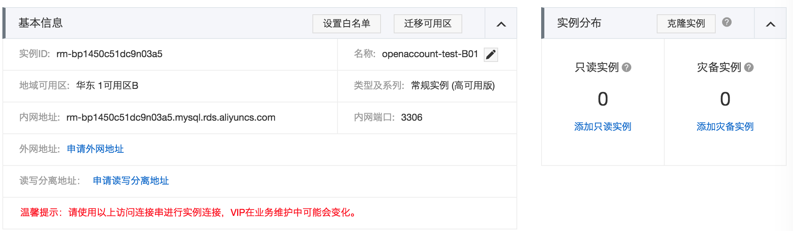

# 基于阿里云平台部署应用
## 前言
阿里云提供的云计算基础服务有很多，例如
- 云服务器（ECS)
- 云缓存（Redis)
- 云数据库(RDS)
- 企业级分布式应用服务（EDAS,目前适用于Java部署包)
- SLB(负载均衡服务,本质上应该是LVS+Nginx)
- 域名与DNS服务
- Elastic Search、表格存储等存储服务

可谓数不胜数,基本可以解决中小型企业所面临的从硬件到软件层面的资源问题，本文尝试从零开始，组合这些产品和服务并部署一个JavaWeb包，用以模拟实际企业可能面临的阿里云部署操作。

## 购买服务器(ECS)
对应软件产品而言，需要依赖具体的运行服务器，因此我们先从服务器开始。
首先，从阿里云的产品列表中找到云服务器ECS( Elastic Compute Service), 产品地址：https://www.aliyun.com/product/ecs?spm=5176.8142029.388261.248.6d796d3eb9FvNl

ECS包含了多种硬件选型，我们需要根据实际的业务规模选择合适的CPU，网络带宽，内存配置。
进入管理控制台，此时需要登录账户，对应企业而言可单独注册一个企业账号，对应个人来说，可直接用淘宝账号登录，此为账户开通流程，本文将不在此屠版。

成功登录后，进入ECS的[管理控制台](https://ecs.console.aliyun.com/?spm=5176.2020520101.0.0.715b4df5YwXmwP#/home),选择创建实例。一般，需要提前明确计费方式,地域,地域选择应尽量选择靠近目前客户,如华东1区域在杭州，华东2区域在上海.
示例截图：

如示例，选择计费方式为：包年包月，区域为：华东1可用区B, 机器配置：通用网络增强型sn1ne，8核16G
镜像安装选择CentOS 7.2 64位，磁盘选择SSD 40G
网络（需要提前创建）、公网带宽、安全组，网卡这些根据实际情况选择，在系统配置页面，设置登录服务器的密码，并为服务器创建一个名字，最好是见名知意，使用者能很便利的知晓此服务器的用途。

如无意外，则来到了订单确认页面，选择购买周期，是否自动续费，最后大胆的付款吧。

购买成功后，在实例列表中，找到指定区域下的实例，可查询实例详情，可修改安全组，配置服务器的安全规则。在实例详情中，可查看服务器的私有IP, 需要把改IP配置到访问数据库或缓存的白名单列表中。

## 购买数据库(RDS)

对应Web应用而言，数据库几乎是必不可少的，因此我们需要购买数据库。
进入数据库RDS(关系型DB)[控制台](https://rdsnew.console.aliyun.com/?spm=5176.2020520141.0.0.45cb63756juEWX#/rdsList/cn-hangzhou/basic/)
, 然后创建实例。示例截图：

如示例选型为：华东1 Mysql版 4核16G内存 1000G存储。
创建成功后，在实例详情页面中，可查看数据库的连接地址，端口号，内外地址，读写分离地址。如示图：

阿里云提供的RDS数据库需要添加访问白名单，旨在运行特定的IP才能访问, 常规情况下，需要添加ECS的IP。

## 购买缓存（Redis)

## 新建EDAS应用

## 购买SLB

## 申请域名
